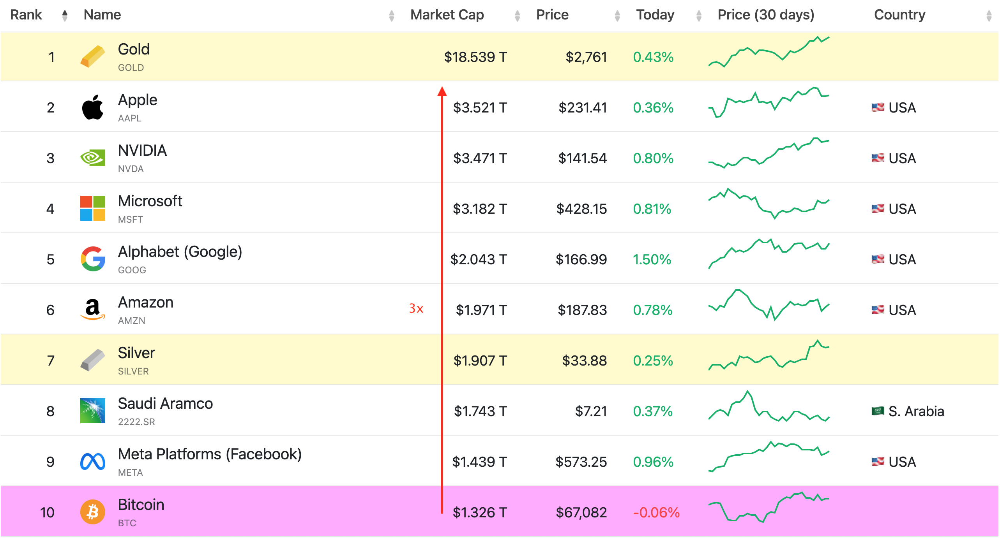

# 引爆点：假如BTC再涨3倍

这个周末，BTC经受住了各种外部事件冲击的挑战，成功捍卫住了67k的阵地。教链突然发现了一个有趣的算数，那就是BTC在67k一线时，其市值是1.3万亿美刀。如果BTC价格再乘以3，市值就会达到3.6万亿美刀。这是一个“引爆点”时刻：因为3.6万亿美刀，刚刚好超过目前全球市值第一企业苹果公司的市值——3.5万亿美刀。

BTC成为全球市值最高的“公司”，一家没有老板、没有员工、没有办公室的公司，一家千年不朽、基业长青的公司，一家现金流巨大而自身利润为零的公司。

6.7万美刀，乘以3就是大约20万美刀。

中本聪据推测可能挖出并持有110万枚BTC。假如BTC在目前基础上再涨3倍，也即是达到20万美刀，那么中本聪的财富将会达到2200亿美刀，超过全球第二富豪、特斯拉CEO埃隆·马斯克（Elon Musk）的2100亿美刀，比肩世界第一首富伯纳德·阿尔诺（Bernard Arnault）的2200亿美刀身家。

可以说，中本聪将成为世界新首富，也是首个从加密行业诞生的世界首富。

这个象征意义是巨大的。一个行业能诞生世界首富，表明这个行业是朝阳行业，会吸引大量人才涌入。

虽然，大概率上，中本聪压根儿就不会理睬这个虚名。

假如BTC再涨3倍，达到20万美刀，按照usd:rmb = 7:1估算，只需要拥有7枚多一点儿BTC，就能实现rmb本位的A8（千万富翁）。

也就是说，一个A8，只需要持有个位数的BTC就能轻松达到。

这就叫，十币可称侯。

根据2023年的数据，中国千万富翁（拥有1000万rmb及以上的个人）数量大约也就是200万左右。14亿里的200万，千分之1.4，可谓“千里挑一”。

而A9（亿万富翁），也将仅需要不到100枚BTC。

中国亿万富翁数量大约是15万左右。14亿里的15万，万分之一，“万里挑一”。

假如BTC再涨3倍，达到20万美刀，只要拥有5枚BTC，你的身家就会达到100万美刀，跻身全球百万美元富翁之列。

截至2023年，全球百万美元富翁（拥有100万美元及以上的个人）数量仅有约6000万左右。

如果这些百万美元富翁每人都想拥有1枚——请注意仅仅是1枚——BTC，他们中绝大部分人都无法实现这个愿望：因为BTC的总量上限只有2100万枚，仅仅是6000万名百万美元富翁的三分之一！也即是说，即使他们平分，每人也只能分到大约1/3枚BTC。

可是，假如BTC再涨3倍，达到20万美刀，就已经很高、很够了吗？不，远远不够。

假设特朗普按照他公开谈论过的国家BTC战略储备构想，让美国政府储备了100万枚BTC。那么当BTC达到20万美刀，这些战略储备价值将约为2000亿美刀。和高达35万亿美刀的美债规模比起来，依然是杯水车薪：2000亿美刀，仅够偿还35万亿美刀中的千分之5.7。这距离能够像特朗普说的“用BTC还债”，还差很远很远。

上述的3倍和20万美刀，并不是一个遥不可及的数字。

当然这是静态假设，实际情况下其他美股公司也在变动，所以可能会是别的倍数和价格才能超越美股。

这一超越，很可能会成为BTC进入“早期大众”的“引爆点”，也因此成为BTC进入下一阶段新增长的转折点。

在这一轮牛市周期，我们将很有可能见到，这个注定会引发全球瞩目的“引爆点”的降临。
