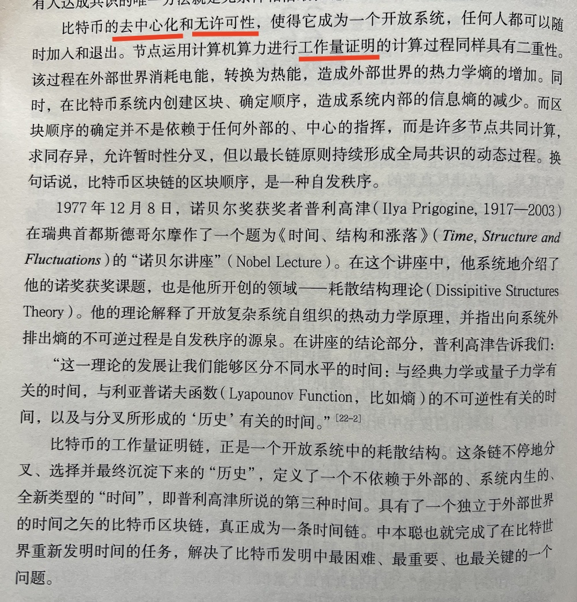
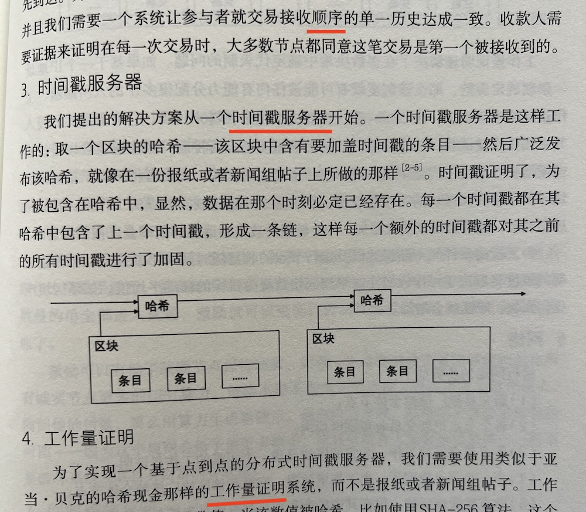

# 比特币背后的诺贝尔奖（一）：普利高津和耗散结构理论

前不久新一届诺贝尔奖的颁发引起了一些热议甚至非议。尤其是物理学奖和化学奖都颁发给AI，让人直呼看不懂。有人说，应该给比特币的发明者中本聪颁发一个诺贝尔奖。教链认为，就算诺贝尔颁奖委员会给他发这个奖，中本聪应该也是没有兴趣去领奖的。

「比特币是 1998 年戴维在密码朋克中提出的 B-money 提案和尼克·萨博的‘比特金’(Bitgold)提案的实现。」—— 中本聪，2010年7月20日。《比特币史话》第八章第30话。

很显然，从上述这句中本聪曾经的发言中可以很明显地看到，他对待比特币这一新发明的态度是极其谦逊的，甚至并未将其称之为自己的“发明创造”，而仅仅是对前人发明的理论的一个“技术实现”而已。

对于中本聪这个人物，教链越研究越觉得不可思议。究竟是何等志向高洁之人，才能同时做到：隐姓埋名，不求名满天下；义务劳动，不向他人索取一分钱资助；公平参与挖矿，但将或可问鼎世界首富的BTC持仓全部锁死，一个不抛，舍弃泼天富贵；以一己之力完成发明创造，却极其谦虚地归功于戴维和尼克·萨博等密码朋克先驱者，不图一丝功绩；离开之前，嘱咐继任者加文·安德森，不要强调中本聪这个形象，而是要把比特币的成果归功于广大参与贡献的社区开发者们，不求任何崇拜和怀念，宁可自己消失于历史的尘埃、隐没于人民大众之中；……

我们对比特币的理解还太过肤浅，以至于无法评判，它究竟应该因为什么而获奖。但是，教链在对BTC的研究中，越来越多地意识到，它的一些底层原理，是十分符合某些诺贝尔奖获奖成果的理论的。有一些，教链曾写进《比特币史话》一书。在此，教链开辟一个系列，来谈一谈，比特币背后的诺贝尔奖。教链希望通过这个系列，来说明一个问题，那就是，比特币也许并不是值得诺贝尔奖某个单一奖项的理论成果，而是像中本聪说的，是数个诺奖级理论成果拱卫而成的实践产物。

换句话说，比特币是诺贝尔奖王冠上的明珠。未来，通过研究比特币，也许还能诞生出更多的诺奖级成果出来。

作为系列第一篇，教链要谈的是1977年诺贝尔化学奖获得者普利高津，以及他的耗散结构理论（Dissipitive Structures Theory）。

在教链的《比特币史话》第六章第22话“耗散结构”中，曾经对普利高津的诺奖成果和BTC的关系做过简要介绍：

书中段落已经清楚无误地说明了，把比特币系统理解为一个耗散结构，那么我们就确切无疑地知道，工作量证明（PoW）乃是该系统自发秩序的源泉。

自发秩序的产物，就是比特币区块账本上所记录交易的有序性。这个有序性意味着顺序的单一历史，也就是一个时钟，一个全局一致的时间。

比特币这个发明的起点，就是这个时钟。所以，中本聪在比特币白皮书第3小节“时间戳服务器”第一句话就写道：「我们提出的解决方案从一个时间戳服务器开始。」

毫不夸张地说，比特币这个发明，最本质上，是发明了一个时钟。这个时钟具有全局一致的时间，一种新的时间。

为什么一切要从重新定义时间开始？因为比特币为了实现全球交易数据的有序性，就不能依赖于任何外部世界的时钟和时间进行定序。每一台计算机的时钟都有可能发生偏差，这就会造成对于时间先后的争议。更何况，蓄意作恶的人可以很轻松地伪造和谎称自己发出交易的时间（外部世界时间）。

困扰计算机科学界长达几十年的分布式系统理论中的所谓拜占庭将军问题以及FLP不可能定理，本质上不过是因为无法定义出一个全局一致的内部时间而导致的问题和推论罢了。

因此，中本聪事实上解决了比拜占庭将军问题更底层、更根本的元问题。他在比特币白皮书中甚至根本就没有提及这些问题，也没有引述任何这方面的文献。但是他并非不知道该问题，因为他在网友互动中明确解释过，工作量证明就是拜占庭将军问题的解。具体可以阅读《比特币史话》第七章“拜占庭将军”，此处不再赘述。

泰山压顶的问题，在中本聪面前轻若鸿毛，不值一提。

简而言之，工作量证明确定了时间，时间确定了顺序，顺序确定了价值。

迷惑之处在于，去掉工作量证明，依赖外部世界时间，也可以定序，然后装作确定了价值。但是，这个价值和工作量证明所确定的价值，完全不同。

这就需要讲一点儿热力学。

众所周知，我们所在的宇宙，在热力学层面上，有一个确定的演化方向，那就是混乱程度的不断增加。比如，食物放久了就会腐败，汽车开久了就会损坏，房间不打扫就会越来越乱，事物不整理就会越来越失去条理，等等。混乱程度在热力学上有个名词叫做“熵”（entropy）。

宇宙演化的方向是熵的增加，终点是热寂，即，一切有序结构的毁灭，陷入完全混乱的状态。

有一个例外，那就是“生命”（life）。

生命是宇宙总体熵增中的反常情况。生命在宇宙局部时空制造了熵减，形成了有序结构，这被称为自组织现象。

生命现象制造熵减违反了宇宙总体熵增的规律吗？并不违反。因为生命只能在局部空间、局部时间存在，而且它每形成一分熵减，就要在它的外部宇宙制造两分的熵增。一分熵减，两分熵增，总体上还是熵增，还是毁灭。

生命为了维持自身生存，注定要以向宇宙索取更多的毁灭为代价。本质上，每一个人，只要活着，就是在给宇宙造成更大、更剧烈的破坏。

宇宙以承受更大的熵增为代价，给生命注入了“负熵”，让生命得以在其自身内部获得熵的减少，获得自组织的有序性，获得生存的延续。

这就是物理学家薛定谔说的：「生命以负熵为食。」

后来，科学家们发现，在宇宙中还存在一些非生命体，也能够源源不断地从周围环境中吸食“负熵”，以给外部环境造成破坏为代价，获得自身内部的自组织有序性。这样的系统比如城市，国家，公司，等等。

比如一家公司，它不断地招聘年轻的大学毕业生加入，作为“新鲜血液”，同时也不断地进行人员淘汰，把大龄员工输送到社会上去，以此维持自身的活力和存续。这个行为，其实很像人每天吃饭和排泄一样 —— 虽然，这样想，感觉对被吃的、被始乱终弃的每个人而言，是很悲凉的，但这就是公司这个利维坦维持自身生命力的本能和冷酷真相。

以上这些包括生命在内的，能够通过吸食负熵而维持自身内部自组织有序性的系统——特别地，开放系统——被普利高津命名为“耗散结构”。

普利高津获得诺贝尔奖的研究成果，正是在于他对于非平衡热力学和复杂系统的研究。他提出的“耗散结构”理论，帮助我们理解在远离平衡的条件下，系统如何自发地形成有序结构。这有助于我们理解和描述开放系统中的自组织现象，对于理解许多自然和社会现象都具有重要意义。

很显然，比特币系统也是一个完美的“耗散结构”。它是去中心化的，开放的系统。矿工消耗巨大的电力，对外部环境释放巨大的热量，排放大量的熵，寻找工作量证明，把“负熵”吸入系统，造成内部的自组织有序性，涌现出时间和顺序，并最终形成价值。

如果说系统失去了去中心化和开放性，就相当于把人的嘴用线缝死。那么抛弃了工作量证明，就相当于把人的胃和肠道切除，系统将无法吸收进食的食物（负熵）。

无论是失去进食，还是失去消化吸收能力，人都无法再继续吸食负熵、对抗熵增，就必然内部腐坏，走向毁灭和死亡。

BTC抛弃工作量证明，相当于一个人切除自己的消化器官。结局就是活活饿死。

最愚蠢的想法，莫过于抛弃工作量证明。

以太坊在抛弃PoW（工作量证明）转向PoS（质押证明）之后，相当于是动手术切掉肠胃，从此开始净消耗之前储存在身上的脂肪和营养物质存活。于是成功走上“减肥”的道路，效果十分显著（LoL）！目前看来，当务之急是要在饿死之前，重建消化系统，不一定是PoW，可能是其他形式的消化系统。

工作量证明可能是迄今人类能找到的、去中心化程度最高的消化系统。其他所有的能够消化吸收“负熵”的方案，教链猜测，都一定要比PoW更加中心化一些。

这就意味着，任何舍弃工作量证明的其他解决方案，其去中心化程度都必定更低，从而，其安全价值更低，也就注定了，不可能和BTC在价值存储这个维度上进行竞争。

人类无法突破这个极限，因为人类迄今还无法突破普利高津的耗散结构理论。人类无法突破热力学的限制，就像人类目前还无法造出永动机一样。

试图舍弃工作量证明的计算和挖矿耗能，取代和挑战BTC，其难度应该大致等价于发明永动机。这就是教链从普利高津的诺奖成果中解读出来的结论。
