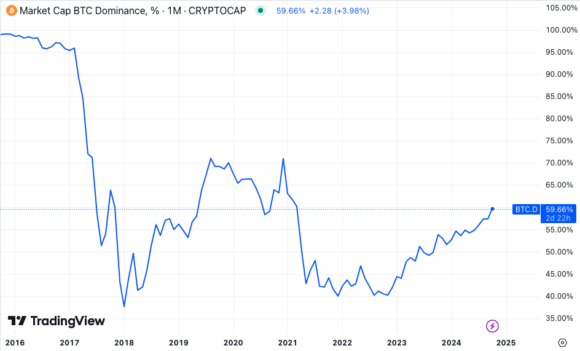
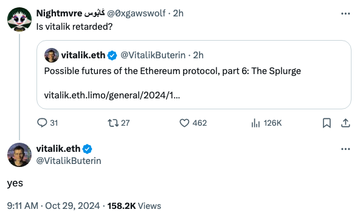

# 看着7万刀的BTC，满仓山寨的我热泪盈眶

教链按：虚构创作，请勿对号入座。

今晨，BTC冲上7万刀。昨晚读到《10.28教链内参：BTC欲上6万9；以太坊更像一家公司》中说，「（69k）这个地方有一个10月20号前后形成的阻力位，看是不是要一举突破了。如果突破并拉升，那么10月中旬的阻力位就是一个强势信号，而24号和26号的插针则是最后支撑点测试。」没想到果然一语成谶。

看着强势突破的BTC，满仓山寨的我热泪盈眶，竟无语凝噎。

耳边响起刀郎的旋律：2024年的山寨季节 / 比以往时候来的更晚一些 / 悄然退群的镰刀大哥 / 击碎了还想翻盘解套的幻觉 / ...

手机里的各种群忽然都起死复生了一般。满眼的消息，砰砰的提示框，我眼花缭乱。嗡嗡的震动，铛铛的提示音，我心烦意乱。

手里握有大饼（即BTC）的，咣咣发图。高耸的K线，像极了持有者挺直的脊梁。掩饰不住的内心喜悦，仿佛要溢出了屏幕似的。我羡慕，我嫉妒，我悔恨。

悔恨交加，后悔莫及，悔不当初，……

殷殷满手山寨情，汩汩套牢铁窗泪。

刚入圈时，我也玩过大饼。

但是很快，经不住山寨的诱惑、土狗的上头、模因的快乐，我左投一只鸡，右投一只鸭，背后还投了一个胖娃娃，咿呀咿呀哎就这样把手里的大饼全都“糟蹋”了。

BTC的市占率已经逼近60%。要知道这几年以来，加密市场中的各种新币又多了何止成千上万？记得教链的内参里曾经说过，仅仅是Solana上的模因发行器，一天就能新发上万个币。僧越来越多，肉却越来越少，再加上新韭菜奉行“炒新不炒旧”、“互不接盘”原则，可想而知，我套在手里的那些山寨凉得有多么彻底，死得有多么让人寒心了！

听闻山寨之王以太坊（ETH）的创始人、“山寨头子”Vitalik Buterin刚刚被愤怒的网友骂了。网友怒问，“小v你是弱智吗？” 请注意该名网友把英语人名故意写成首字母小写，表达了内心的轻蔑。Vitalik竟腆着脸回答了一个“yes”。也真是让我看得哭笑不得了。

这是一个拉盘即正义的时代。ETH跑赢BTC，你就是万众顶礼膜拜的“V神”。ETH现在如此拉垮，你就是愤怒的散户投资者口中“弱智的小v”。

大饼千般好、万般好，离不了BTC一浪更比一浪高、一轮更比一轮强。试想如果BTC今年果真如年初某些看空者所言，3月历史大顶，今年开始走下坡路，谁还会把中本聪当作“你聪哥”？早就给骂成骗子了。

是的呀。我只是一个手无缚鸡之力的小散户投资者。辛辛苦苦打螺丝、送外卖，节衣缩食攒下来的一点儿血汗钱，买进来不就是为了赚点小钱的吗？

你项目方让人窒息的伟大梦想，和月薪3000的我有什么狗屁关系？

不，我仔细想了一下，有关系。也许你口口声声的伟大梦想，就是为了收割我的月薪3000？

不要再拿甜言蜜语的谎言哄骗我，也不要再用晦涩难懂的概念欺瞒我，更不要用你一直在努力、你已经尽力了、你也想让币价涨这等屁话来搪塞我。

我明白了，币圈就是法外之地。疯产模因币的班加罗尔在印度，圈我钱的大割们在新加坡，爆我合约的平台在迪拜。被收割的我，没有任何能力把割我的人送进监狱。那我不就是案板上的猪肉，被宰的羔羊，毫无反抗之力？那我不就是在引诱别人对我犯罪么？

民间有言：百善孝为先，论心不论迹，论迹世间无孝子。万恶淫为首，论迹不论心，论心世上无完人。

你说这币圈投资，是被孝呢，还是被淫呢？

我看是被淫。那就要论迹不论心。心，就是项目方的动机、意愿、努力。迹就是结果，就是币价涨。

一边币价跌跌不休，一边对我说你正在努力？那你和一边躺在其他异性床上、一边对我说你还爱我的渣男渣女有何分别？

持有BTC就像老夫老妻过日子。玩山寨则像是参加欧美社交大趴体——你以为自己是上了，其实是被上了。

山寨币对我始乱终弃，BTC永远等我回家。

过尽千帆，阅尽山寨，蓦然回首，才发现，BTC才是那个对我始终如一、从不变心的“一生所爱”。
