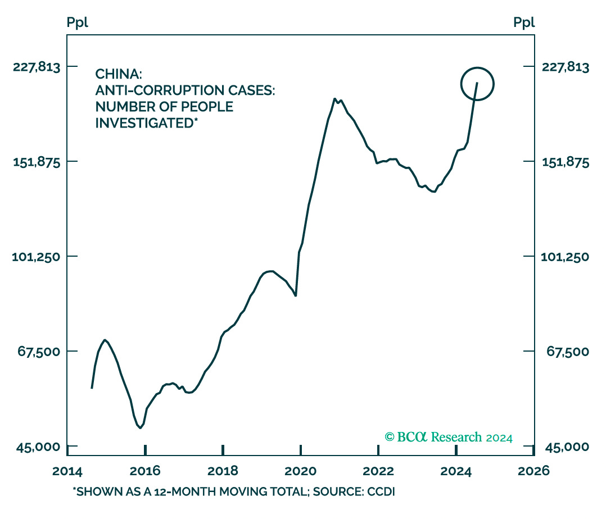

# 加油比特币

教链按：悄然不觉地，BTC已经攀升到72k+，努努力马上要突破年初高点，续创历史新高了。昨天《10.29 内参：BTC强力拉升，离岸rmb跳水》提到了BitMEX创始人Arthur Hayes当天新写就的一篇长文《加油比特币 Let's Go Bitcoin》[1]。文章的主要内容是分析本轮中国即将实施的经济刺激政策，背景、原因和思考。有的时候，我们每日「身在山中」、低头走路，反而有些「不识庐山」，听一听旁观者的视角和看法，反而可能会有「他山之石」的启发和恍然大悟之感。由于文章太长，教链花了2个小时才从头到尾仔细看了一遍，下面把原文的观点和逻辑叙事简要梳理，并加以解读，以飨各位读者。

* * *

Arthur Hayes开宗明义地说道：美国大学书本上宣扬的自由资本主义和目前的美式资本主义相去甚远。事实是，在美国，财务上最成功的公司都是一些最能依赖政府补贴的企业。

他恰好是在美国次贷危机引发全球金融危机的2008年9月份毕业开始参加工作的。刚参加工作就亲眼目睹了真实世界的资本主义有多么不堪。他宁可称其为“公司社会主义”——因为那些曾经如日中天的大银行，都靠着美国政府注资救助才得以存活。

正是靠着美国政府出手救助——本质上是全球人民被强迫共同掏腰包救助，美国的大银行们从2009年3月金融危机的低谷，股价一路飙升，迄今已上涨超500%。（下图是美国最大上市商业银行的股票指数——KBW银行股指数）

Arthur Hayes认为，在过去几十年中，如1989年的日本、2008年的美国以及2011年的欧洲，都分别经历了房地产泡沫破裂所造成的金融危机。现在，中国在2020年出台“三道红线”严控房地产信贷，主动刺破了泡沫。那么，中国将会如何应对，房地产泡沫破裂后的问题？从日本、美国的历史经验和教训中，又能吸收到哪些有益结论呢？

他认为，当房地产泡沫破裂时，所在经济体无一例外都会陷入流动性陷阱或者所谓资产负债表衰退。这会抑制经济活动。从企业到个人，都开始努力存钱还债。于是信贷增速下降。

信贷增速下滑无法用常规的凯恩斯药方——即适度财政赤字和降息——来缓解。Arthur Hayes认为，走出通缩需要财政和货币政策“双管齐下”的“大火箭”。

一方面，银行系统需要借助公共资金来实现“再资本化”。

二方面，央行下场“印钞”，实施量化宽松（QE）。

教链以前文章说过，过去人民币的主要增量在于M2，通过购房者贷款，由商业银行创造信贷货币。也就是说，过去几十年，货币增长的驱动引擎主要在地方（居民，企业，地方政府）而不在中央。现在遇到的问题是地方加不动杠杆了，而中央的杠杆率还很低。这就带来了一个可能性，即中央通过各种“化债”工具接盘地方的债务，从而重新激活经济。

现代法币是债务货币。要创造货币，就要先创造债务。由于咱们央行过去没有QE，发行货币主要靠外汇占款——主要是美元、美债，本质上还是用美国政府的负债来发行咱们的人民币。

上面Arthur Hayes说的第一方面，所谓“公共资金”的来源，其实就是财政通过发行国债来募集，本质上是全体国民出资；第二方面则是央行要创造新的政策工具，来逐步摆脱依赖美元资产来发行货币的传统办法。这两条其实在今年来政府发出的声音里都有所提及，并不意外。

他认为本轮中国实施的刺激政策，其力度和规模不会输给美国在2020-2021年疫情期间救市的力度和规模。

然后是从三个方面展开分析：

一、为什么现代政府都需要打爆房地产泡沫？

二、分析中国房地产泡沫的规模，以及为何政府要刺破它。

三、中国要实施经济“再通胀”的线索。

Arthur Hayes的观点：现代世俗政府的合法性来源是人民财富和执政政府的成功相关联。教链觉得，他这意思咱们政府早就用更直白的语言说过，比如“贫穷不是社会主义”，又比如“人民群众追求幸福生活的权利”，等等。

进一步的，他认为对一个人来说，最重要的金融资产就是房子。因为生理上，我们人类是恒温动物。如果没有地方居住，就会被冻死。

对于房子这样的资产，最重要的不是价格（不妨假设你买得起），而是如何保护你的财产权。如果没有政府，你就只好自己拥有武装。可是你如何阻止同样武装起来的邻居声称你的土地是他的？所以，人们组成国家，相信政府来保护自己的产权，并遵守政府的要求。

上述逻辑接近于霍布斯《利维坦》和卢梭《社会契约论》的见解，但是并不符合历史唯物主义。这里我们不作过多深究。Arthur Hayes只是为了引出下一个论点，即政府的兴趣总是在于让尽可能多的人成为有产者，并且其财产从金融和物理层面上都和国家紧密相连。其实咱们政府也有过类似表述，像“有恒产者有恒心”等等。

他从美国政府对房地产的一贯支持性政策中看到，次级贷市场的兴起离不开美国政府的政策基础。从1992年《联邦住房企业财务安全与稳健法》开始，通过像房利美、房地美这样的政府支持的企业，美国房地产市场突飞猛进。

中国的房地产泡沫具有中国特色。

从历史数据可以看出，房贷利率水平始终位于工业附加值百分比之下（下图）。工业附加值百分比指的是一个国家GDP中由工业部门贡献的比例，计算方法是将所有工业活动产生的附加值除以总GDP。

Arthur Hayes认为，这说明了一个问题，即，中国政府通过国有银行控制信贷成本（利率），用便宜的资金来为国有工业企业提供资本，以推动国家快速工业化。

这样一来，银行就不会给普通储户提供很高的利息。（下图是存款利率变化图）

于是储户就会寻找更好的投资渠道。传统只有三个：海外，A股，房子。其中，海外投资渠道少而且受管制，A股则多年表现平平，最后脱颖而出的就是房子了。

下图是沪深300指数减去标普500指数的变化图，从中可以看出过去的多数年份，A股没有跑赢美股。Arthur Hayes将其解释为政治因素——A股主体是国有企业，它们要讲政治而不能只讲利润。教链觉得，中国目前最大的政治就是“民族复兴”和“共同富裕”，如果股价上涨能够对齐这个政治目标，那么就会涨；否则，就不能涨。

所以，我们会看到，大型国企的资产回报率水平（实线）其实一直保持在一个很稳定的高度上。不过说实话，这个高度也不低了——尤其是最近几年，看起来私有企业的水平也下降到差不多的水平了。

下面这个图是中国GDP增长（绿色曲线；+1200%）和沪深300的增长（白色曲线，+200%）的对比：

房子成了老百姓和政府共同的选择。中国开启了轰轰烈烈的城镇化进程。中国的城镇化率从1995年不到30%，突飞猛进到如今超过65%。（下图）

在短短几十年时间里把大量人口从农村搬到城市，需要大量的建设。建设的钱从哪里来？卖地。

1958年的税制改革，把中央政府变成了一个仅分享20%税收的“小政府”。1994年的又一次税制改革，才把央地拉到了几乎持平、5-5开的水平。如下图所示，其中绿色实线是中央税收占比，蓝色虚线是地方税收占比。

改革谈判是艰苦的。结果是中央把卖地收入让给了地方政府。随着房价起飞，土地财政逐渐成为地方政府的依赖。

从上图可以看到，在过去19年间，土地价格上涨了80倍，折算成CAGR年化复合增长率约有26% —— 比巴菲特的长期投资回报率20%还要高不少。

绝大部分人的工资水平增长，是跑不赢房子的。比如一个2005年之前毕业的大学生，月薪5000元。工作至今，如果还没有失业的话，月薪有50000元，可称得上不错的了。这也只有10倍增长而已。要增长80倍，需要达到月薪40万元 —— 这对于九成的人而言，都是可望而不可及的数字吧？

教链也是从头到尾亲身经历了上面这张图。如今回看起来，别有一番滋味。

这个曲线的起点，恰好是80后一代人大学毕业、进入职场的时代。「人生最大的区别，不是进了什么公司、干了什么行当，而是买没买房子、买了几套房子」，或许已经成为深深刻在80前后几代人心中不可磨灭的观念。

唯一的意外变量，是2009年出现的BTC，跑赢了这条曲线。

房地产泡沫的程度，从租金回报率，或者租售比上可见一斑。

当房价过高，导致大部分人无力买房，并进一步影响到生育率的时候，房地产泡沫就该爆破了。同时，政府希望信贷资金要进入高科技制造业，而不是涌入投机性的房地产市场。

于是，从2020年开始，银行信贷资金明显调转航向：通往房地产的资金量（下图红线）显著下降，而通往工业部门的资金量（下图蓝线）显著增加。

刺破房地产泡沫是需要巨大决心的，因为这蕴含着风险。但2020年年中，中央下定决心，提出“房子是用来住的，不是用来炒的”，出台政策“三道红线”。很快，大量过度加杠杆的房企就停工停产，出现美元债违约风险。

Arthur Hayes经过研究后认为，当年果断刺破房地产泡沫是正确的、必要的。因为数据显示出，彼时房地产市场已经进入了接近庞氏骗局的模式，而开发商则成为了庞氏操盘手。这体现在几个方面：

一、超过50%的资金来自于期房的预售贷款，而此时房子还是空气。（下图）

二、期房销售占到了总销售的88%以上。（下图）

三、两年以上的未建期房面积大幅增长（下图红线），而期房的完工面积增速（下图蓝线）却严重落后，差距正在飞速拉大。

如果不是中央在2020年及时踩刹车，恐怕整个国家都要跟着在庞氏螺旋里疯狂周转的房地产开发商们冲出道路、冲下悬崖了。

中央给信贷来了个急刹车，并加强了反腐败力度，成功地在庞氏模式失控早期，刹停了房地产这列疯狂的列车。

房地产熄火后，地方政府的土地财政不能继续了。经济活动也会因为流动性的消失而受到抑制。

美国、日本前车之鉴。我们必须尽快把房地产在低位止跌回稳。2008年，美国用了3年稳住了房市的下滑。1990年，日本用了整整20年才稳住。我们肯定等不了那么久。

所以就要主动实施政策举措，推动经济进入“再通胀”。下面左图可见，国内信贷的GDP占比并未减速。而右图可见，从2015年前后，亏损工业企业比例开始上升，这意味着它们在使用信贷资金在维持生产和就业。

但由于经济通缩，实际利率上升，抑制了社会融资需求，社会融资水平（下图蓝色实线）和GDP一起在下行（下图绿色虚线）。

这显示出广义货币增速处于历史低位，并拖累了GDP增速。

当经济收缩，失业率上升，就会造成社会问题。2023年6月，城镇青年失业率数据就停止公布了。

Arthur Hayes在这里进行了郑重的提醒。他说，当国家充满着一群年轻、受过教育、没有财产、不能吸引异性青睐的失业男青年时，他“敢说美国中情局（CIA）对于在中国煽动颜色革命的前景跃跃欲试”。

最近在中文网络上搞认知作战，借助社会热点煽动民众不满情绪，挑拨各种身份对立、性别对立的事件层出不穷，拿钱发帖的蝗虫遍地成灾。一切有赖于全民擦亮眼睛，提高警惕性，独立思考，辨明是非，谨防被洗脑而不自知。

Arthur Hayes这个外人都看得明白，我们中国人更应该看明白。

他认为，重要的是要通过实施量化宽松和增加广义货币增长来重新激活经济活动，以便让普通的大学毕业生能够找到工作。

从今年8月开始，央行将地方政府债券的持有量从1.5万亿元人民币增加到4.6万亿元人民币。这是自2007年以来，央行首次印钞购买政府债务，以解决地方债务问题。Arthur Hayes说，这还不够，应该采用QE的方法，利率降到零，并大量印钞。

同时，Arthur Hayes还注意到，中央提出的“三个区分开来”：一、要把干部在推进改革中因缺乏经验、先行先试出现的失误和错误，同明知故犯的违纪违法行为区分开来；二、把上级尚无明确限制的探索性试验中的失误和错误，同上级明令禁止后依然我行我素的违纪违法行为区分开来；三、把为推动发展的无意过失，同为谋取私利的违纪违法行为区分开来。

他认为这也是在政治上给地方官员松绑，推动信贷发展和经济提振。

那么，当中国实施大手笔的货币宽松政策，是否会造成人民币（对美元）的快速贬值呢？Arthur Hayes认为，并不会。

他分析主要是两方面原因：

一方面，中国的贸易顺差越来越大。这一是因为国产替代越来越多，进口减少；二是因为积极推动人民币国际化，现在很多国际资源进口已经用人民币取代了美元。下图展示了两个例子，上图是建筑机械进出口，下图是汽车进出口，绿色是出口，蓝色是进口。

他还吐槽了一下美西方制裁俄罗斯，盗窃了俄罗斯的美元和欧元，一手推动了美元、欧元退出俄罗斯市场，拱手让给了人民币。

另一个方面自然就是美元还会持续印钞了。Arthus Hayes吐槽说美国本次大选就是选小丑，无论谁上台，肯定都会超发更多美元。

好了，他最后的结论是，法币大放水时代又要降临了。手头如果有一些钱，要保值增值，最好还是换成BTC。

---
[1] https://cryptohayes.substack.com/p/lets-go-bitcoin
