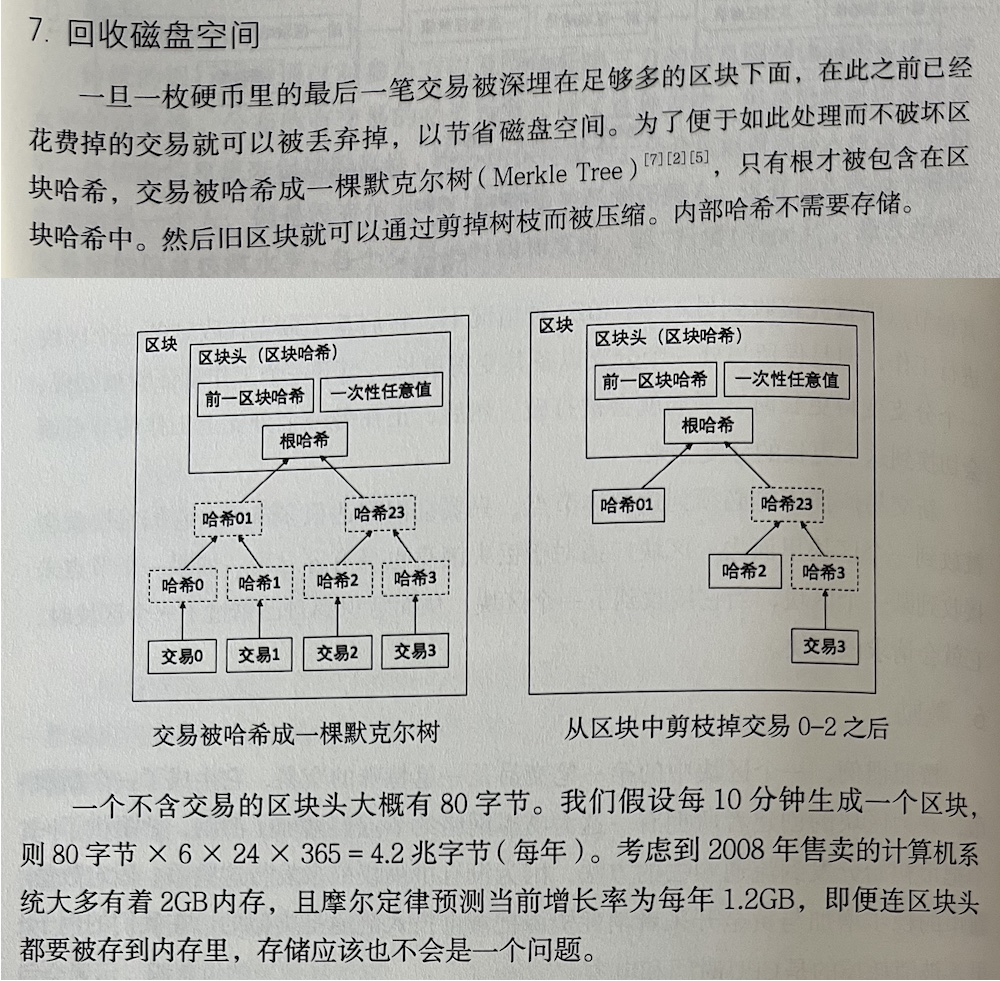

# 价格是比特币最不重要的事（重温白皮书）

BTC这次冲锋太硬了，死死钉住72k阵地不退后。教链觉得，市场总是出人意料的。数学上叫做非线性，或者混沌系统。敬畏市场的意思，就是不要试图在市场面前耍小聪明。从猜短期多空，到觉得今年模因热明年还会模因热，或者价值币现在很惨后面也不会好，等等等等，恐怕都是错误的思维方式。总是这样思考和行动，迟早是要栽跟头、吃苦头的。

如果你不能确信自己是对的，那么你大概率是错的。

今天是2024年10月31号，一个特殊的日子。16年前的今天，严格来说是2008年美东时间10月31号下午2点10分（北京时间11月1号凌晨2点10分），比特币的发明者，一个自称“中本聪”的人，在一个密码学邮件组中投递了比特币的“白皮书”，向世界公开了他的发明。

所谓“白皮书”，其实是一篇只有区区9页（其中一页还是参考文献）的论文。

一切都从这里开始。

哲学有三大问题：我是谁？我从哪里来？我要到哪里去？——当你困惑于自己的处境，迷茫于自己的未来时，就要去向后寻找，找到出发前的起点，看一看来时的路。

这篇名为《比特币：一个点到点的电子现金系统》的薄薄论文，就是起点。

过尽千帆，回到起点，再一次捧起白皮书，细细阅读，我们才惊讶地发现：价格，原来是比特币最不重要的事。

很多朋友可能从来没有读过这篇论文。在教链的《比特币史话》附录B完整附上了刘教链的译本。下面我们就对着教链的译本，来看看16年前，中本聪在这篇改写人类历史的论文里，究竟写了些什么呢？

让我们一个小节、一个小节地仔细看看吧！

中本聪使用了学术论文的排版格式写的比特币白皮书，所以理所当然的，先是论文标题，论文作者，联系方式，论文摘要。标题给比特币的定义是“一个点到点的电子现金系统”，这显然是一个纯技术的定义，而不是“一个总量有限的货币”等经济或金融的定义。至于摘要，则完全是比特币系统技术原理的梗概，充满了技术术语。

第一节是引言。这也是学术论文的通行版式。一般而言，引言部分是用来介绍这篇论文的研究课题，是要解决怎样的实际问题。值得注意的是，中本聪在比特币白皮书的引言里，所针对的问题是传统线上支付无法“点到点”必须借助中间方，这呼应了论文标题里的“点到点”。但是，中本聪完全没有在论文里把货币超发和贬值作为问题一并陈述，似乎是有意无意隐去了这个敏感的话题。这和他在邮件中的大声疾呼形成了鲜明的反差。

“逃离中央管理货币的任意通胀风险！比特币的总流通量限制在2100万枚。” —— 中本聪，2010年7月6日

第二节给出了比特币——或者说，更广义的，电子硬币——的技术定义。这是划时代的。传统的，经济学里，认为货币是一般等价物，是数量，是稀缺性，是生产关系，等等。中本聪则给出了全新的定义：货币是交易的全部历史。

这已经超出了全人类过往历史上全部经济学所能触及的高度。

但是这里的“硬币”不是BTC这个货币单位，而是它的载体。一枚含有0.125 BTC的电子硬币，就像一张面值100 USD的美元大钞一样的意思。

这一节还引出了一个技术上的关键问题：硬币的流转，是采用中心化的铸币厂模式，还是采用去中心化的点到点模式？中心化的铸币厂模式，启发了咱们央行研究的CBDC。而去中心化的点到点模式，则需要攻克人们未曾攻破的一个关键问题，即所谓“双重花费问题”——同一枚电子硬币花两次。

问题已经分析清楚了，第三节就是提出中本聪的解决方案：确定时间。确定了时间，就能确定方向。确定了方向，就能确定顺序。确定了顺序，就能避免“双重花费”——很容易检查是否“在此之前花过啦”。

后人把这个东西叫做“区块链”。但是，区块链本身只是一个数据结构，很容易被篡改或者伪造，这就需要下一节的所谓“工作量证明”(PoW)。

很多人在亲眼见到PoW能工作之前，打死也不敢相信这玩意儿竟然真的能行。

另外一拨人则在见识了PoW之后，开始动心思，想把PoW去掉，看看系统是否依然能工作。

爱因斯坦说过，向前一步是真理，向前两步是深渊。

PoW是客观真理。它是向一个新加入节点证明全部历史没有被伪造或篡改的唯一证据。

PoS（质押证明）用随机节点的签名来取代PoW，但是对于我一个新加入的节点而言，如果采取“零信任”原则，我又如何能够判断，每一个区块的签名者是不是假冒的呢？毕竟，重写全部历史，伪造全部质押记录并假冒签名者，对于一台普通计算机的算力而言，都不是什么难事。因此，答案是不容辩驳的：无法判断。

智商爆表的意见领袖们，却有意无意地回避这个极其直白、简单的逻辑，甚至发明许多高深的术语和理论来模糊这个逻辑，试图掩盖其“反动”和开历史倒车的本质。

每阅读一次中本聪写的白皮书，就重新思考一次没有PoW到底行不行。每重新思考一次，都会得到同一个答案：不行。

有了前面第三、四两节的成果，第五节就很简单了。只需要一个简单的广播模型，就足够好了。就像中本聪在摘要里写的，「网络本身只需要最为精炼的结构」。

第六节讲的是挖矿。在这里中本聪用开采黄金作为比喻，解释了激励的来源及其作用。

比特币在2017-2018年前后，“电子黄金”的叙事逐渐脱颖而出。根子也是在中本聪这里。

第七节讲的是如何剪掉无用的旧数据，以节约磁盘空间。

第八节讲的是轻量级节点。直到今天，最正统的Bitcoin Core客户端依然还没有完全实现中本聪当年的这一构想。虽然技术上是完全可行的，但是依然存在隐私保护等诸多方面的课题需要研究和解决。

第九节是账本交易的处理。电子硬币可以随意合并和拆分，有别于法币的纸币不能任意拆分，而更像黄金可以熔融或者切割。

第十节是中本聪提出了全新的、不同于传统互联网的隐私模型。

传统互联网隐私模型特点，简单一个词就是“KYC”（识别你的客户）。为啥互联网平台要识别客户呢？自然是有一大堆冠冕堂皇的理由了，比如更好地提供个性化服务啦，监管要求啦，防止诈骗啦，等等。

这带来的最大的问题就是，被识别的客户（用户）总是被迫过度上交个人隐私信息，才能享受到平台的服务。用户总是需要被迫信任平台不会滥用这些个人隐私信息，但是互联网的历史却充满了对这一信任的破坏，甚至是轻蔑！——比如某厂公就曾在公开场合大言不惭地说，「中国人不在乎隐私」。

中本聪隐私模型的最大不同，就是从一开始就不要“KYC”。系统完全不收集、不接触、不索取你的个人隐私信息。

当然，这又超出了全人类过往历史上全部法学和政治学所能触及的高度。

定势思维肯定是惊诧——这岂不是无法无天了吗？

其他山寨币为什么很难挑战BTC？刨到根子上，它们无力抗衡铁拳。而BTC，用强大的PoW算力，铸就了足以让任何强权和平共处的铜墙铁壁。

「失去人性，失去很多；失去兽性，失去一切。」——《三体·死神永生》

分秒咆哮的PoW算力，是BTC系统的暴力美学，BTC的兽性。这是BTC能够实施中本聪隐私模型的重要保障。

Code is law? No. Power is law.

第十一节，劝退很多读者的数学公式和仿真计算结果。

再次说明了PoW的必要性。

没有了PoW，柏松分布、可验证随机性和去中心化统统消失不见了。

第十二节，结论。把摘要再重复一遍。

最后是参考文献。注意，第1篇是戴维的b-money提案，第6篇是Adam Back的哈希现金论文——也就是工作量证明（PoW）所借鉴算法的来源。

有人怀疑中本聪是戴维。教链觉得不是。从中本聪的网络发言和所作所为可以看到，他是一个谦虚、低调、高尚的人。因此教链认为，他不太可能做出那种在自己论文的参考文献里高调引用自己这等浮夸的作派出来。

「比特币是 1998 年戴维在密码朋克中提出的 B-money 提案和尼克·萨博的‘比特金’(Bitgold)提案的实现。」—— 中本聪，2010年7月20日。《比特币史话》第八章第30话。

中本聪十分谦虚地把发明的功绩归于戴维和尼克·萨博，并未居功。

白皮书参考文献引用了戴维，但没有引用尼克·萨博。如果说中本聪是后者，倒是更能让教链觉得更合乎常理。当然，人家尼克·萨博已经多次否认过了。

现在各位亲爱的读者，你对于比特币白皮书有了近距离的直接了解了。

在这篇论文问世16周年之际，让我们一起感谢这位也许我们永远无法知道其真实身份的伟大奉献者——中本聪——把它带给这个世界吧！
