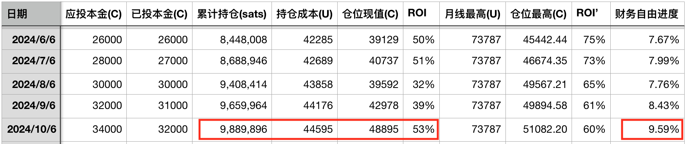
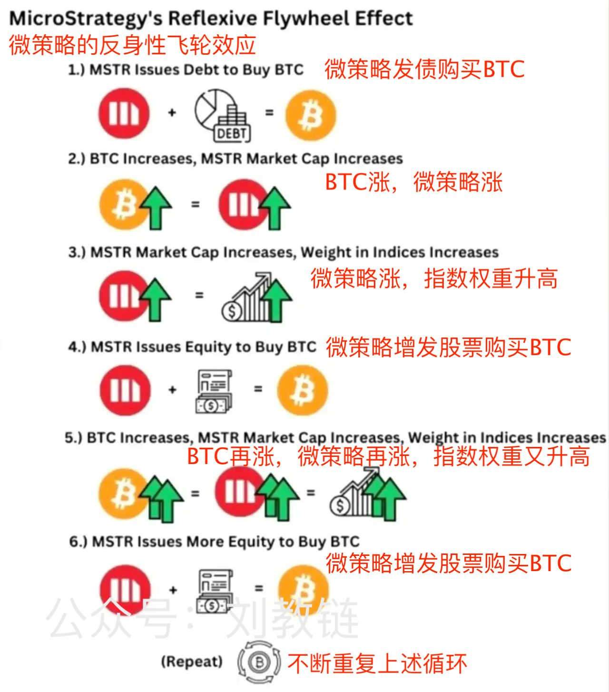
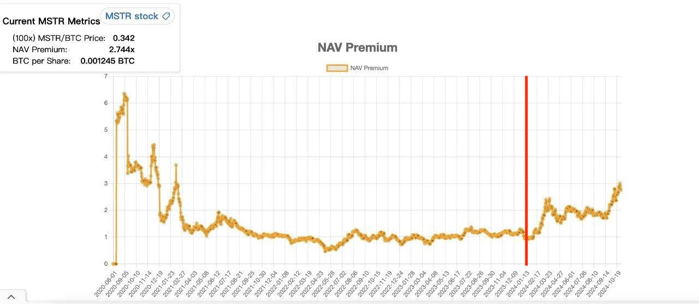
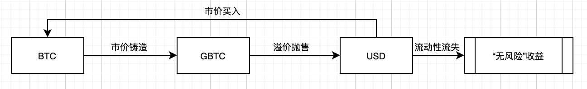
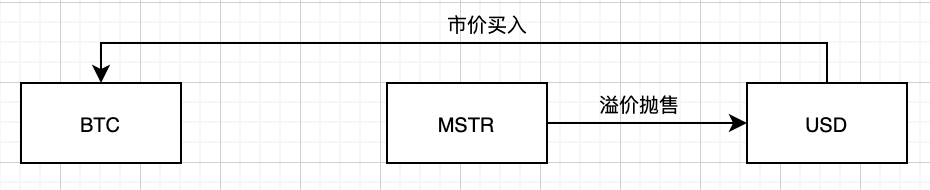
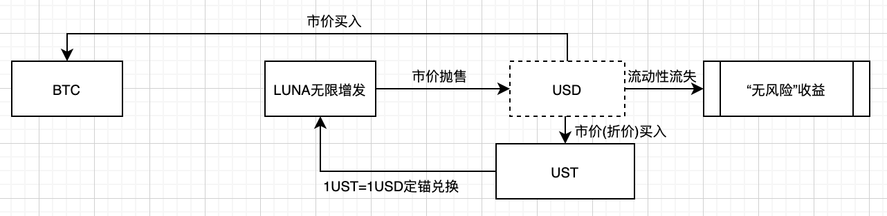
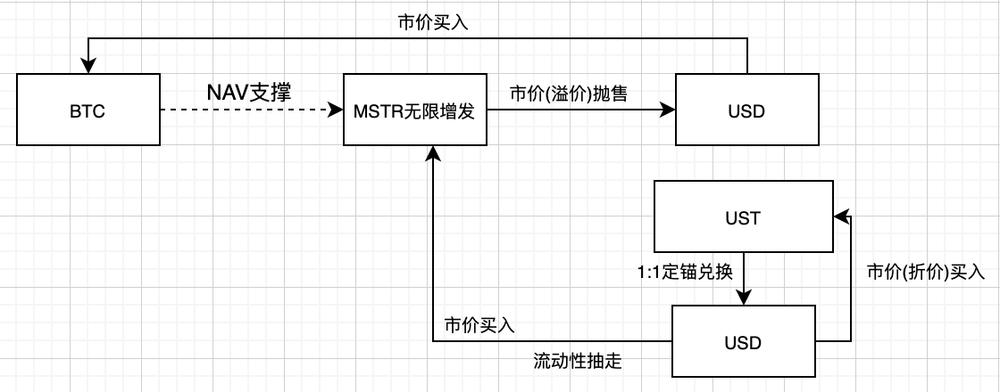

# 微策略的金融永动机 —— 十年之约＃34（ROI 53%）

隔夜BTC果然如愿以偿地倒车接人了。大概是前段时间的特朗普交易遭到了选情焦灼的狙击。十月BTC开盘63.5k，收盘73.6k，收涨超11%。今天是《八字诀·十年之约》实盘见证计划的第34次汇报。十月收涨，不加仓。目前“十年之约”仓位持仓成本44595刀，按收盘价，收益率约53%；财务自由进度9.59%。

对参数设定不了解的新读者，还请移步温习2024.10.6文章《月薪5000工薪族的财务自由计划 —— 十年之约＃33（ROI 34%）》，以免重复问一些没有意义的问题。

昨天《10.31教链内参：微策略欲再筹420亿美刀加仓BTC》说到，微策略（MicroStrategy）又宣布了一个大计划。

这个Michael Saylor（微策略创始人）是找到了“金融永动机”的玩法，彻底爽了。

微策略把自己变成了“印钞机”，只要不断增发股票，卖股票，买BTC，就可以实现股价和BTC的双螺旋上升！

分水岭大概发生在去年底。此前微策略是发债囤饼，这相当于是场外加杠杆来买BTC，不足为奇。这时候的微策略股票（以下简称MSTR），可以近似为一支自带杠杆的BTC基金。但是从分水岭之后，微策略开始通过增发股票来买BTC。

由于美股市场持续给出MSTR正溢价，使得它可以“溢价增发”股票抛售后买入更多BTC。市场预期它会买入更多，加上预期BTC未来会涨，于是就持续买入MSTR，从而支撑和拉高其正溢价。

从下图可以看出，自今年以来（红线右侧）MSTR的NAV Premium（净资产价值溢价）开始持续攀升。

由于微策略的主要资产就是BTC持仓。所以净资产价值溢价大于1，说明美股的投资者们认为微策略的价值要超过它当前持仓BTC的价值。

特别地，当微策略市值增长到足够大，进入美股指数（比如纳斯达克100指数），就会造成大量指数和基金投资者被动投资它，从而获得更多的资金。

微策略就像一台强力抽水机，源源不断地把流动性从美股市场抽出来，注入BTC。而且，这台抽水机的马力，还在持续加大！抽得越多，马力越强，抽得越快。抽得越快，抽得越多。这是一个正反馈循环！

有人担心微策略这么玩会不会爆仓呢？

要知道股票不是债务，是不会被清算的。大不了美股熊市，微策略股票没有正溢价了，它可以停止增发股票。但是它并没有回购跌价股票的义务，所以并不会因此而被爆仓，被迫出售持有的BTC。

就像前些年DCG搞的灰度BTC信托（GBTC），在2021年牛市时大幅正溢价，吸引了投机套利者大量购买。用BTC以1:1铸造GBTC，反手就以1:(1+n%)的溢价卖出去，稳赚n%，美滋滋。你说最后谁亏了？肯定不是灰度。人家GBTC是受铁拳保护的信托，一个子儿都别想让它吐出来。当GBTC在2022年熊市转入负溢价后，谁扛不住割肉了，谁就是亏损的人。

当然，趁熊市GBTC骨折级负溢价，把亏损者割的肉尽数笑纳，然后转眼等到2024年初GBTC转成BTC ETF之后，负溢价消失叠加BTC上涨，又美滋滋地赚了一波。

微策略MSTR这个局比GBTC更高明！

GBTC的正溢价并不会被灰度回收，而是拱手让给了投机套利者。投机套利者们太短视了，吃掉了正溢价，这部分流动性可能就流失了。本质上这是对BTC价值的透支——因为如果这些被收割的投资者不是买溢价的GBTC，而是买BTC，就不会浪费这部分溢价的钱。

而MSTR的溢价则完全被微策略公司回收了。而微策略公司回收了这些溢价资金，又会拿去买BTC。这就不会让溢价资金流失，而是继续助推BTC的升值。

如果MSTR不透支BTC，那么就不会干崩BTC。不干崩BTC，也就不会干崩BTC对自家股价的支撑。如果它不会干崩自家股价，那么就不会收割那些投资MSTR的人。

问题是，MSTR这么“左脚踩右脚，右脚踩左脚”上天，谁会是最终付出代价的买单者呢？

有两个候选答案：一是没有采取同样策略的其他美股股票；二是美元-美债体系。

答案一是显而易见的推论。当前美股头部集中问题已经很显著了。指数长牛的背后，是持续走牛的“美股七姐妹”，以及大量表现平平的长尾公司。微策略如果不断增发，持续从美股市场抽走流动性，且体量不断膨胀，抽走越来越多的流动性，就有可能把其他美股的流动性抽走，使其失血暴跌。美股七姐妹要被一个微策略给榨干了。

美股巨头要反抗，就要动用非市场竞争的手段。要么借助铁拳，打倒微策略；要么借助法币印钞机和政府补贴，给自己输血。

于是就会推导出答案二。

微策略将会站在当年LUNA/UST死亡螺旋中LUNA的生态位，把美元-美债体系给干崩。

发明LUNA/UST体系的Do Kwon虽然失败了，但是不得不说他是个吃透了美元-美债庞氏螺旋精髓的家伙。

2022年LUNA靠着无限增发机制，源源不断地给套利者无风险套利的机会，买入折价的UST，按1 UST = 1 USD的定锚超发LUNA抛售获利。这本是天衣无缝的算法稳定机制，但当UST的“债务规模”已经是LUNA流动性不可承受之重时，流动性迅速枯竭，死亡螺旋就发生了。

有趣的是，UST这名字起的就很灵性。Do Kwon称之为美元稳定币，其实它是个债务。巧了，美债的缩写，也是UST。

Do Kwon当年已经着手试图建立BTC储备来支撑LUNA的价格，但是为时已晚。

在微策略的MSTR这个局中，它先构建好了BTC对MSTR的NAV支撑，然后在溢价的基础上无限增发。无限增发不是套利者驱动的，而是微策略自己掌控的。而且，增发抛售的获利也完全归微策略掌控，用于继续囤积BTC，而不会流失到套利者手中。

众所周知，美元是由美债支撑发行的。美债要靠美元的回收来支撑其价格，否则就要崩盘。当微策略的金融永动机像黑洞一样把流动性抽走，就会对美债体系发起“吸血鬼攻击”，推动美债的价格下跌和收益率上升。

这就变成了BTC和美元之间，通过MSTR和美债展开的“代理人战争”。要么，BTC崩，MSTR崩。要么，美债崩，迫使美联储注入新的流动性，美元大幅贬值。

当然，从根本上讲，MSTR身在美股，增发股票也要SEC审批，铁拳在必要时可以直接摁死它。

乐观的看，资本主义是有“优越性”的，美国的铁拳在资本面前很可能会变成花拳绣腿。毕竟，别忘了，贝莱德也早已入局了呢。

所以这一波，微策略是不是有点儿“以身入局，胜天半子”的味道了呢？
