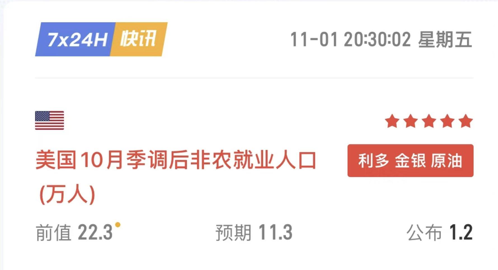
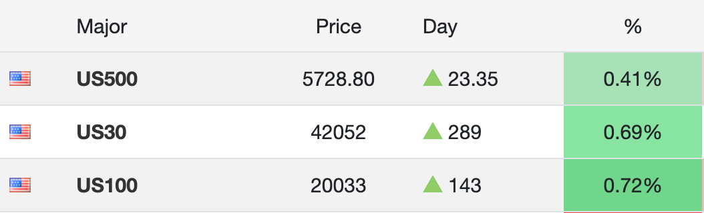
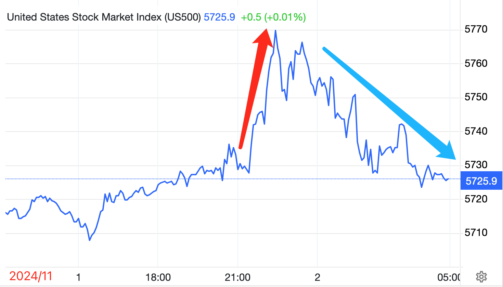
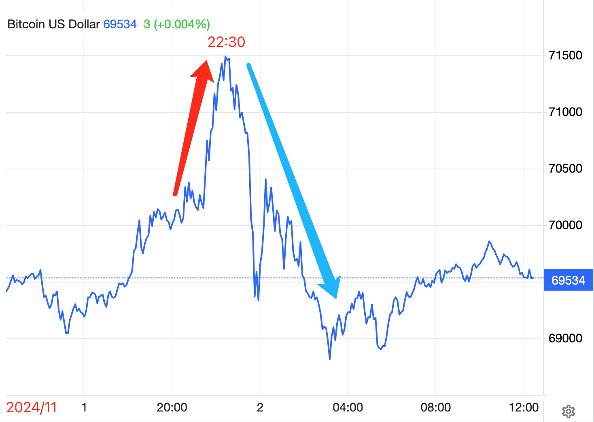
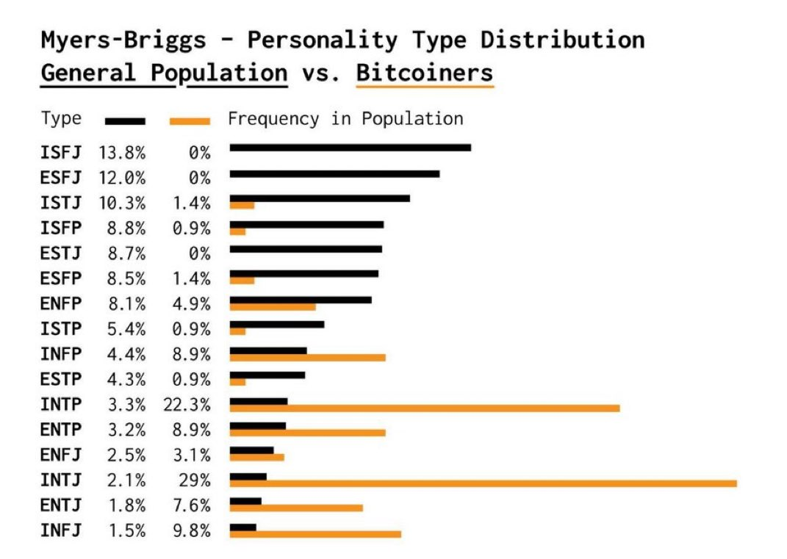
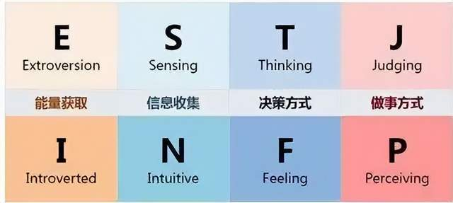

# 天敌

昨夜非农数据把市场惊呆了。据《11.1教链内参：一声炸雷，非农低至冰点，降息板上钉钉》，统计出来的就业人数只有预期的十分之一左右。更为奇葩的是，从美股到BTC，风险资产这次没有遵循“就业崩=>经济衰退=>风险资产下跌”的路子，而是齐刷刷上涨。于是只好强行解释成“就业崩=>美联储必降息=>风险资产上涨”。

可是在非农数据出来之前，市场已经定价了超过九成概率美联储11月降息25bp了。这么糟的数据出来，也不过就再加一成，变成必定降息而已。怎么就能把衰退的风险给抹杀了呢？

拉出日内数据仔细看一下。原来是上演了一出先涨后跌的戏码。

这自然也联动了BTC走了个过山车，20:30从70k急拉到近71.5k，22:30突然跳水，一个猛子从71k上方高台，猛扎到69k的水下。

真真假假，虚虚实实。

兵法有云，虚则实之，实则虚之。要跌，那就先虚涨一下；要涨，那就先虚跌一下。

兵法又云，能而示之不能，用而示之不用，近而示之远，远而示之近。要涨，那就先做出不涨的样子；要跌，那就先做出不跌的样子。

前几天教链在内参里分享过一个有趣的统计图，是关于性格分布在大众和BTC持有者群体中的差异。嗯，就是《10.27教链内参：涨服》，不知道看了这期内参的朋友有没有注意到或者仔细看看。这幅图是这样子的：

图里的性格分型是MBTI十六型人格。具体是哪十六型，在《10.27教链内参：涨服》中有介绍，这里就不再赘述。黑色柱状图是各型人格在大众人群中的分布。橙色柱状图是各型人格在BTC持有者中的分布。

可以很明显地看到，橙色柱状图的分布明显和黑色柱状图的分布有特别大的差异，甚至几乎可以说是反过来的！

比如在大众人群中占比最高的前五种人格ISFJ、ESFJ、ISTJ、ISFP、ESTJ，却几乎很少有BTC持有者。而在大众人群中并不多的INTJ、INTP、INFJ等性格，却是最常见的BTC持有者。

性格决定命运吗？看起来在某些情况下的确是这样。（如果你作为个体，不符合统计平均，那么说明你用理性克服了自然约束，很厉害）

教链注意到，非BTC持有者的性格，不管是外向还是内向，大都是非常注重社交关系的。换句话说，他们可能日常倾向于放弃自己的独立思考，纯粹是为了保持人际关系的和谐。在BTC的渗透率还处于极早期的小众阶段时，周围人大多是不持有、不理解甚至是反对的态度，那么对于注重关系和谐的人而言，就不太容易克服社交压力而特立独行，做一个BTC持有者。

而与之相反，经常在社会中被评价为不善交际、性格孤僻、在计算机程序员中最常见的INTJ人格，却是占比最多的BTC持有者群体！

这种人格有何优点？他们的优点正是这个社会常常给他们评价的缺点：只考虑他们心中认为的客观对错，几乎不考虑人际关系的和谐，不考虑对方的立场和好恶——哪怕那个对方是权势熏天的领导，哪怕曲意逢迎一下能够给自己带来更大的利益。

股票交易员，或者说，各类型金融市场的交易员，也是INTJ的舞台。冷静，理性，客观，独立思考。

在金融市场的交易中，从众就是亏损的原因。与众不同，是盈利的基础。

但是，从众才是符合人性的。而特立独行，本就是反人性的。这才是金融市场交易盈利十分困难的原因。

教链找到了进化论的解释。

在漫长的亿万年的艰难生存和激烈竞争中，所有动物都学会了一个生存法则：抱团取暖。无论是羊群还是鹿群，掉队的个体，很容易就被悄悄跟随的掠食者抓住并杀死，从而不断减少单独行动有关基因的遗传。

即使是掠食者，像狼，也在面临更为凶猛的野兽存在的进化压力下，族群中逐渐筛选出了群体行动的优势基因。

至于智人，更是把合作相关的基因进化到了令所有其他动物望尘莫及的高度。

很显然，在自然界，越是善于社交抱团，越是能够增加个体存活的概率，因此，善于社交的基因也就成了优势基因，代代遗传下去。

这很符合上文图中大众人群中性格分布的特征。

金融市场的丛林法则、弱肉强食，和自然界一样残酷。但是，这里的生存法则，却有一点区别很大。

这个区别就是，这里的掠食者对离群的少数个体不感兴趣，而专注于猎杀抱团的猎物。

原因是什么？因为在金融市场的丛林里，猎杀的效率很高，收割一颗韭菜和收割一亿颗韭菜，所需要付出的体力（能量）相差并不多，而后者的收益却可能是前者的上万倍。

以加密市场的合约交易为例。当市场上绝大多数人预期上涨开多，就像2021年牛市初期，大量多头合约爆仓线在3万刀。那么，这就必然引来掠食者的兴趣，找到机会，借助甚至炮制恐慌消息，精准插针到2.9万刀，把这些多头合约仓位收割一空。

如果掠食者发现，上方还有一些空头仓位，那么它会先拉涨一波，把空头仓位先爆掉，避免它们在稍后猎杀多头仓位时跟着喝汤，窃取了掠食者的猎杀成果。但是如果这些空头仓位极少，不值得费力费钱拉爆，那么也可能就会直接下杀。只有这种情况，作为小卡拉米的散户韭菜才会在这场波动中喝到汤，赚到钱。

不用怀疑，掠食者和韭菜根本就不是一个物种。你们的差异，就像狮子和野鹿。你们不是在玩对等的游戏。他能看到所有的开仓数据，而你两眼一抹黑，只能靠猜。

掠食者不是韭菜的“对手”。它们是韭菜们的：

天敌。
