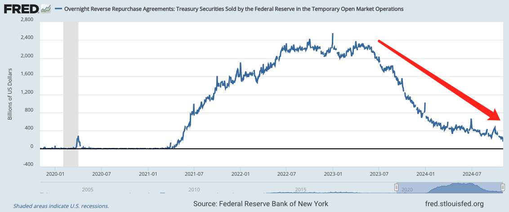
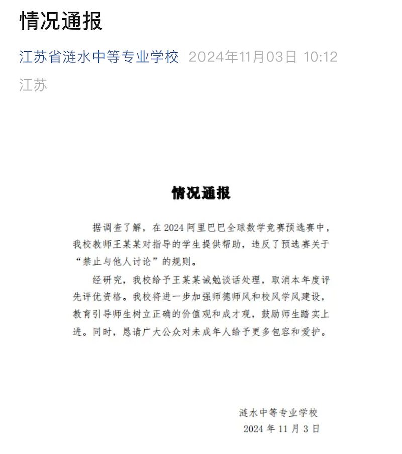

# 信庄家，上大当

隔夜BTC继续向下，一度跌穿68k。美联储隔夜逆回购资金池里蓄积的流动性还有1555亿美刀，比最高时2.5万亿美刀仅剩6%。

根据9月份美联储降息后的操作指南，隔夜逆回购利率下调至4.8%。从图上可以看出，其实资金从2023年中就开始流出了。回顾一下，那时候美联储加息就已经接近尾声。

显然，资金考虑的是未来的趋势，而不是现在的价格。一年多来，94%的资金从隔夜逆回购池子里跑掉了，推高了资产价格，譬如美股、黄金、BTC。

现在蓄水池快耗干了。当某个临界点来临，不再有足够的流动性可以支撑银行不破产，或者美股不崩溃，美联储就该被迫再次转入扩表了。

庄家想借韭菜之力达成自身的隐秘目的，屡试不爽的方法就是与个别的韭菜合谋，人为制造韭菜梦想成真的神话。大肆宣传，用梦想吸引成千上万想走捷径的韭菜尽入彀中。

为什么你经常看到某人晒出开合约暴赚几千倍的截图？为什么你总听说某链某平台上某人炒模因币一夜暴富的故事？为什么你会被媒体刷屏某私企办的数学大赛中某天才中专少女碾压全球一流大学选手？

当你看到别人暴赚也跑去交易平台开合约时，当你听说模因币暴富故事也跑去土狗链上搏一把时，当你被天才少女的特招梦感动而要求给予大公司们举贤才的特权时，你就上当了。上了庄家的大当。

你以为你是在为自己的梦想而努力，其实你不过是成为被庄家利用的一颗棋子。一颗纯纯的傻韭菜。

人们总是有一种幻觉，觉得平台或者公司作为一个组织，似乎应该有比个人更高的道德水平。这实在是极大的误解。

事实恰恰相反。平台或公司作为一个组织，其道德水平总是低于具体的个人。它们时常将自身利益置于道德之上，甚至是法律之上。一个最简单的道理，连劳动法都不能老老实实遵守的企业，难道你还指望它讲道德？

道德在于人心。组织没有“心”，所以不会有道德。它只是遵从一个简单的目标动机，即自身利益最大化。法律是约束其原始兽性的底线。

在与平台等组织打交道的时候，不要把自身安危寄希望于它讲道德，而是要考虑清楚它的利益取向，是否和你的利益一致。

一个平台，一个项目，手握百万韭菜充进去的几十亿、几百亿美刀的资金，如果跑路的利益更大，它就会倾向于跑路。它不跑路只有一个原因，那就是对它而言，不跑路的利益更大。

如果你不能100%确信庄家的利益与你一致，那么你最好对它说的话，一个字儿都不要相信。

这就是中本聪BTC思想中，重中之重的理念——“不要相信，要验证”。
