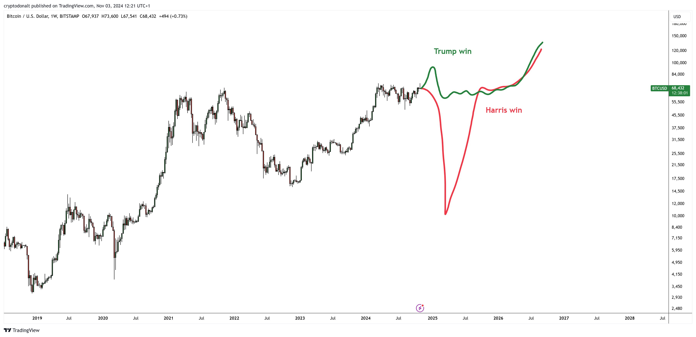
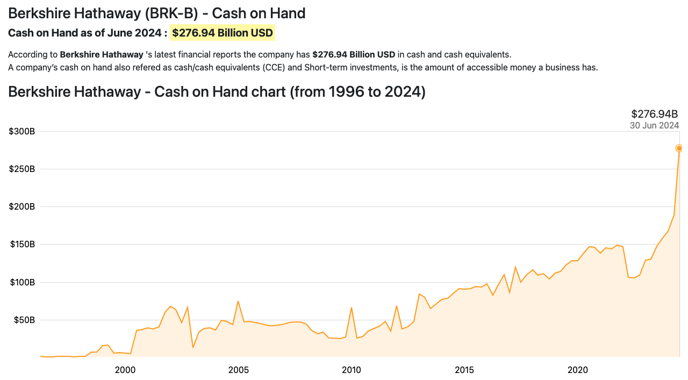
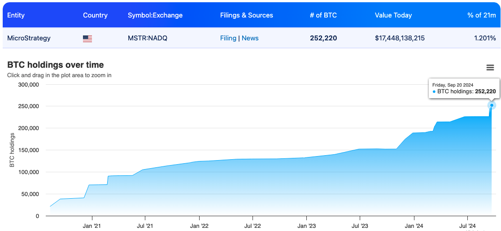

# 反转时刻（为什么百万美刀的BTC并不贵）

隔夜BTC急跌了一下，一度跌穿68k，至晨又拉回68k，并向69k反击。明天就是美大选日，网上铺天盖地都是双方的宣传，遮天蔽日的，几乎淹没了其他所有的消息。不由感慨，当今世界，认知作战投入最大、火力最猛的，还得大美利坚。

很明显，特朗普的媒体阵地在推特（X）。支持他的人在这里总是能够找到共鸣。中文社交平台则几乎都被民主党火力覆盖了，很容易看到支持哈里斯或者信誓旦旦预测哈里斯必将获胜的文章。支持她的人则应少看推特，多刷一刷这些爽文。

他们浪费了太多注意力资源。烧那么多钱，只为了争夺一个总统之位。早好些年微博公知就已经科普过了，美国拥有最先进、最完善的三权分立制度和民主架构，就算是放一条狗上去当总统，也丝毫不影响美国继续称王称霸。既然按公知的说法，体制如此完美，总统如此不重要，为何还要浪费纳税人的钱、浪费全世界人民的注意力去关注这个意义不大的选举呢？

无论是特朗普上台还是哈里斯上台，有一些趋势是确定性的，不以人的意志为转移的。比如，美债规模必然继续增长，美联储还要继续印钞，BTC就必然要上九天揽月。

一个自律的投资者从来不赌。这个原则不仅适用于市场操作，还适用于生活的方方面面。

不要被资本炮制的消息、媒体刻意的宣传吸引了眼球，带了节奏，影响了内心的平静。否则，如果你的精力跟着媒体跑，你的情绪随着消息推送的挑拨而起伏不定，那么，这只能说明一点，即你离一个合格、成熟的投资者还有距离。

理性、冷静的投资者只是用脚投票。

巴菲特用脚投票，看空美股的长期未来。他大手笔抛售美股，转而囤积短期美债。截至2024年6月份，伯克希尔·哈撒韦的现金及现金等价物已经高达2769.4亿美刀。

尤其看2022年中到2024年中最近两年的趋势，更是陡峭地令人惊悚。

这2769.4亿美刀里，绝大部分都是短期美债（T-bills），达2346亿美刀。所以，美元现金其实只有423.4亿美刀。这大量的短期美债，如果美联储维持高息的话，每年大约能给伯克希尔·哈撒韦带来月120亿美刀的无风险收益。

去年8月份教链就撰文谈过这个问题。2023.8.9教链文章《巴菲特囤积千亿美债》。当时伯克希尔·哈撒韦的现金加等价物有1470亿美刀，其中1200亿是短期美债。

短短一年，就翻倍了。从上图也可以看出，增速陡然升高。

如果美联储缩表的这三年，没有巴菲特舍身取义、“为国接盘”，美债市场是不是就崩了呢？

无风险收益，舍了什么身呢？投资，都是有机会风险的。投了美债，就不能投别的了，比如BTC。如果实际通胀率超过名义利率，所谓无风险利率的实际收益率就反转成负值了。这就带来了名义上的收益、实际上的损失。

同样是用脚投票，Michael Saylor和他的微策略公司就投了别处。

微策略也是在卖空美股，不过卖的是自家增发的股票。然后拿钱去增持的，不是美债，而是BTC。2024.11.1教链文章《微策略的金融永动机》有介绍过它的策略。

截至2024年9月20号，微策略已经囤积了252220枚BTC。总成本99.1亿美刀，平均每枚BTC的成本约为39292.18美刀。

精明的Tether公司，也就是知名稳定币USDT的发行商，则是“脚踩两只船”，两头下注。一边，截至2024年10月28号，约持有82454枚BTC，大约是微策略的三分之一。另一边，2024年三季度继续增持短期美债，总持有量超过1020亿美刀，也快赶上了巴菲特持有量的一半。

无论是谁入主白宫，共同的做法都将会推动美联储进一步落实宽松政策，毕竟，放水是炮制政绩最佳的手段，或许已无第二选项。

囤美债策略和囤BTC策略，孰优孰劣，也就将迎来不可逆的反转时刻。

有趣的是，就算BTC暴涨到100万美刀一枚，巴菲特拥有的现金及等价物，仍然可以把微策略的所有仓位全部买走（假设OTC交易，不会在换手过程中影响边际价格的话）。252220枚BTC，乘以100万美刀，等于2522.2亿美刀。伯克希尔·哈撒韦的2769.4亿美刀，接完盘还能剩下247.2亿美刀。

如果是微策略加上Tether两家总共334674枚BTC，当BTC百万美刀时，总价值3346.74亿美刀。而伯克希尔·哈撒韦加上Tether自己，仅短期美债就有3366亿美刀，足够全部接盘。全接完盘还能剩下19.26亿美刀，加上没用到的423.4亿美刀，总共还能剩下442.66亿美刀。

BTC目前不到7万刀。到100万美刀还有超过13倍的空间。

如果你现在持有一百万美刀的BTC，到BTC百万美刀时，仍按usd:rmb = 7:1计算，你的总资产将接近“一个小目标”。

扪心自问，世上这么多人，又有多少人一辈子能赚到一个小目标？谋生计的道路千万条，又有几条道能够让你此生赚到一个小目标？一个小目标如此触手可及，还去贪心求快，陷入这币那币的暴富陷阱里面去自寻短见干什么？

贪多求快的人们只看到BTC已经这么贵，却没看到可以接盘的美元犹如天量。而这些未来可以接盘的大资金，基本上如果考虑接盘，也只会接盘BTC。而对于这些大资金来说，百万美刀的BTC，真的不算贵。
