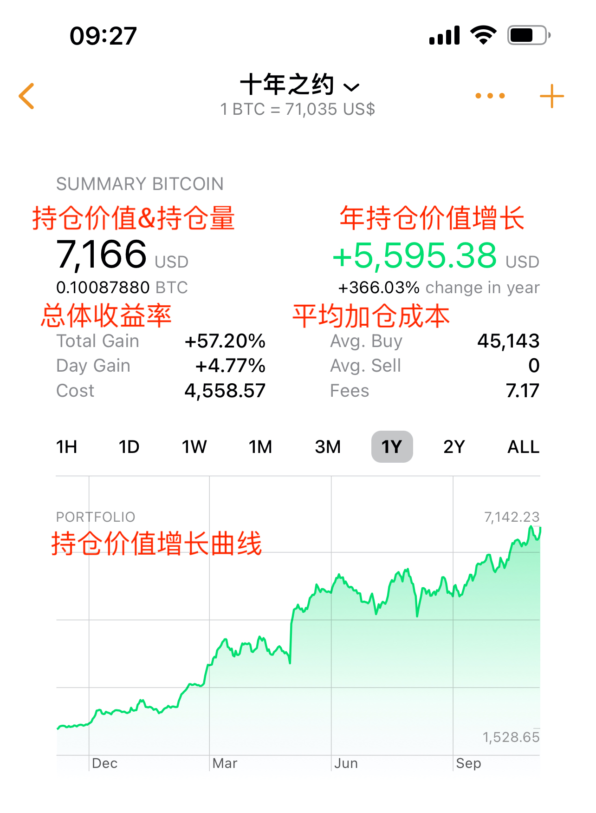

# 大选日，7万刀，1000万聪——十年之约＃35（ROI 55%）

美国大选日如火如荼。特朗普的选举人票暂时领先，市场给予了强烈的呼应。BTC扶摇直上，冲破7万刀，一度站上71k。请注意市场风险，如果后面计票数据有变化，可能会出现剧烈波动。

今天正巧是“十年之约”实盘见证计划的第18个月，第35次报告，第24次加仓，也是11月的6号加仓日。于是按纪律执行加仓，刚好撞到了冲高高点，加在了71146.6刀（18个月以来最高买入价），高位接盘。

这就是人生。不如意事常八九，可与人言无二三。

本次加仓是一个里程碑。本次加仓后，十年之约仓位的持仓量终于突破了1000万聪（即0.1 BTC）这个整数关口。这是过去十八个月以来辛勤积累储蓄所得。平均持仓成本45k，收益率(ROI) 55%。

有人总是空谈什么“BTC太贵，我的钱太少”之类的话。其实合抱之木也是生于毫末，九层之台也要起于累土，千里之行关键是始于足下。跬步前行，也能致千里之远。溪流汇聚，也能成大江大海。沙土积累，也能起万丈高楼。

同时，实盘数据显示，以50%储蓄率(SR)行此八字诀囤BTC法，仅十八个月，财务自由进度已经超过10%。模型和参数的具体解释，还请参见2024.10.6教链文章《月薪5000工薪族的财务自由计划》。

10%虽然只是一个小小的开始，但是却像浓雾中隐约可见的灯塔，指示和确认了船儿的航向，给人以信心的鼓舞和希望的温暖。

无论BTC年内如何跌宕起伏，看着持仓价值的稳步增长，内心就总是会充满了稳稳的幸福感和安全感。宁静，恬适，听花开花谢，看溪水流觞。

禅坐静思。世间一切人或人组成的组织，既有可能支持你、帮助你、保护你、原谅你、包容你、照顾你，也有可能利用你、离弃你、背叛你、陷害你、压迫你、收割你。人本是佛魔同体。组织虽可以具有神性，但具体办事的，仍然是具体的人。是人，就必是一面佛性，一面魔性。

带着强大神性光环前来办事的人，如果现了魔性，那将会比一个平凡的人现了魔性更为可怕。解决方法只能是博弈论——你作为弱小一方，拥有足够制衡魔的力量。而BTC，就是赋予你这种力量的神器。

社会是所有人对所有人的战争。为了和平，人们发明了很多社会建构和工具，封印人性中的恶魔。于是文明从此诞生。
