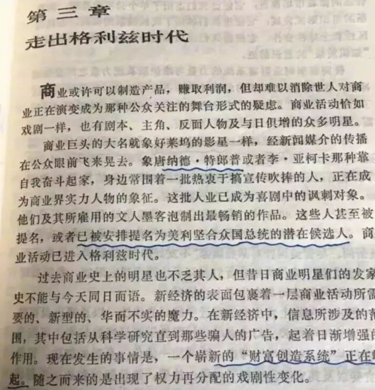

# 特朗普王者归来，比特币续创新高

昨早叫醒儿子起床的时候，我说美国要大选了。小家伙说，他觉得特朗普会赢。晚上接他放学的时候，我告诉他猜对了，特朗普真的赢了。小家伙很开心，比了个耶～

小家伙的BTC仓位是在68500刀附近建的仓（参阅2024.10.19教链文章《如何给孩子做财商教育》）。特朗普王者归来，比特币续创新高，当日即冲上75000刀。至今晨续写传奇，继续攀升，一度站上76000刀。简单估算，小家伙的“特朗普交易”已经浮赢超10%。

教链说过，比特币从不辜负每一个不辜负它的人（2023.4.15文章视频）。历史新高，意味着在此之前任意时间、任何价格买入的仓位，都转入盈利，不再亏损。近16年来，BTC一再证明、反复证明并且必将继续证明：只要你信任BTC，BTC就对得起你的这份信任。

近4年前，恋恋不舍地离开白宫的特朗普有些落寞，有些不甘。毕竟从未有闻，地球最强国家美国的最高统帅，竟然被一家公司、一个小小推特平台封杀账号，还要被杀人诛心的水军宣传成丝毫不违反美国宪法言论自由的精神。教链在2021.1.20文章《推特封杀特朗普的是与非：比特币、抗审查性和货币自由》中对辩经者的谬论进行了逻辑上的拆解。

虽然彼时的特朗普并不支持BTC，但是BTC如心有灵犀一般，在他离开的当日下跌，似乎是路见不平、无声控诉。2021.1.21教链文章记录道，《特朗普和平交权，比特币先跌为敬》。

彼时的加密行业，自欺欺人地把特朗普的离开解读成利好。很快，新任SEC主席Gary Gensler就开始了他对加密行业的四面出击。2021年中旬，SEC就对DeFi/DEX龙头项目Uniswap (UNI)发起了调查。调查迟迟无果。到了今年2024年4月，SEC更是步步紧逼，直接给项目背后的开发公司Uniswap Labs发出了韦尔斯通知（Wells Notice）。教链替大家把这一笔笔账都记着呢。2024.8.30教链在文章《疯狂的SEC》中总结道：

「现在的SEC，已经成了加密行业发展道路上的一块绊脚石，压在加密行业身上的一座大山。……

「11月的美国大选结果，或许会在这方面带来一些变数和希望。

「加密行业需要支持那个能够把Gary Gensler撤职的候选人。」

如今，特朗普冲破重重艰难险阻，躲过射向他的子弹（非比喻意义上的！见2024.7.14教链文章《子弹射向特朗普，却杀死了熊市》），以天命之人的形象，重返属于他的白宫。加密行业的春天，BTC距离开启第二超级周期更近了一步（参阅2023.12.5教链文章《2024减半之辩：涨幅消退或者超级周期？》，2023.9.18教链内参《第二周期，超乎想象》，2024.10.17教链文章《大突破：BTC反幂律增长的另一种猜想》）。

而且，特朗普将不仅成为美国历史上继第22任和第24任总统克利夫兰（Grover Cleveland）之后第二位下台后重新上台的总统，而且成为继美国第32任总统罗斯福（FDR, Franklin D. Roosevelt）之后首位将分立的三权，即行政权、立法权、司法权三大权柄重新集于一身，拥有接近“皇帝”般至高无上、为所欲为的权力的总统。

罗斯福总统连任了四届，史无前例，后无来者。也许，说不定，此番归来，特朗普和共和党深耕四年，可以修订一下修正案，让特朗普干完这届之后，再干两届，比肩罗斯福，超越罗斯福。同时，共和党通过体制改革，实现对美国的永远执政（即确保大选必胜）。

历史走到了一个岔路口。特朗普误打误撞，成了美国工人阶级的代言人。

曾经充满梦想、世人向往的美国，被身份政治、觉醒病毒这些乱八七糟的玩意儿搞得乌烟瘴气、撕裂堕落。特朗普要治愈当今美国的伤痛，要找回曾经的美国梦。甚至，他本身从商界到总统的不懈努力和传奇经历，就是美国梦最好的体现。

穷人可以没有钱，但不能没有希望。美国梦，让每一个美国穷人不会觉得自己是被压迫被剥削的无产阶级，而只是一个暂时落魄的百万富翁。美国梦，更重要的内核是，努力，坚持努力，不惧他人的嘲笑坚持努力，最终一定会梦想成真。

未来学鼻祖、世界著名未来学家托夫勒（Alvin Toffler, 1928-2016）在其气势恢宏的“未来三部曲”之中一部，出版于1990年的《Power Shift（权力的转移）》一书中，就已经记载了特朗普开始为成为美国总统而努力奋斗。虽然，如托夫勒所写，当时的他「已成为喜剧中的讽刺对象」。

那可是1990年！34年前！

像每个人一样，当你想干点儿什么和身份不符的“出格”的事儿，必定会遭受到周边人们甚至社会大众的冷嘲热讽。就拿鼓起勇气投资BTC这么个小事来说，很多人都要迫于周边人的社会压力而不得不放弃。这个是有统计数据支撑的，教链在2024.11.2文章《天敌》里曾经介绍过，性格分析发现，现阶段的BTC持有者大多是不喜社交性格的人，而不是重视社交关系的人，原因想必就是前者能够克服社会压力而“固执己见”。

可想而知，1990年前后，40多岁的特朗普，作为一个商人身份，竟然敢做起上位美国总统的春秋大梦，难怪会被全社会疯狂嘲笑，“成为喜剧中的讽刺对象”。

他放弃了吗？他没有！他无惧别人的嘲讽，坚持不懈地向着自己的梦想前进。终于，2017年1月20日，特朗普在华盛顿宣誓就职美国第45任总统。

而托夫勒，没有能够亲眼见证这一奇迹的发生。2016年6月27日，托夫勒就已经在洛杉矶抱憾长辞。

即便是已登大位的特朗普，仍然遭受到传统政客、背后老钱及其控制的大众媒体的持续嘲讽和打压，并在换届选举中被赶出了白宫。

他没有屈服，没有灰心。他重燃斗志，继续参选。他被诬有罪，承受诋毁。他直面死亡，躲过子弹。他奉天承运，王者归来。

这一切，不是一蹴而就，而是长达三四十年不懈的努力和奋斗。而美国梦，就是这一切的努力奋斗终得回报。

他，成为“美国梦”的最佳代言人。

一切压制他的和阻挠他的东西，一朝突破，就统统从阻力位反转为支撑位，成为未来为他所用的力量。这是对人定胜天极好的诠释。

站在太平洋对岸的我们，只需尊重美国人民的历史选择。我们无需赞美特朗普。他也不需要我们的赞美。

特朗普归来了，中文社区的某些人如丧考妣。这里面，一部分是为民主党哭坟。但说实话，任何一个家里有娃的爷爷奶奶、爸爸妈妈、外公外婆都不会支持民主党搞几百个性别、立法让小孩子可以不经家长同意就做变性手术那套玩意儿。而另一部分则是表面上装作忧国忧民，大谈特朗普的经济政策将会令我们的日子雪上加霜。这些人就是得了小布尔乔亚知识分子不接地气的幼稚病和软骨病。

中国的国家富强和民族复兴，绝不是依靠在谁当美国总统上面的。中国人民的幸福生活，靠的是每位劳动者数十年如一日的勤劳和努力去创造。

为什么很多中国人民群众对满满敌意的特朗普反而更有好感？就是因为有骨头的人只会尊敬有骨头的人，为梦想坚持不懈的人也只会尊敬为梦想坚持不懈的人，哪怕他是对手。

早在2021.1.21文章《特朗普和平交权，比特币先跌为敬》的末尾，教链就如此写道：

「我们可以肯定的是，无论是谁当美国总统，都阻挡不了比特币的崛起。正如无论是谁当美国总统，都阻挡不了中国崛起那样。」
