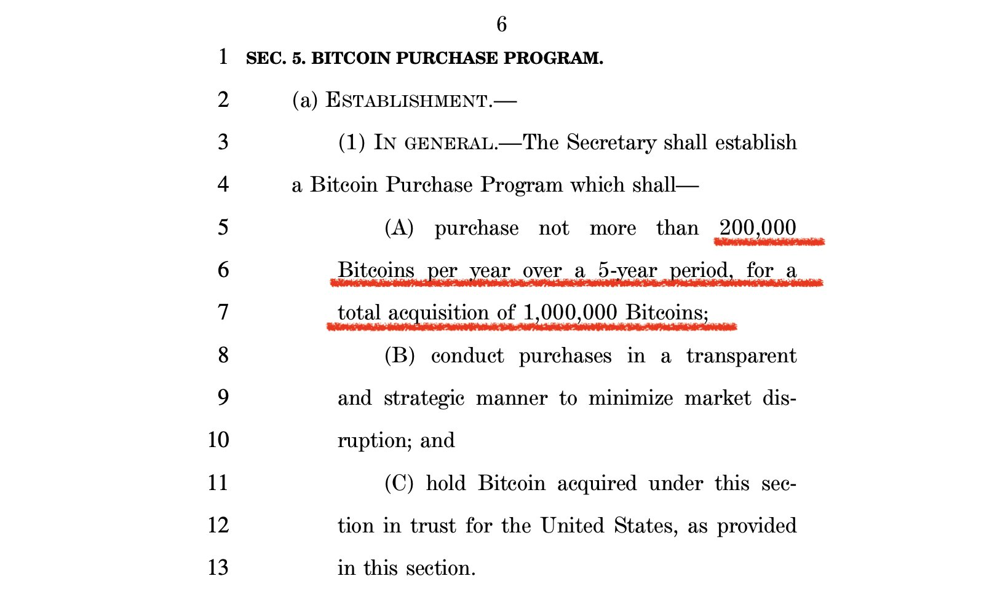
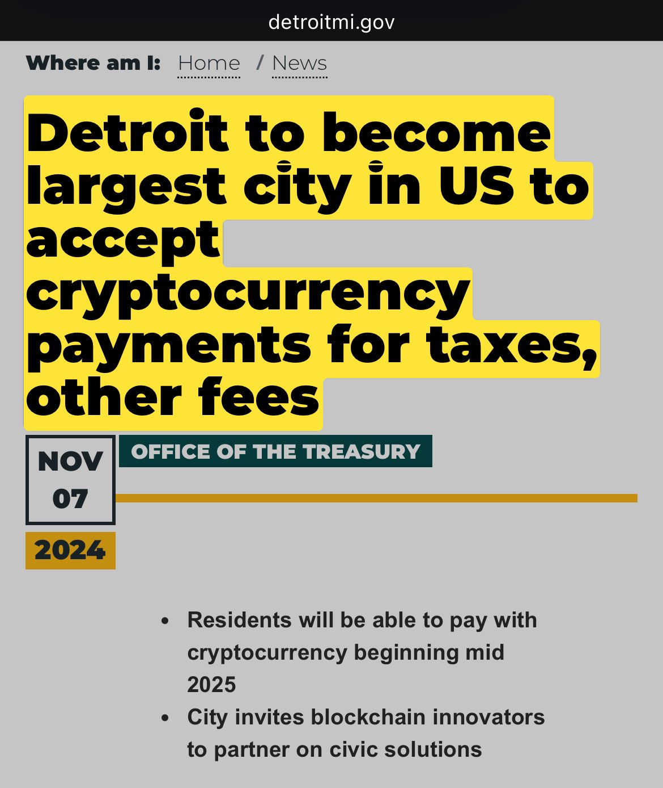

# 美联储如期降息，鲍威尔拒绝辞职

隔夜BTC继续发力，站上76k。多空双方围绕这条战线展开激烈争夺。

因美国大选，美联储11月议息会议推迟一天召开，今日凌晨才公布决策结论：如期降息25bp。联邦基金利率降至4.5-4.75区间。没有意外。

虽然市场前瞻当选总统特朗普的政策主张或将推高通胀，这料将对美联储的降息路径形成阻力，但是美联储还是坚定不移地进行了降息，而没有进行预防性地暂停和观望。

不过，在会后的FOMC声明中，11月的文案相较于9月，删去了半句话：

9月：The Committee has gained greater confidence that inflation is moving sustainably toward 2 percent, and judges that the risks to achieving its employment and inflation goals are roughly in balance.
委员会对通胀正稳步向2%目标迈进的信心有所增强，并认为实现其就业和通胀目标的风险大致平衡。

11月：The Committee judges that the risks to achieving its employment and inflation goals are roughly in balance.
委员会认为实现其就业和通胀目标的风险大致平衡。

删去了信心，那就是暗示没有信心了。

作为共和党人的美联储主席杰罗姆·鲍威尔（Jerome Powell）无视大选前特朗普对他的隔空喊话，在9月份大幅降息50bp，推高了美股，客观上为民主党的选情提供了支持。因为据统计，美股选前上涨有助于执政党派连任，否则有助于在野党派翻盘。

但是，很多统计规律在特朗普面前都失效了。他似乎专为打破常规而生。

现在特朗普胜选，即将入主白宫。在今晨美联储FOMC会后记者会上，有好事者问台上的美联储主席鲍威尔：

> 如果新任总统特朗普要求你辞职，你会照做吗？

鲍威尔面无表情地从嘴缝里挤出一个单词：

> No.（不会）

再问：

> 总统是否能够依法将你解雇？

再答：

> No.（没有）

根据1913年联邦储备法案，美国总统的确无权解雇美联储主席。他只能等后者4年任期届满，然后不予续用，而是提名其他人来当。但是，被提名人只能在FOMC委员中挑选，而委员的任期长达14年。

现任美联储主席鲍威尔是在2018年由特朗普提名的。2022年由拜登提名连任。所以，即便特朗普想换掉他，也必须忍耐到2026年5月。

有美国网友支招说，特朗普可以釜底抽薪，大力发展比特币，把比特币变成法定货币。

这位美国网友可能忘记了，肯尼迪总统脑洞大开的历史。

1963年6月4号，肯尼迪总统签署了11110号行政令，要求美国财政部以白银为支撑直接发行货币“白银券”，意在夺回由美联储背后的金融集团控制的货币发行权。

仅仅5个多月之后，1963年11月22号，肯尼迪总统被刺杀。此后短短三年，18名关键证人相继死亡，其中6人被枪杀，3人死于车祸，2人自杀，1人被割喉，1人被拧断了脖子，5人无原因死亡。从1963年到1993年，115名相关证人在各种离奇的事件中自杀或被谋杀。

中国民间有句俗话叫做，断人财路，犹如杀人父母。事实比这话更严重。杀人父母，还能握手言和。断人财路，必须你死我活。

比特币的发明者中本聪为什么从一开始就使用假名，抹掉一切痕迹，并匆匆消失于人世间？因为他太清楚了，如果将来比特币成功了，他将会面临巨大的危险。这危险并非是来自于善良的普通人所以为的主权政府和监管机构，这些至少都是站在明面的。最大最可怕的，其实是站在暗面的全球金融资本集团。他们神挡杀神，佛挡杀佛，美国总统不从其意志亦可斩落马下，何况一个小小中本聪乎？

明枪易躲，暗箭难防。

所以中本聪不能有肉身。它必须成为一个抽象的、完全数字的化身。肉身不能拷贝，被杀死就被消灭了。而数字化身可以无限复制，中本聪的故事、思想和理念永远流传，甚至最后，人人都是中本聪。只有这样，才足以对抗一切暗黑力量的索命之恶。

中本聪不是消失了。中本聪是把自己融入到了亿万民众之中了。

美联储的至高权柄，不在三权之内，而在三权之外。

终结美联储的行动已经开始。

参议员Lummis正在推动一项法案，让美国政府在未来5年内，每年购买20万枚BTC，直至达到特朗普选前所讲的100万枚BTC国家战略储备。

底特律正在考虑接受加密货币支付税款。

星星之火，正在燎原。

以美总统一人之力，纵使付出生命代价，也难以撼动传统金融利益集团分毫。

但若能唤醒和发动1亿美国人、2亿美国人，就有望掀了老钱们的桌子。
