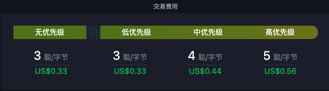
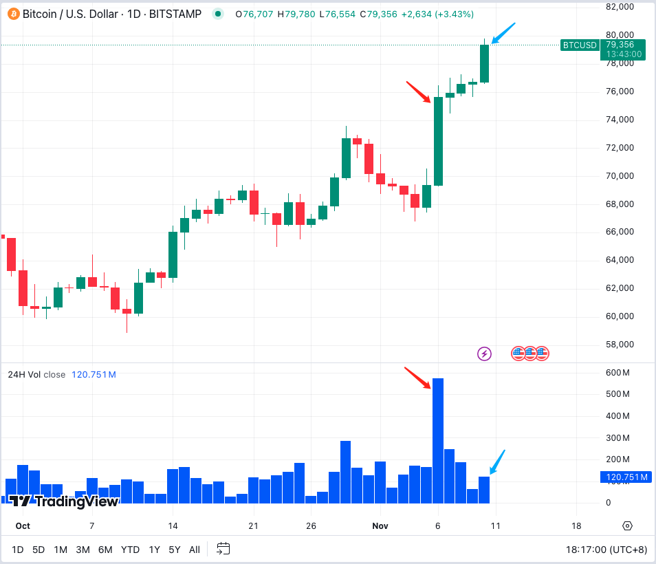
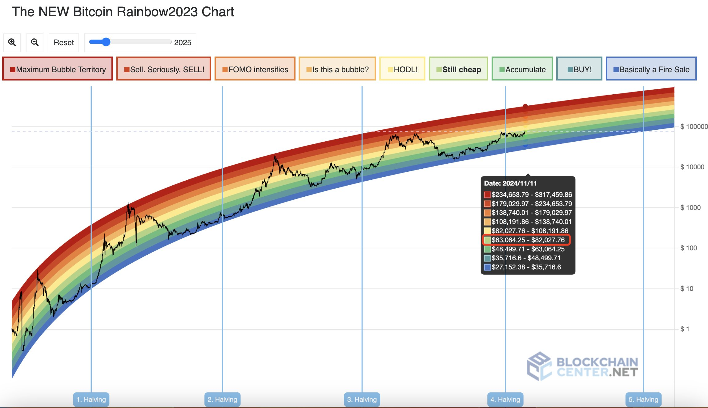
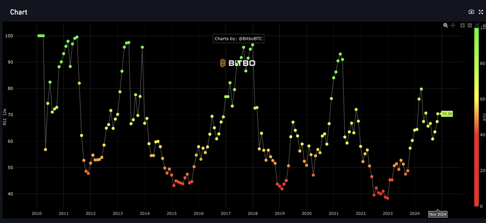
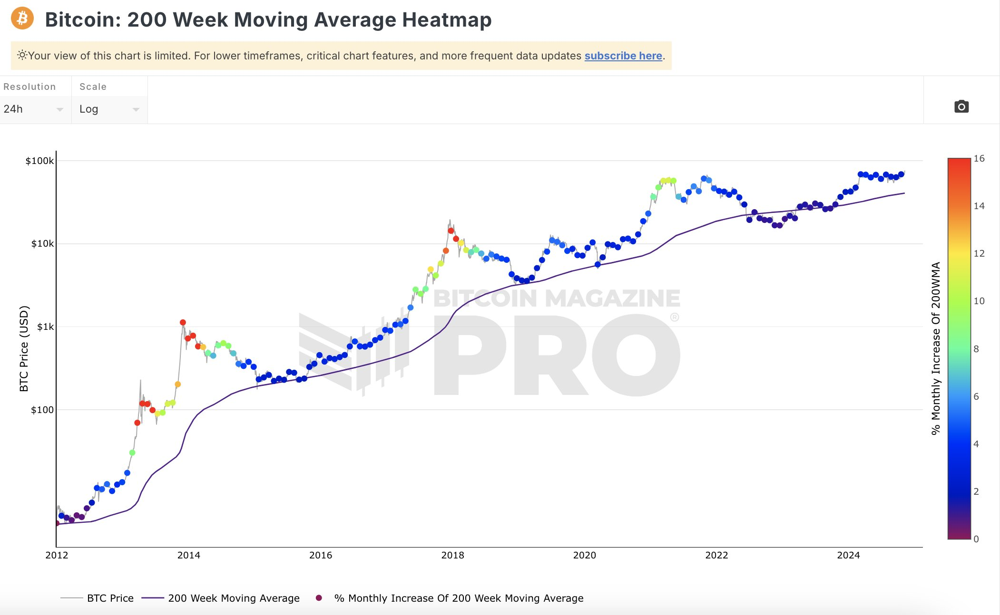

# BTC冲击8万刀，沉默是今晚的康桥

BTC在6号大选日爆发之后，稍事休整，至今日10号骤然发力，从75k以迅雷不及掩耳之势向上突破，强势撕开79k防线，向8万刀重要整数关口发起冲击。

但是，我们并未感受到市场的热闹。链上也依然冷清。矿工费率低至3聪/字节，一笔普通转账仅需约0.33刀，显示出链上交易的不活跃。

这与K线图里的缩量上涨遥相呼应。和6号的放量大涨不同，10号的急涨却没有放量。典型的缩量上涨。

教链说，缩量上涨，最为致命。

BTC的冲锋，把多头和空头都给看沉默了。

市场鸦雀无声，刹那安静。静静的是告别的音乐。夏虫为之沉默，沉默是今晚的康桥！

持币看多的多头，不是在半年震荡下跌洗盘中割肉割光了，就是在大选前的不确定性中空仓避险了，或者在特朗普胜选后的暴涨中早早止盈清仓了。总之一句话，没有仓位了。没有仓位了，被甩下了车，只剩无言的沉默。

看空开空的空头，屡空屡爆，屡爆屡空，誓不服输，哪怕剩下最后一个子儿的保证金，也要开空赌利好出尽，可是等来的，却是再一次的猛拉爆仓。寥寥几次爆仓，就亏光了全部的家当，看着一骑绝尘的大饼(BTC)，空悲切，只有无语的沉默。

教链说，空头不死，暴涨不止。

遥忆大饼2020年末，空头一路头铁不断做空，爆了再开，开了再爆，爆了再开。大饼就一路向上猛冲爆仓，迅速干到5万多刀。

羽扇纶巾，谈笑间，樯橹灰飞烟灭。

8万刀，牛市开始了吗？开始了——如果用突破上轮周期前高为“开始”的话。

8万刀，牛市开始了吗？没开始——无论是市场热度，用户活跃度，山寨板块轮动，新韭菜进场的热闹程度，都还没有看到牛市的样子呢。

从彩虹图上看，BTC现在还处于低估区间。

RSI指标则显示，对BTC的超买刚刚开始。

从200周均线图上来看，目前市场还处于冷静期，远未到狂热期。

而2年均线乘数条带显示，现在还在中轨偏下的位置蓄势待发呢。

系紧安全带，坐稳扶好，千万别被甩下车。也许接下来的加速度，才是真正令人眩晕的超凡体验呢。
