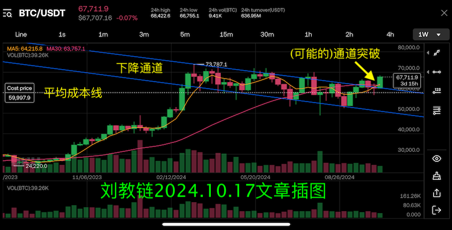

# BTC开启8万刀新时代

隔夜BTC一骑绝尘，吸血式上涨，强势破开8万刀城门，到今日早间已站上81000刀！从5号到11号，短短6天，从7万刀到8万刀，整整拉升了1万刀。再愚钝的人，应该也意识到，突破真的来了。

2个月前，BTC刚刚回复6万刀时，教链在2024.9.14文章《BTC重回6万刀，钟慢效应显现》中就画了这个图，说了这个话：

> 现在我们唯一需要期待的，就是BTC跟上黄金的步伐，在2024年底或者2025年初，走出决定性的右侧突破。这一突破，势将气贯长虹、石破天惊！为什么？因为这一次右侧突破，乃汇聚了两轮周期的力量。

1个月前，BTC还不到7万刀时，教链在2024.10.17文章《大突破：BTC反幂律增长的另一种猜想》中又画了这个图，说了这个话：

> 10月14号开启的这根本周K线，很有机会成为今年初以来所构筑的下降通道的、向上的决定性突破。拉远一些，视野放大，会看得更清楚。…… 目前，我们也许正处于本轮快牛周期启动的前夜。只差临门一脚。

今天，11月11日，BTC站上81000刀，2个月、1个月前的预见，都已变成现实。只不过，彼时彼刻，又有几人愿听这高山流水、伯牙子期之音呢？

此情可待成追忆，只是当时已惘然！

教链说，当BTC突然暴涨时，人会被石化，根本无法上车。

俗话讲得好，机会总是留给有准备的人。可是太多人，理解不了这句人生智慧。他们不知道提前准备，不愿意提前准备，看不起提前准备，最后，当BTC突然暴涨，他们已经来不及进行准备了。

教链说，坚持定投，逢跌加仓。

这就是提前准备的八字诀。唯有仓位才能抓住暴涨，唯有准备才能抓住机会。准备的窗口期，不是1个月，不是2个月，不是半年一年，而是足足2年！

早在2年前的2022.12.6，《刘教链2022年年终报告》中，在BTC深陷于16000刀左右的熊市低谷期的哀鸿遍野中苦苦挣扎的时候，教链就笃定地如此写道：

> 今时今日，比特币所处的16k-17k的价格，也许大致相当于2015年底的230美元，或者2020年“312”熔断低点下方的5000美元。…… 至2023年底，我们也许会看到不低于25k、不高于69k（前高）的比特币。在2024年底之前，比特币有望回升至4-10万美元的区间。如果在2025年前后我们能够迎来下一轮牛市的大泡沫期的话，我们可能有机会看到比特币从10万刀下方迅速取得突破，并势如破竹，挑战40-50万美元的周期上限。

在教链写下这段话的小一个月后，2022年12月底，BTC年度收盘于16595刀。

在教链写下这段话的一年多之后，2023年12月底，BTC年度收盘于42457刀。

在教链写下这段话的小两年之后的今天，2024年11月11日，BTC开启8万刀新时代，站上81000刀。

一切尽在不言中。

看着BTC按照预期稳步成长，就像看着自己家的娃越长越高一样，内心充满无声的喜悦之情。

是的呀。做父母的都知道，岁月青葱，烟火流年，日日如常不经意，时光从指缝间滑过，在某个阳光灿烂的午后，忽然意识到，娃竟然不知不觉地长这么高了！

不是一样的感受么？不敢想，仅仅不到2年前，2022年底，BTC才16000刀。现在竟然已经81000刀。长高了400%！

和娃一起走在路上，黑夜的路灯照在我们的肩上。我让大娃算一下这道数学题：假设在2年前BTC不到16000刀投下去100万，拿到2年后的今天，会变成多少？

娃很快就算出来了，500多万。

正确。我不由得感叹了一下：要知道，这可是仅仅2年的时间。从100万到500万。

娃接过话：平均一年赚200万，一个月近20万。

二娃和我一起躺在床上，心里盘算着自己的仓位赚了几块钱。盘算着盘算着，小家伙忽然悲从中来，说，“我出生的太晚了唉！”

我问他咋了，赚了还不开心？

他说：我本金太少了。唉，富人赚钱总是比穷人更容易！富人本金比穷人多，同样的上涨，富人赚的钱比穷人多。

我安慰他说：你还小嘛。等你长大了，就可以赚钱积攒本金，然后肯定会有属于你的机会的。

我继续劝告他：不要把眼光放在过去。要看到未来。

娃还是不开心，逆反道：不。就要放在过去。

没一会儿，他就带着满心的不甘，进入了梦乡。

窗外，夜色微凉，月光倾泻，大地锁清秋。
