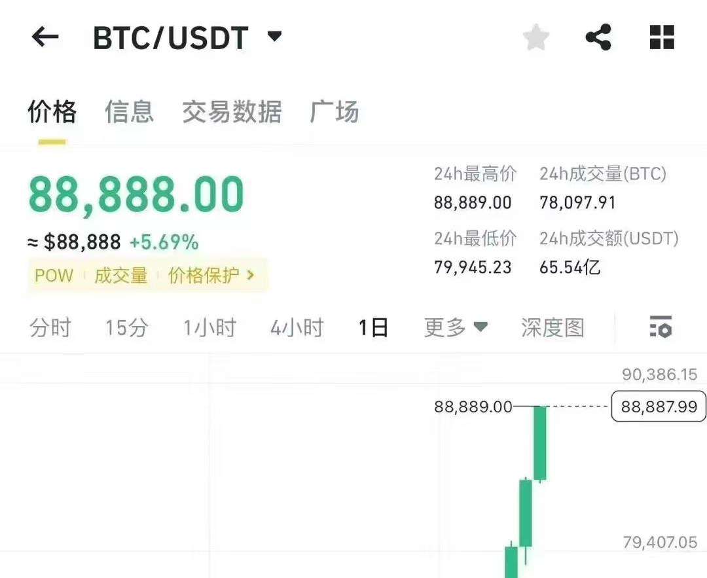

# 疯牛

一觉醒来，BTC冲上了88k，一度站上89.5k，9万刀已经触手可及。教链写文章的速度已经跟不上价格上涨的速度了。

就说昨晚内参《11.11教链内参：开局即王炸，BTC攻上84000》吧。晚上八九点起笔的时候，BTC才82k，写的是BTC攻上82k。等11点多写完准备发出时，发现BTC已经84k了，只好改成攻上84k发出。早上起床一看，已经88k了。

教链的心中却没有大的情绪，只是充满了如水的宁静和淡淡的幸福。似静坐在一湖池水旁，微风吹过，水面泛起涟漪。深秋的叶，红的红了，黄的黄了。风吹过，叶落水上，随波追流。阳光洒在水面，波光粼粼，映出晴空的倒影。晴空万里，有鸟儿飞过，欢快的叽叽喳喳声，那是大自然的恩赐。

教链说，熊市才是建仓良机。

熊市许的愿，牛市会实现。牛市嘛，就是用来实现一切愿望的——前提是，在熊市建好了实现愿望所需的仓位，在冬天埋下了发芽的种子。

种子的生根发芽，长成参天大树，皆拜自然之伟力。我们自己能做的，只是微不足道的工作——播种，适时地播种。

教链说，成功是运气，失败是实力。

认知再怎么提高，还是得借助运气才能成功。切莫贪天之功。

而失败就简单多了。大部分时候是认知不够。

一早朋友发来88888的截图，恭喜发财。教链的思绪被拉回2018年底、2019年初，与三五好友畅聊BTC的时候。印象中当时BTC大约在3500刀上下。短短6年时间，人是物非。BTC成长了25倍，已远不是当初的那个BTC。

教链重新翻了翻2018-2019年的投资笔记，亦难掩唏嘘之情。

6年前许下的愿望，今日已经实现。那就是，真金白银亲身入局，验证一个命题：普通工薪族储蓄BTC可以实现财务自由。

更重要的是，这是一个人人都可以复制的成功模式。

像教链这样一个普普通通的打工族，从身无分文的大学毕业生起步，在毫无根基的大城市里打工、漂泊，过着拮据的生活，在每日数小时的通勤和披星戴月的加班中燃烧掉青春，兜兜转转，终于在黑夜中摸索到了一条被微弱星光照亮的道路。

这照亮前途的，正是BTC的光。

走上正确的道路，靠着自食其力、节衣缩食、努力储蓄投资，只要不到两轮BTC周期（6年 < 8年），真的可以翻身上岸，打开通往人生梦想的大门。

教链这样的普通人能做到，相信每一个人只要努力也都能做到。

不求大富大贵，但求此生自由。自由地追梦，无拘无束地遨游于天地之间。

谢谢你，BTC。
