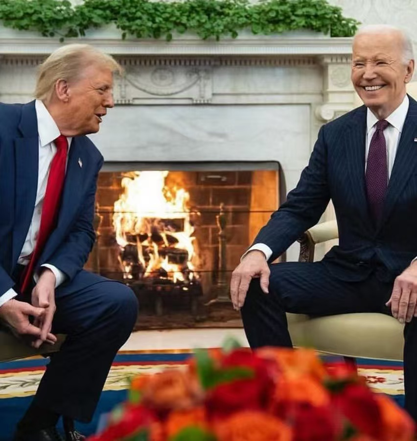

# 9万刀，九九归一

昨晚教链在写《11.13教链内参：美通胀符合预期，BTC再次冲击9万刀》时分析道，看这盘面，第一，或再次冲击9万刀，第二，随时向5日线回归。

内参刚发出后，第一条就应验了。BTC成功冲破9万刀，沿着惯性方向最高冲上93k。子夜无人入睡。

一觉醒来，第二条也应验了。BTC从93k开始回撤，跌破9万刀，最低跌穿88k。作势向5日线86.5k回归。健康的回调。

站在9万刀的历史高点，回望过去，“一览众山小”。

小山，没爬过还可以再爬。过去，过去了就永不再来。

从前 现在 过去了再不来 / 红红 落叶 长埋尘土内 / 开始 终结 总是没变改 / 天边的你 飘泊 白云外

[歌曲：卢冠廷 一生所爱]

人生漫漫，经此数年，BTC真的是让我们学到了太多、太多。经验，教训，都是对人生的领悟。

人这一辈子，抓住一两次机会，足矣。

可是为了真正抓住、抓牢这一两次机会，我们又要走多少弯路，经受多少迷茫、无奈、屈辱和不甘。

教链收获的最大教训是：把钱放到什么地方，投到什么资产或者事业上，真的是有巨大的机会成本存在的。

BTC就是那把测量机会成本的最严格的尺子！

教链暗下决心：余生只做减法。

“只做减法”，当然是一种努力的决心。什么车子、房子、家具、服装……，一切世俗之好，都是消耗自身能量，拖累人生幸福的身外之物。

身外，减去赘物。身上，减去赘肉。社交，减去赘人。仓位，减去赘币。

每一轮牛市最大的教训几乎都是，一赚就上头，上头就瞎投，瞎投就丢掉好不容易积累的BTC……

能量聚敛，内心光明，百毒不侵，神清气爽，身轻如燕。老子问曰：「专气致柔，能如婴儿乎？」（《道德经》第十章）

人生随欲望而发散，随觉悟而聚敛。舍九九而归一，归于BTC。私钥记于心，而与己身融为一体。不再为世间一切名利所累。一丝不挂，赤条条的，复归于婴儿。

教链说，比特币就是历史，而且是一部世界史。

人世间几多风雨春秋，悲欢离合，获得和失去，喜悦和泪水，战争与和平，都凝结在了区块账本里的一笔笔转账数据里，凝结在了BTC永不消逝的价格跳动中……

百年之后，人们也许会忘记，2024年那场惊心动魄的美国大选，忘记拜登总统戴上MAGA小红帽，以及与当选总统特朗普在白宫围炉谈话，其乐融融，但是人们永远不会忘记，2024年11月中，BTC一鼓作气冲上9万刀。

BTC就像是古人在山洞岩石上奋力刻下的笔画，向千年之后的后人无声地诉说着人类文明的进程。

无论是愿意或者不愿意承认，美国通过这次大选，完成了国内的重新团结。无论是愿意或者不愿意承认，特朗普冰释前嫌，破格提拔、重用了一大批八零后入阁担任要职，这是为美国建国248年后的奋力“中兴”注入年轻血液和新的动力。无论是愿意或者不愿意承认，独孤求败后陷入迷茫的美国正在试图重新振作精神，未来的世界不会是一个霸权轰然倒塌、另一个霸权取而代之，而会是多元化的新时代。

当下，BTC已经在用它的价格跳动，无声地预告着这一新时代的到来。

强大的外部压力甚至是阻力并不是坏事。种子顶开压在头顶的石头顽强生长。鸟儿借助空气的阻力和升力展翅翱翔。民族国家在面临强大对手围追堵截时最能同仇敌忾、主动改革、不懈奋斗。BTC在日复一日、年复一年的批判、质疑、封杀、嘲讽、唱空中不断向上，指数级增长！

有一种批评BTC的声音说，BTC是法币的掘墓人，它是文明的破坏者。

错了。这样想的人，对人类文明进程的理解太狭隘，目光太短浅。

马克思早已为我们指出，国家不是文明的终极形态。随着人类文明的发展，国家是要消灭的。

法币，与其说是货币，不如说是政治，是政治意志的产物。

民族国家之所以建构，不过是因为我们人类的狭隘，暂时无法容忍外族人同居一个屋檐下，总是怀着“非我族类，其心必异”的警惕心罢了。

当将来的将来，人类社会世界大同之时，民族国家解体，谁也不需要再借助法币来将自己的政治意志强加于他人。

九九归一。到那时，形形色色的法币便会与国家建构一同自然消亡。全人类只需要一种超越政治意志、超越意识形态的，纯粹基于人的共识的真正货币：

比特币。
