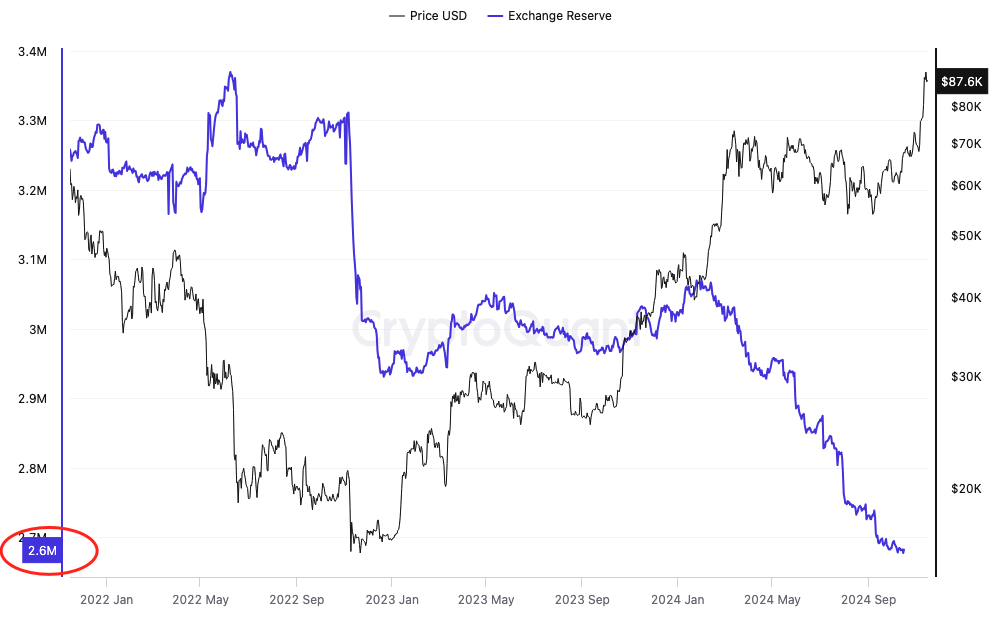

# 很快全世界都会意识到BTC的妙处

经过连续几天的狂飙突进，BTC终于成功回踩5日均线，把沿5日线止损的家伙给赶下车，目前暂居88k。这非常好，给过热的市场泼盆冷水，降降温。每次BTC把市场热度带起来之后，鸡啊狗啊的就开始纷纷升天，一夜之间冒出来数不清的模因币晒单者，不是赚A8就是赚A9，你要是赚个A7都不好意思晒出来。交易所也是不顾节操，什么火上什么，甚至就是它们在拱火，借着新闻热点，制造暴富梦，吸引韭菜丢掉BTC去炒模因币，然后瓮中捉鳖，一网打尽。

有人言之凿凿地说，这一波突破前高的暴涨，是有若干个国家悄悄购入BTC所致。它们很快就要宣布，建立BTC国家储备。意图也很明显，就是抢跑，抢在美国建立BTC国家储备前，提前抢筹建仓。

微策略公司创始人、超级钻石手Michael Saylor说，美国要建立BTC国家储备，按照特朗普最大化原则，应该囤积至少400万枚BTC。

教链听到这话吓了一跳，赶紧把目前全世界加密交易所的BTC储备数据翻出来一瞧，果真远远不到400万枚！你猜有多少？只有260万枚BTC！

好家伙。这要是老钻石手们不愿意出货的话，美国就是把目前全世界所有加密交易所里的BTC全部掏空，也凑不齐400万枚BTC。

这简直就是明牌博弈了。

你猜如果我越是知道有人想买，而市场上根本没有那么多货，我是更愿意卖给他呢，还是更不愿意卖给他呢？

肯定是惜售。

这就是卖方市场，待价而沽。看你能给出多高的价码咯。反正我不着急卖。

很快全世界都会意识到BTC的妙处。

教链用“妙处”而不用“好处”。好处是主观判断。而妙处则是客观特点。

对BTC有更深刻的认知之后，你就会意识到，BTC不是典型的满足供需关系定价的正常商品或者普通商品。

普通商品，满足基本的经济学规律：增加供应，价格下降；减少供应，价格上升。需求增加，价格上升；需求减少，价格下降。

反过来，价格下降，会抑制供应，增加需求；价格上升，会刺激供应，抑制需求。

归根结底，这些商品的使用价值是不变的。一块面包能满足的饱腹欲，不会因为它的价格是1美元还是10美元而有任何变化。

但也有些商品不满足这个规律，而是出现所谓反射性或反身性的现象。即，价格越高，需求越大，这又会进一步推升价格，从而形成一个正反馈循环；当价格崩溃时，也会出现价格越低，需求越低，价格进一步崩溃的循环。

房价和股价，虽然在基本面即提供房租和分红的层面上，受到供需关系约束，但是由于其金融化的性质，大部分时候，其大部分的价格，并不是供需关系的反应，而是为市场投机的反身性效应所推动。

如果把基本面抽离，那么我们就得到了最纯粹的、仅由市场投机反身性效应推动价格涨跌的商品——模因币。

比模因币更恶劣的，是假装有基本面但实际上已经被大股东掏空的上市公司股票。模因币只是愿赌服输的游戏，而垃圾股票是精心包装的诈骗。

为什么这一轮周期，韭菜们宁愿去炒模因币，也不愿意再去碰那些项目方和VC（风投）大量持仓的山寨币、VC币？因为VC币就是币圈的垃圾股呀——项目方和VC大量持仓，那就是明晃晃高举的镰刀，“黑手高悬霸主鞭”。

再笨再蠢的韭菜，2017-2018被割一回，2021-2022再被割一回，事不过三，怎么也该学聪明一点了吧？难道2025-2026还要再去被项目方和VC割一回吗？所以韭菜们要么就老老实实囤BTC，要么宁愿去模因币里pvp（人玩人），也不愿意去捧项目方和VC的臭脚了。

但是BTC与上述各类商品都不同。它其实相当独特。（教链注：经济学中还有一些独特的商品类别，如吉芬商品、凡勃伦商品(炫耀性商品)等，本文篇幅有限，不再展开论述）

首先，BTC不能用于直接满足人的生理需要或生产需要，即缺乏实用性。它既不能当饭吃，也不能当房子住，甚至不像黄金等贵金属具有一些工业用途。

大把经济学者把这个当作BTC最大的缺点。

教链却说这是BTC的优点。缺乏实用性，让BTC摆脱了普通商品的市场价格受到供需关系制约的规律。

其次，BTC不是生息资产，也不能满足人的金融需要，即缺乏所谓生产性。生产性，特别是金融产品的生产性，也就是剥削性——即不劳而获，简称躺赚。

巴菲特等真正的金融资本家很明白这个道理，所以主要批评BTC的就是这一点。

但是教链却认为，生产性金融资产的所谓基本面和估值模型，其实是一把双刃剑。基本面即提供了对资产价格的支撑，但也限制了资产价格的波动——价格总是会向估值模型所给出的所谓价值回归。

房价摆脱不了租售比这个基本面的约束。股价摆脱不了P/E这个基本面的约束。缺乏基本面，让BTC摆脱了一般金融资产的市场价格受到估值模型制约的规律。

最后，BTC也不是单纯的反身性资产。单纯的反身性资产如模因币，其价格运动规律就是单纯的庞氏螺旋。但BTC的价格运动，不是单纯的庞氏螺旋，而是价值发现的过程。这就是为什么模因币会归零，而BTC却总是能够在更高的水平上“再次崩溃”的根本原因。

大量的散户投资者分不清模因币和BTC的区别。幻想模因币会像BTC一样长久。这幻想是一定会破灭的。

教链说，BTC的价格越高，其作为价值存储和价值传输工具的使用价值就越大，更大的使用价值就会支撑BTC更高的价格，这是一个正反馈循环。

为什么？

因为BTC的正反馈循环，不是单纯反身性的“价格-价格”循环，而是“价格-价值-价格”循环。根本上，在于工作量证明（PoW），在于算力。

更高的价格，带动更多的算力部署；更多的算力，带来更高的安全性；更高的安全性，提高了BTC作为价值安全存储和安全传输的价值；更高的价值，支撑了BTC更高的价格。

这是一个价值建设和价值发现的双螺旋上升的过程。

很快全世界都会意识到BTC的妙处。

教链说的“全世界”，不单单是指散户、企业，而是指各个主权国家。

众所周知，1944年，二战结束前夕，美国拉着世界多国筹划战后秩序，建立了以美元为全球货币基础的布雷顿森林体系。

美国承诺，35美元挂钩1盎司黄金。国家贸易不用把黄金搬来搬去了，又慢又花钱。大家把黄金都存放在美国，换成美元。拿美元做生意，轻便好用。

但是美国失信了。它按耐不住偷偷超发美元的诱惑，印了比黄金多得多的美元出来。特别是，到了20世纪60年代，美国深陷越战泥潭，财政赤字飙升。美元已经很难与黄金保持挂钩了。

时任法国总统戴高乐对美国偷偷超发美元的行为很不满。1965年，戴高乐指示，法国外汇储备不再保留美元，而是直接要求美国换成黄金。戴高乐派出军舰，把存放在纽约的黄金运回了法国。

「1971年8月15日，美国第37任总统理查德·尼克松单方面宣布中止美元与黄金的可兑换性，史称“尼克松冲击”」——《比特币史话》第42话

不过，不是所有国家都有法国所处联合国五大常任理事国的地位和实力，也不是所有国家的总统都有戴高乐的手腕和能力。

2012年，阿根廷的经济形势不稳定，通货膨胀和外汇储备紧缺的问题加剧。为了增强国家金融主权并减少对西方金融体系的依赖，阿根廷政府决定将存放在国外的黄金储备运回国内。

阿根廷大部分黄金储备存放在英国伦敦的金库中，而阿根廷与英国的关系紧张（尤其是围绕马岛争端）。当阿根廷提出将黄金运回国内的请求时，遭遇了复杂的国际压力和阻力。

雪上加霜的是，运回大规模黄金需要复杂的物流和安保措施，涉及费用高昂、运输安全、以及国际保险的安排等问题。

最终，尽管阿根廷坚持要求运回黄金，但在多方面的阻挠下，计划未能顺利实施，大部分黄金储备继续存放在英国。

试想，如果阿根廷的国家储备不是黄金而是BTC，它还需要把自己的睾丸放在别人手里任人拿捏和羞辱吗？

对于有战略核导弹的大国强国，自然不用担心用任何资产作为国家储备，因为手握真理（武力）总是可以说服人。

但是对于五常之外的几百个大大小小的国家，如何才能获得金融自主，捍卫国家尊严？

很快他们都会意识到BTC作为国家储备的妙处。
