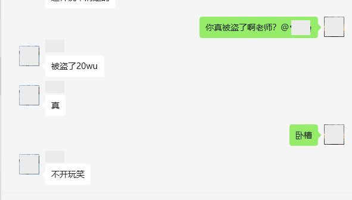
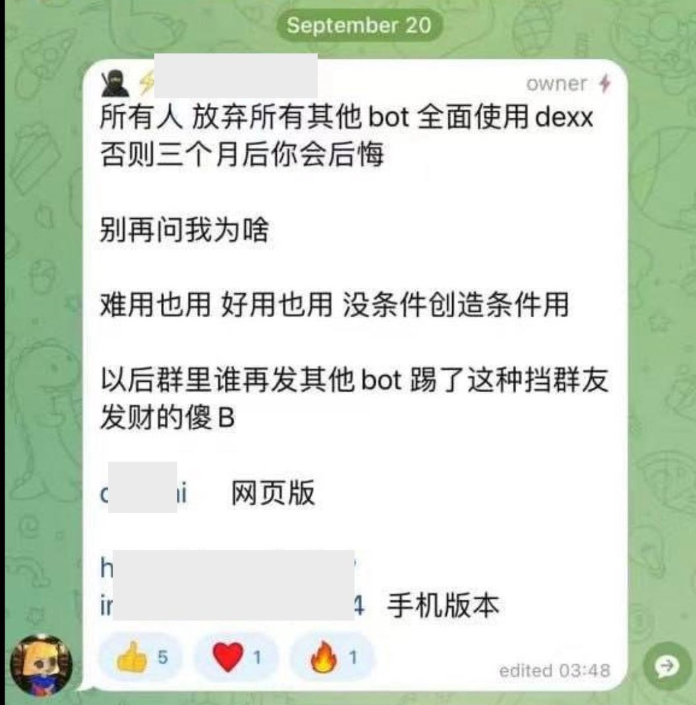
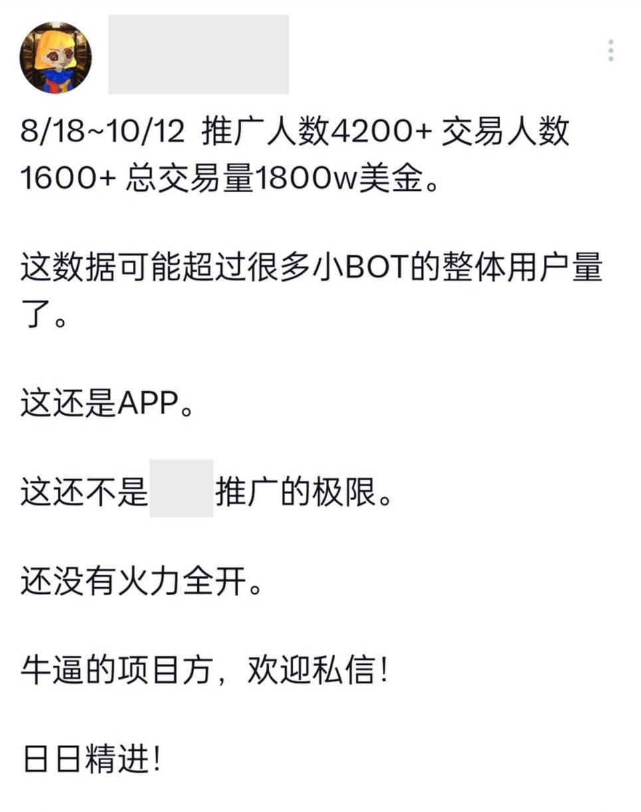
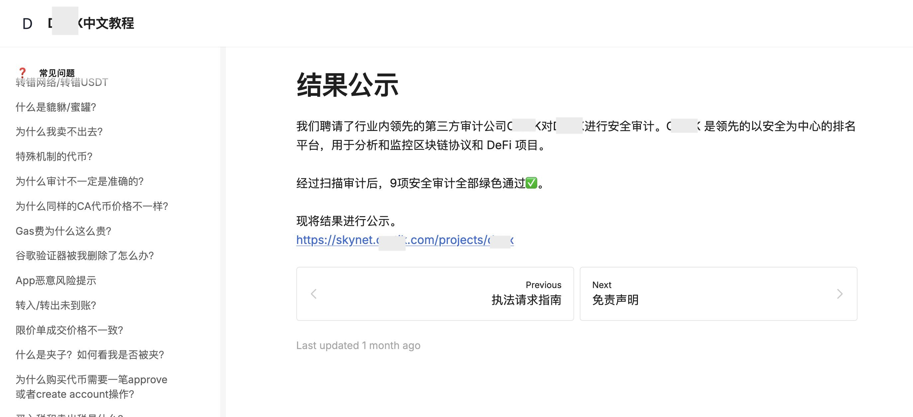
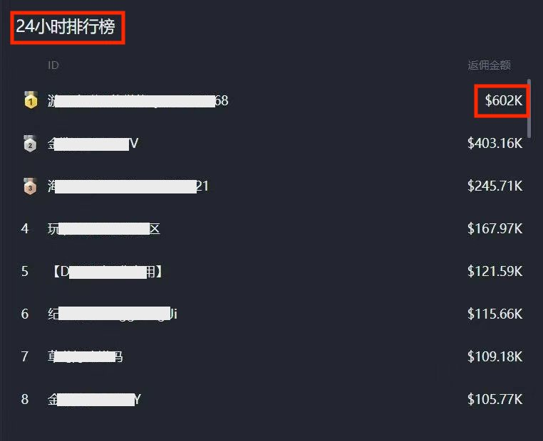
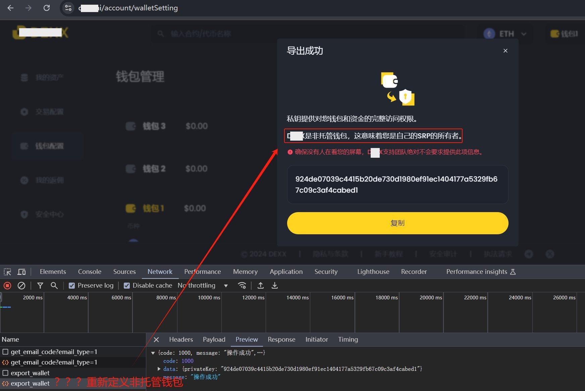

# Meme大军被一网打尽，炒币者资产一夜归零

周末BTC回踩5日线后继续缩量上攻9万刀，情况在昨晚内参《11.15教链内参：回踩5日线，再战9万刀》已经写过，不再赘述。

最近随着BTC右侧作出历史性突破，迅速点燃了整个加密市场的热情。自2023年以来炒了好几波的Memecoin，又译作模因币，再次死灰复燃，再次疯狂。

这个所谓的模因币，它不是一个币，而是一类币，一类纯纯的空气币。通常，它仅仅是借助一个热点事件的关注度，随便捏造一个与热点事件中的某个角色具有相似名称的虚拟币，而后操盘者大肆拉升价格，把关注度转化为投机资金的流量，炒热币价后，操盘者获利退出，把整个投机盘子甩给所有进场投机的人相互博弈，最后价格随着热点事件冷却直至被社会遗忘而逐步归零。

教链反复多次提醒过，不要拿辛苦积累的大饼（BTC）去玩模因币（Memecoin）。最后的结局大概率是丢掉了大饼。

这不余音犹在，炒模因币的Meme大军就被收割了，而且是以极其惨烈的方式被一网打尽，资产一夜归零。

隔夜今晨，大批在Solana等链上炒模因币的人还在睡梦中，忽然就听到手机传来资产转账的声音。睁开惺忪的睡眼，一个激灵，困意全消。自己在某个叫xxxx（此处隐去名字）的链上交易自动化工具相关的钱包地址中的资产被洗劫一空！

这次如此众多受害者，主要也是拜一大票所谓KOL（意见领袖）拼命拉人头推广所赐。

还有某某安全审计公司给他们出具安全审计报告，全部合格。这无异放松了所有人的警惕，放心大胆地使用，押上全部身家。

KOL为啥这么卖力拉人头呀？审计公司为啥要给出合格鉴定呀？当然是为了赚钱呀！

君不见，金牌“销售”的返佣金额都是以几十万美刀计的嘛？！

一旦出事了，曾经拼命推广的KOL迅速发帖撇清关系，审计公司马上删除了网站上评定合格的审计报告并发帖“辟谣”说他们没有审计过涉案的版本云云，主打一个甩锅。

资产归零的韭菜们呢？叫天天不应，叫地地不灵。天旋地转，六神无主，不知所措。

教链从来不接币圈的推广，为何？因为教链这些年见过太多，知道这里面水有多深。推广给的价码确实诱人，但是教链不想嚯嚯关注教链的每一位朋友。

因此教链就和加入星球的会员约法三章：不荐币，不带单，不推广。

教链说，如果某一天，诸位见到教链违反了约法三章，请立即取关并拉黑教链。

这次盗币事件中，最让教链觉得哭笑不得的，是这个被吹破牛皮的工具产品，竟然在安全上存在一些极其低级幼稚的错误。而就是这样一款漏洞百出的产品，竟然能得到某知名安全公司的全部合格的审计报告！

比如，声称自己是非托管钱包，其实私钥是存在服务器上的（这也是疑似本次被黑客一把薅光的重要原因之一）。还有人发现，私钥居然就大剌剌以明文方式在网络上裸奔传输。以及，有人提醒它的App会监听剪切板并偷偷上传，如果你曾经复制粘贴过助记词或者私钥，那么大概率就被泄露了。

教链在2024.10.16文章《安全是加密投资的立身之本》中写道，「安全是加密投资的立身之本。失去安全，失去一切。你辛辛苦苦在市场中搏击，在农场主的眼里却就像是自己吃食长大的火鸡。一朝长肥，就被宰杀，辛苦积累的仓位顷刻之间付之东流。」

那篇文章是为了介绍教链的超级小白课程而写的。超级小白课要讲的，就是通过动手操作和亲自实践，体会和认识到，什么是安全的，什么是不安全的，以及，为什么是安全的，为什么是不安全的。

但是说实话，如果要用自动化工具，特别是那种云端自动化，那就必须交出私钥，否则机器人要替你自动化操作买卖的时候，没有私钥权限，是没有办法执行的呀。等待人工介入授权，那么很可能就错失了转瞬即逝的交易机会。所以这事无解。你只能选择相信开发团队的技术水平和安全意识。或者，放弃这些诱惑，老老实实在冷钱包里囤BTC。

最近模因币的暴富神话让太多老韭菜都不免看了眼馋，摩拳擦掌，跃跃欲试，准备抛了BTC去跟风炒作。谁又能料到，在这时候，当头浇下来这么一盆冷水，顷刻间Meme大军就被收割殆尽，而且是以如此惨烈的方式。原本差点儿按耐不住要冲的老韭菜，也应该会悄悄停手并暗自庆幸了吧。从这个角度看，这么一个极其恶劣的坏事，或许也起到了一定的有益作用呢。
