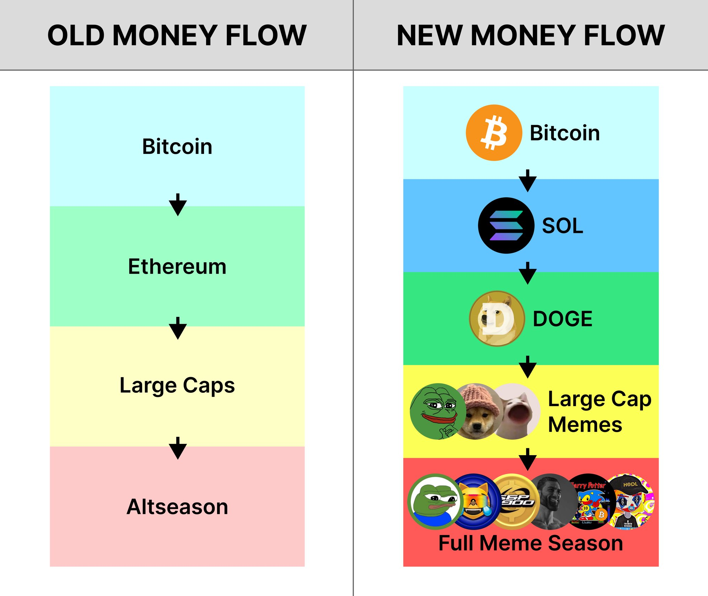
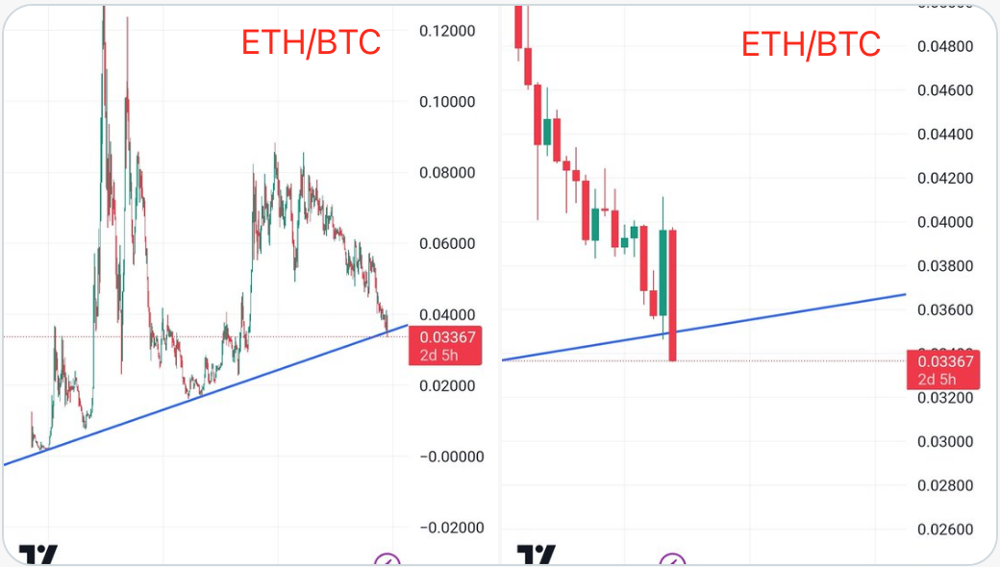

# 山寨人的悲歌

周日BTC继续沿5日线向上顽强爬行。所有人似乎都在惜售，以至于成交量已经逐渐枯竭。多头反复争夺9万刀阵地，屡得屡失，屡失屡得。在这个高度，暂时依然未能盼来援军。11.17教链内参总结道，《第46周 比特币大战九万刀 模因币疯狂送人头》。

模因币（memecoins）这个东西，竟至于渐渐地要从山寨币（altcoins）中分离出来，独自开宗立派了。以至于模因人（memecoiners），即模因币的炒家，也要把自己和山寨人（altcoiners），也就是那些投资山寨币的家伙们，从身份上区分开来。

模因人看不起山寨人，大概是觉得山寨币“明明都是些包装、炒作出来的货色，却非要扯什么价值主张，装什么正经投资”，虚伪，做作，“既当又立”，哪里有俺们模因币那么如空气般透明、纯粹、真诚。

当然，模因人看不起山寨人，更重要的原因是，在这个拉盘即正义的赛道上，在这一轮周期启动前的预热赛上，山寨币纷纷哑火、趴窝，每一波市场热度升高，大多数时候都沦为了模因币表演暴拉、暴涨、暴富的舞台。

硬不起来，当然就被人看不起。

这一轮周期迄今，市场呈现出了不同上一轮时的热钱流向。

在上一轮周期中，热钱从BTC溢出后，借由以太坊为“管道”，流向大市值项目，以及各种协议应用及其代币，推动山寨币的“寒武纪大爆发”，形成所谓“山寨季”（altseason）。

而这一轮周期，以太坊拉垮了，Solana上位。ETH/BTC几欲跌破8年趋势线。

地形变了，水无常势，流向就改变了。当热钱从BTC溢出后，通过新管道Solana、老模因狗狗币，直接进入大市值模因币开始加热，凭借模因币无需任何基本面、炮制极其容易的优势，大量复制发行，快速轮动，此起彼伏，声势浩大，形成“模因季”（meme season）。

山寨币需要项目，项目需要基本面，基本面需要有故事、逻辑和团队。而这些模因币统统不要。它可以一天发行上万个。

天下武功，唯快不破。它一天上万个，你怎么破？反正都是投机炒作，炒什么不是炒呢？要当镰刀，你得懂韭菜的心理：

一定得选最新、最红的热点，发就得发最牛逼的模因。总统直接站台，最少也得是首富喊单。什么缩写梗啊、换logo啊、发帖暗示啊，能用的手段都给它用上。推特(X)上有大V、电报(TG)里有KOL(意见领袖)，discord频道里都是印度群主，头像都是当红NFT小图片特贵的那种，韭菜一进群甭管有事儿没事儿都得跟人家说，welcome to join the channel，一口地道的咖喱味儿英语，倍儿有面子。

社区多搞一些活动，人传人返佣就发出去几百上千万美元，再炮制一些梗图、动图、小视频啥的，就是两个字儿——烧钱，这叫舍不得孩子套不着狼。韭菜一看，身边的兄弟不是赚百倍就是赚千倍，你要是才赚个十几倍啊，都不好意思跟别人打招呼说你是炒模因币的。

你说这样一个模因币盘子能收割多少？
（自问自答，扮作回答者的腔调）我觉得怎么也得两千万美刀吧？
（切回）两千万美刀？那是操盘成本！四千万美刀起！你别嫌少，行情好的时候搞到上亿美刀也有可能！

你得研究韭菜的炒币心理。愿意掏一万美刀炒山寨币的韭菜，根本就不在乎多掏两万炒模因币！

什么叫暴富你知道吗？暴富就是买什么币都只买天天暴涨的，不买天天讲价值的！

所以我们鼓吹模因币的口号就是——毫无价值，只有暴涨！

哎呀呀，手里捂着山寨币死活不见涨的山寨人，神伤于大牛市拿错了筹码，听到这一番精神病院里的鼓吹，竟然不免怦然心动，精神又抖擞起来了呢！
