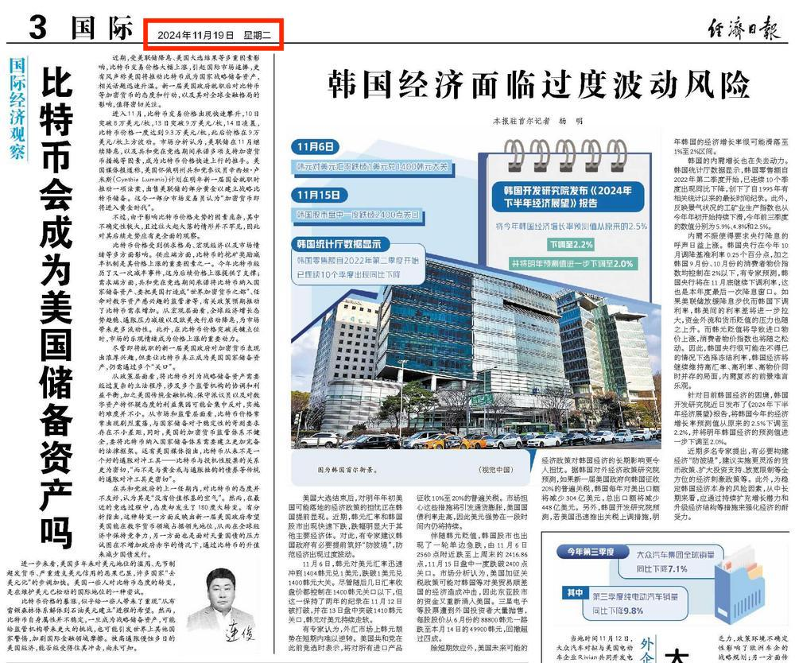

# 经济日报：比特币会成为美国储备资产吗？

隔夜BTC重新站上9万刀。

今天，2024年11月19号的经济日报，在第3版国际栏目中发表国际经济观察文章，标题叫做《比特币会成为美国储备资产吗？》。

人们面对前所未有的科技创新，总是表现出这样的接受模式：少数人因为相信而看见，多数人则必须看见才会相信。

BTC问世已近16年。从零起步，16年间，有多少人敢于相信、愿意相信并且能够坚持相信，它终有一日会有机会成为世界顶级大国国家储备资产？

不要怪BTC不给你机会。它给了全世界所有人整整16年的时间去理解、布局，低位建仓。对所有人都是公平的、无歧视的参与机会。

可是给你机会，你把握了吗，你抓住了吗？没有。你不相信。你怀疑。你否定。你反对。

有句话说得好，悲观者常常正确，但乐观者才能拥有未来。

多年来，有些人，一上涨就默不作声，一下跌就大肆唱空。可是连起来看，每次跌破的点位却越来越高，这是怎么回事？

坚持空仓，坚持唱空，当然常常是正确的。毕竟，市场的波动总是双向的，一会儿涨，一会儿跌。就算是完全坏掉的钟表，一天还能有两次指示正确的时间呢！

所以说，正确，其实是最屁用没有的。可惜有些人就是非得执迷于“我正确”而执迷不悟。实乃一种古怪的好胜心在作祟。

美国开始相信BTC，那对全世界是好事，而不是坏事。

不相信BTC的美国，就会推行它的美元霸权，不断向全世界输出零成本印刷的美元，换走别人手里有价值的资源和商品。这实在是一种因铸币税而带来的剥削。

过去几十年，这世界上忍受美元铸币税剥削最厉害的国家，不是别人，正是中国。

勤劳的中国人，起早贪黑，生产无数商品，源源不断地输送给美国，供美国人享用。美国人敲敲键盘，印刷出美元，源源不断地输送给中国，可是美元毕竟只是数字，既不当吃也不当穿。

而且美国还不许中国拿这些美元去买东西，而是让中国再用血汗美元去买它印刷出来的美债，号称是可以赚取利息。

如果是以重商主义的思维去看，会觉得只要赚钱了，就是好事。

但是如果从人本主义的角度去看，赚到再多钱如果不能转化成老百姓的衣食住行等物资，守着一堆美元美债过穷日子，实在是天底下最蠢的事，不是么？

美国搞脱钩断链、制裁禁售，不啻一根大棒，一棒子敲醒了中国，敲碎了重商主义的迷梦。

如果怀揣美元而买不到自己想买的东西，那么还要美元有啥用？于是就搞去美元化，货币互换，用人民币。用了人民币，就会清醒很多。因为人民币是自己印的，总不会沉迷于把赚更多人民币作为贸易目的吧？

如果包括中国在内的全世界越来越多的国家，不再沉迷于拿资源和商品去换美国的美元，就会少受美国的剥削。

现在美国开始相信BTC了，那么以后再和美国做生意，就可以索要它手里的BTC，而不要它自己印的美元。毕竟，美国能印美元，但不能印BTC。

当采用BTC这样不能被任何人超发的价值媒介时，重商主义的bug（漏洞）就被堵住了。（如果问为何是BTC而不是其他国家的法币，因为美国不认别国法币呀！）

用BTC和美国打交道，和它搞贸易，也就不用担心被它超发的美元所剥削了。

世界贸易和全球化因此而变得更加公平。这对全世界不就是最大的好事嘛！
