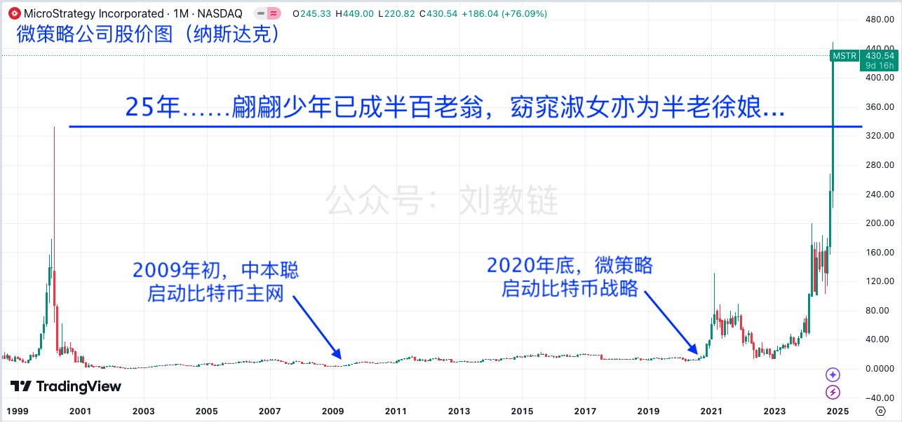

# 微策略咸鱼翻身

隔夜BTC再冲新高93.8k，但未能守住阵地。不过，几日来多头继续推动价格上行，拖拽着5日线向上移动，依然保持着趋势。

不觉间，微策略已经悄然完成了历史性的跨越。昨晚《11.19教链内参：BTC期权上市，微策略跑赢大饼》聊了很多有关微策略的最新情况。今早拉出微策略在纳斯达克的股价，真的是惊呆：昨收430.54美刀，已大幅超出2000年互联网泡沫期间的历史前高333美刀。泡沫破裂近25年后，微策略终于咸鱼翻身，再创历史新高！

25年，翩翩少年已成半百老翁，窈窕淑女亦为半老徐娘。

25年，9125天。人生不过3万天，又有几个9125天可以错付？

君生我未生，我生君已老。君恨我生迟，我恨君生早。
君生我未生，我生君已老。恨不生同时，日日与君好。

世界上最遥远的距离，不是天涯到海角，而是我已割肉清仓，你却突破了前高。

宇宙中最遥远的距离，不是牛郎星到织女星，而是BTC不断续创历史新高，我却满手山寨横盘熄火望眼欲穿。

2020年底微策略启动BTC战略之初，其股价仅仅15美刀左右。短短5年之后，已达430美刀。涨幅超过25倍。

同期BTC也不过从2万刀到达现在9万刀，涨幅仅3.5倍。

可以说，微策略的表现，把美股七姐妹都给看沉默了。

他们眼中的屌丝男，竟然真有咸鱼翻身的这么一天！

从结果的角度讲，微策略老板Michael Saylor的BTC战略无疑是成功的。而且可以说是极其成功。

而微策略的这一成功，将给满世界无数的咸鱼股树立光辉的榜样。不久的将来，我们将看到全世界各大股市上市企业，纷纷开始盘算和实施属于自己的BTC储备计划。

俗话说得好：你跑得再快，也不如坐在高铁上快。

人贵有自知之明。年轻的时候血气方刚，以为靠自己一己之力就能改变整个世界。四处碰壁，撞的头破血流之后，才逐渐认清自己几斤几两，开始懂得布局和借势，四两拨千斤，做事、赚钱才开始变得顺风顺水起来。

太多太多的人，总是陷入能力幻觉，觉得自己无所不能，于是创业、投资，业务烧钱，投资亏损，败光家产。

Michael Saylor被毒打20年，终于认清现实，自己做业务就是做不起来，那就不如嫁给BTC，挤上这趟百年一班的高速列车，跟着高铁去青藏高原！

财富，金钱，货币，五行属水。

法币的河流大水漫灌，浪高风急，逆水行舟，不进则退，拼命划船，也难进分毫。

BTC的河流水势愈行愈缓（每4年减缓一半），风平浪静，晴空万里，日光和煦，碧波荡漾，悠然泛舟，就轻易比在法币河流中激流勇进的船只要前进得更快、更轻松了。

谚语说，人生不要两次踏入同一条河流。

教链说，财富的秘诀就在于选择踏入哪一条河流。

上对花轿嫁对郎。坐上高铁去西藏。静水泛舟不慌张。

人生的幸福，从智慧的选择开始。
