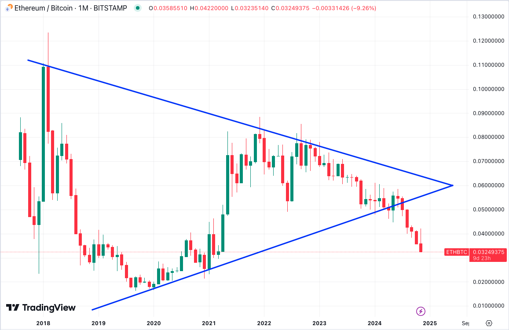
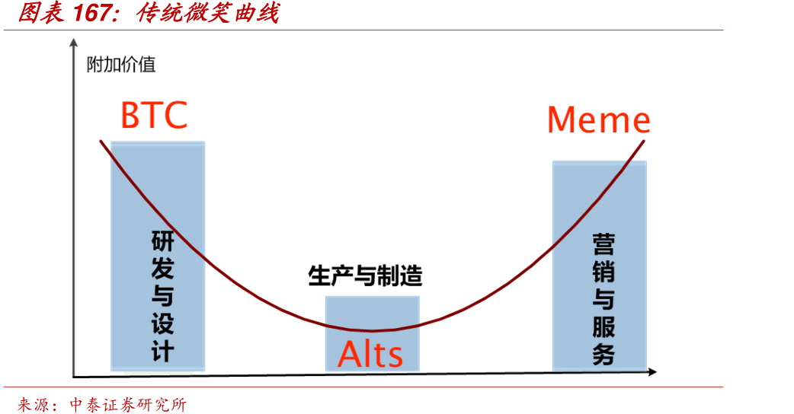
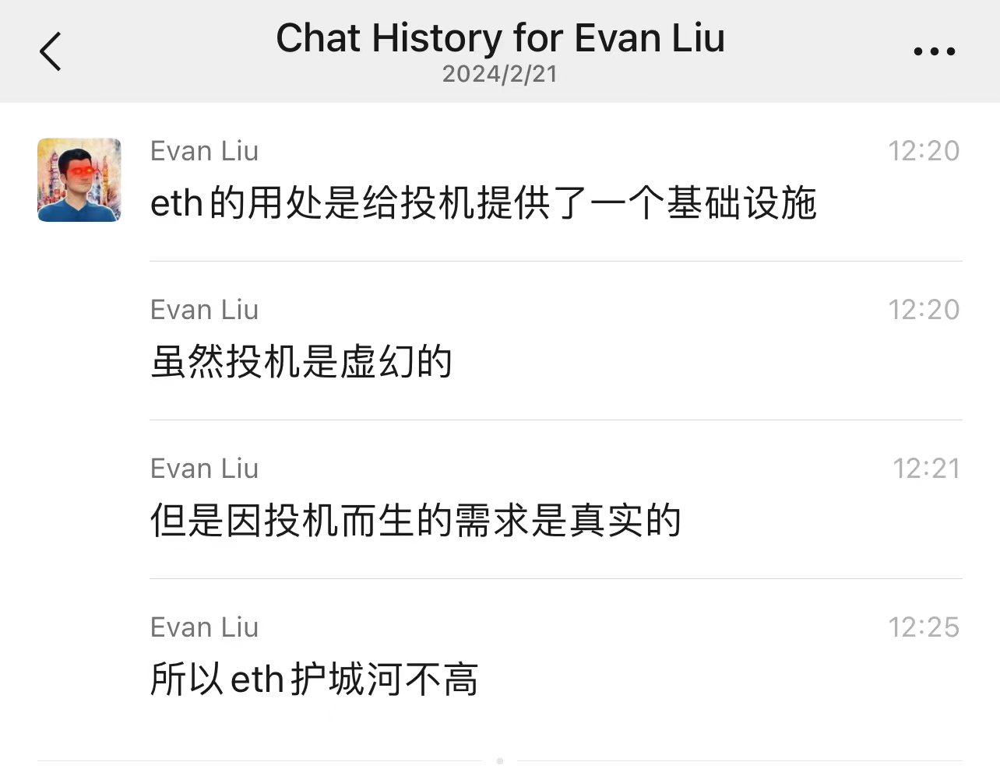

# BTC已近95000，再看币圈微笑曲线

隔夜BTC继续奋力向上，一度逼近95000历史新高。随着BTC不断新高，以及Meme币（模因币）的疯炒，让满手山寨，特别是重仓ETH的朋友们天天感到心在滴血。

下图是ETH/BTC近6年的月线。当楔形收敛走到尽头，不是向上突破，而是向下跌破时，人们的希望就被砸得稀碎。此时此刻，连怒骂年初唱多ETH/BTC的KOL们的心力都已经没有了（参考教链2024.2.28文章《多位加密人士看涨ETH/BTC，或将促动山寨季的爆发》），真称得上是“心力交瘁”。

教链也是躬身入局、陷入泥坑者之一。毋须讳言，在2021年那一轮牛市上头期，教链也去玩DeFi、NFT，彼时那些玩意儿都在以太链上，所以自然也就陆续积累了不少ETH。

有一种自作聪明叫做“牛市BTC太贵了，还是买点儿山寨（ETH）吧！” 教链也难逃这种大聪明的魔咒，2021年停止了高位加仓BTC，而是去买山寨包括ETH。

潮水退去，才知道自己是个裸泳的傻瓜。

虽然教链还是有些风控的，以美刀本位看，ETH仓位目前并不亏损，但是，以BTC本位看，当年买ETH而不是BTC实在是亏掉了BTC的。

在ETH上，教链属于是“明知山有虎，偏向虎山行”，或者可以说是“以身伺虎”。

一方面，教链深知并公开写过多篇文章指出，持有ETH的风险是极高的。过去3年多形成的主要理论（判断）有三：

1. EIP-1559燃烧机制，让ETH“软化”，失去价值存储性质。相关论述文章：2021.8.3文章《以太坊的“费改税”》，2021.8.6文章《以太坊渐行渐远》，2021.8.10文章《秋季以太坊，1559差强人意》，2021.10.13文章《以太坊是比比特币更好的价值存储吗？》，等。

2. 放弃PoW转为PoS，让ETH系统“吸食负熵”的能力大幅下降，从而损害其长期价值。相关论述文章：2022.4.1文章《警惕PoS军国主义》，2022.4.24文章《PoS的根本缺陷在于循环论证》，2022.4.25文章《工作量证明(PoW)再辨》，2023.2.21文章《挖矿漫谈》，2023.6.4文章《对PoS的链重建攻击》，2024.8.27文章《以太坊的人生困局》，2024.10.28文章《比特币背后的诺贝尔奖（一）：普利高津和耗散结构理论》，等。

3. ETH的价值基础——以太链作为“web3基础设施”、“世界计算机”，定位在产业链中游。而产业链中游，护城河最低、附加值也最低。这就是工业界知名的“微笑曲线”。相关论述文章：2021.10.12文章《“微笑曲线”假说》。

这一年来，甚至说这两年来，位于微笑曲线两端的BTC和Meme币赛道你拉我涨，好不快活。昨晚《11.20教链内参：BTC站上94000，再创历史新高！》中，教链就又想起来这个理论，并随手画了一个图，来说明当前加密市场两级分化的现状：机构暂时只顾抓紧加仓BTC，散户去炒模因币，没有人玩山寨了。

微笑曲线的左右两端代表产业链的核心科技和品牌营销，一边掌握“核心科技”（PoW），紧抓“核心价值”（最安全的价值存储和价值传输），比如BTC，另一端是紧抓“用户心智”（研究返贫梭哈致富，空气币套路最少反而更公平），迎合“用户需求”（炒币暴富），只保留“品牌价值”（除了品牌营销没有任何其他价值），比如Meme币，因此这些环节附加价值较高。曲线的中间部分代表生产和制造，虽然一直在开发、升级、创新（比如一层二层等公链基础设施），但由于竞争激烈、护城河低、容易复制、可替代性强，附加值通常最低。

今年2月份教链还聊过这个ETH护城河低的问题（见下图聊天记录截图）：

截图中的原话是这样说的：「eth的用处是给投机提供了一个基础设施…… 虽然投机是虚幻的，但是因投机而生的需求是真实的…… 所以eth护城河不高……」

过去，在新公链如Solana等还不太成熟，二层如Arbitrum、Base等也还没有大肆复制时，以太坊左端还是掌握技术领先优势，右端也占据了行业中的心智高地的。但是从2021年牛市新公链迎头赶上，然后二层链如雨后春笋般大量近亲繁殖，不仅削弱了以太链的技术优势地位，而且眼花缭乱的品牌和名称，极大的分散了用户的认知焦点。以太坊被“两头堵”了，造成其价值向微笑曲线的中段严重收缩！

另一方面，虽然有以上这些认知，但是教链并没有“知行合一”，而是坚持持有ETH仓位，就是心中对ETH还有幻想，想要看看ETH到底是否能守得住江湖地位，不被新公链们超越。加上教链本身也在ETH生态中做一些开发工作，所以还是希望ETH能够取得最终的胜利。

坦诚地分享这些经验教训，一是做一个自我的反思和解剖，二是说明教链虽然在加密市场略有收获，但绝非一直正确，恰恰相反，教链犯过无数错误。幸运的是，这些错误都不致命，没有击垮教链。

但是，反思这么多，却并不是任何操作的意见。教链常常分析自己持仓的看空理论，BTC是这样，ETH也是这样。这是给自己的持有进行压力测试。如果自己都没有勇气经不住压力测试，也许从最开始就不应该建仓和持有！

如果自己天天用最逻辑严密的理论来看空自己的仓位，而自己还能坚定持有不割肉，那么市场上就很难有任何肤浅的唱空声音可以撼动你的坚定持有。

一个最坚定的现货多头，一定是最懂各种看空理论的专家。

既然建仓了，就要有持有至归零的决心。此所谓“视死如归”。

教链是不会在这个时候割肉换仓的。

一个原则是，永远不在市场最悲观的时候割肉。

当然，教链可能又错了。但是这个错误最大的后果不过是自己的ETH仓位归零而已。

建仓前就要想清楚，如果归零了，这么大的仓位是否能够接受？不能接受？那就少一点，再少一点。直至能够接受。这就叫“风控”。

金融市场上最主要的亏损原因之一就是投入了自己并不能承受损失的资金。

永远不要等到损失发生了才开始后悔。

教链说，要敬畏市场。

永远不要因为一点儿盈利就沾沾自喜。永远不要觉得自己比市场更聪明。永远不要觉得自己有战胜市场的能力。

市场终归是有效的。试图战胜市场，比市场更聪明，只会暴露自己的无知。

你笑市场太疯癫，市场笑你看不穿。
绝望割肉拿不住，高买低卖全亏完。
