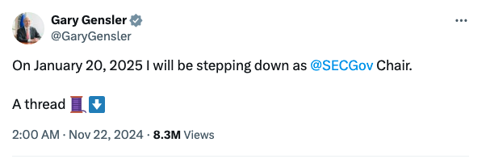
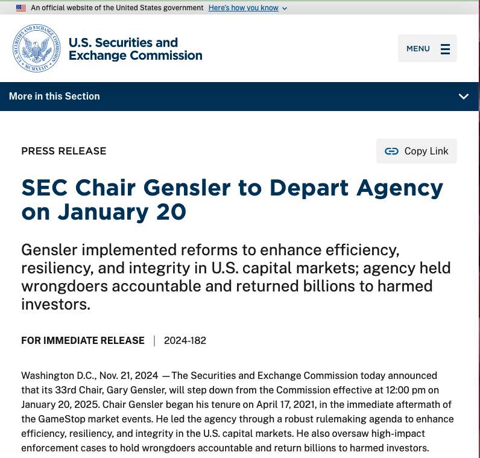

# BTC剑指九万九，SEC主席将辞职

隔夜BTC继续上攻，一度站上98k，最高逼进98.9k。99k就像一层窗户纸，一捅就破。99k若破，十万刀也就近在咫尺了。不用怀疑，在这个高度上，靠散户的仨瓜俩枣已经不能形成有效推动力了。BTC已经进入了机构时代。许多企业正在模仿微策略的成功经验，利用长期零息债券进行极低成本、极低风险的融资，购入并积累BTC作为企业的储备资产。

对于过去16年间任何时间进入市场并成功持有BTC至今的散户，接下来就将进入幸福时光。只需要安安心心、舒舒服服地坐在BTC这列高速列车上，让机构以及后面的主权国家来作为新动能继续驱动列车向前疾驰就好了。

就在这个动力切换的档口，完成BTC ETF上市批准的美SEC主席Gary Gensler官宣将于2025年1月20号辞任。Gary Gensler因领导SEC对加密项目四处出击而深受加密行业千夫所指，但同时却又在其任上亲手帮助BTC完成了登堂入室的历史性跨越。如今他终于做出正式决定，将因总统换届而辞任。千秋功罪，留给后人评说吧。只能说，一代人有一代人的历史任务。任务完成，也就到了谢幕时刻。

以下，是美SEC官网今晨发出的关于主席Gary Gensler即将辞任的官方通稿中译版。

* * *

**SEC主席根斯勒将于1月20日离任**  

根斯勒在任期间推行了多项改革，以提升美国资本市场的效率、弹性和诚信；该机构对违规者追究了责任，并为受害投资者追回了数十亿美元。  
**即刻发布** | **编号**: 2024-182

华盛顿哥伦比亚特区，2024年11月21日 - 美国证券交易委员会（SEC）今日宣布，其第33任主席加里·根斯勒（Gary Gensler）将于2025年1月20日中午12点正式卸任。根斯勒主席自2021年4月17日上任，接手了GameStop市场事件后的复杂局面。他领导SEC制定了一系列重要规则改革，以提升美国资本市场的效率、韧性和诚信。同时，他还监督了多起影响深远的执法案件，追究违规者责任，并为受害投资者追回了数十亿美元。  

“美国证券交易委员会是一个了不起的机构，”根斯勒主席表示。“工作人员和整个委员会都以使命为导向，致力于保护投资者、促进资本形成，并确保市场同时为投资者和发行人服务。SEC的员工是真正的公共服务者，能够与他们一起为普通美国人服务，确保我们的资本市场保持全球最佳，这是我一生中最大的荣幸之一。”  

“我要感谢拜登总统赋予我这一重要责任。SEC履行了我们的使命，并在执法中不偏不倚。我非常享受与我的委员会同事合作的时光，包括Allison Herren Lee、Elad Roisman、Hester Peirce、Caroline Crenshaw、Mark Uyeda和Jaime Lizárraga。同时，我也感谢国会、美国政府的同事以及全球范围内的其他监管者。”

**国债市场**  

在根斯勒主席任期内，SEC对28万亿美元的美国国债市场实施了关键性改进。为了降低国债市场的成本和风险，SEC出台了促进集中清算的规则，并收紧了经纪交易商豁免于国家证券协会注册的适用条件。这些改革将降低风险并提高整个美国资本市场的运行效率。  

**股票市场**  

在根斯勒的领导下，SEC对55万亿美元的美国股票市场进行了近20年来的首次重大更新。委员会一致通过了对全国市场系统（NMS）的更新，使股票交易更加高效，价差更窄，费用更低。此外，还将交易结算周期缩短至一天，这对投资者有利并降低了市场风险。同时，SEC一致通过了更新经纪商执行质量信息的规则。这些改革使股票市场更加高效，最终惠及投资者。  

**市场韧性**  

在根斯勒任期内，委员会修改了《PF表格》，这是某些在SEC注册的私募基金投资顾问提交的机密报告表格。新规则要求大型对冲基金和私募股权基金顾问就某些事件向SEC提交实时报告。此外，SEC还与商品期货交易委员会（CFTC）联合修改了《PF表格》，以提高各机构收到的信息质量，这些改动将于明年实施。最后，SEC还对货币市场基金进行了改革，使其在压力时期更加具有韧性、流动性和透明度。

**公司治理**  

为进一步增强资本市场的信任，根斯勒主席领导下的SEC对公司治理规则进行了多项更新，包括：修订企业内部人员出售股票的规则；要求高管在财务报告有误的情况下退还基于错误报告获得的薪酬；强制披露高管薪酬与公司绩效的关系。 此外，SEC还通过了新规，允许股东在董事选举中通过通用代理卡投票，选择自己偏好的董事候选人组合。委员会还要求对那些试图获得控制权或收购超过公司5%股份的行为，进行更及时的披露。  

**信息披露**  

自2021年4月以来，委员会颁布了多项规则，以确保投资者能够从上市公司、拟上市公司、经纪商和投资顾问处获得所需的信息。  

首先，委员会制定了规则，强化了上市公司关于网络风险和气候风险的披露要求，同时对通过特殊目的收购公司（SPAC）上市的公司提出了额外披露要求。这些规则基于信息的重要性，帮助投资者在买卖、持有和投票时做出明智决策。  

其次，委员会要求特定经纪商和投资顾问在客户个人信息因数据泄露面临风险时，必须通知客户。  

最后，委员会通过定期发布关于注册投资基金、私募基金和投资顾问的汇总匿名数据，进一步提升了市场的透明度。  

**会计与审计**  

在根斯勒主席任期内，受SEC监管的上市公司会计监督委员会（PCAOB）成功与中国市场监管机构达成协议声明（Statement of Protocol），首次允许PCAOB全面检查和调查与中国相关的在美上市公司审计事务所。在过去两年中，PCAOB已能够履行其在中国和香港审计机构的检查和执法相关职责。  

此外，截至2021年4月，PCAOB仅更新了其20年前成立时暂行采用的五项标准。这些暂行标准沿用了美国注册会计师协会（AICPA）的现有标准，而《萨班斯-奥克斯利法案》原本设想PCAOB在成立后不久便会对其进行更新。自根斯勒主席宣誓就职以来，PCAOB已更新了18项暂行标准以及其他两项标准，以反映当前会计与审计的监管需求。

**检查与执法**  

在根斯勒主席任期内，SEC的执法部和检查部（占整个机构约一半人员）一直是坚定的市场“守护者”。该机构收到了超过145,000条举报、投诉和转介信息，并向举报人发放了约15亿美元的奖励。委员会提起了超过2,700起执法行动，并获得了约210亿美元的罚款和追缴命令。在2021至2024财年期间，SEC通过执法行动为受害投资者返还了超过27亿美元。  

此外，SEC通过对投资顾问、投资公司和经纪交易商等的检查，为受害投资者追回了超过2.5亿美元。检查部还通过及时分享年度重点和观察结果，提升了与注册实体的沟通，并积极与行业和其他监管机构互动。  

在根斯勒主席的领导下，委员会延续了前任主席杰伊·克莱顿保护加密货币市场投资者的工作。在根斯勒任期内，SEC对加密货币中介机构提起了涉及欺诈、刷单交易、注册违规及其他不当行为的诉讼。  

根据SEC监察长办公室的数据，在最近一个完整财年中，尽管加密货币市场占美国资本市场的比例不足1%，SEC收到的举报、投诉和转介信息中有18%与加密货币相关。法庭接连支持SEC保护投资者的行动，并驳回了所有认为SEC无法根据证券形式执法的主张。  

**关于根斯勒主席**  

根斯勒主席曾担任美国商品期货交易委员会（CFTC）主席，领导奥巴马政府对400万亿美元掉期市场的改革。他还曾担任美国参议员保罗·萨班斯的高级顾问，协助起草《萨班斯-奥克斯利法案》（2002年），并在1997至2001年间担任美国财政部国内金融事务副部长和助理部长。  

因其卓越服务，根斯勒主席被授予美国财政部最高荣誉“亚历山大·汉密尔顿奖”，并获得了2014年的弗兰克尔受托责任奖。  

在加入SEC之前，根斯勒主席曾任麻省理工学院斯隆管理学院全球经济与管理实践教授，同时担任麻省理工学院Fintech@CSAIL项目联合主任及麻省理工媒体实验室数字货币项目高级顾问。他还在2017至2019年期间担任马里兰州金融消费者保护委员会主席。  

在职业生涯早期，根斯勒曾在高盛公司工作，担任并购部门合伙人，领导公司的媒体集团，在亚洲负责固定收益与货币交易，并担任全球财务部门的联合主管，负责公司的财务控制与财政事务。  

根斯勒主席出生于马里兰州巴尔的摩市，1978年获得宾夕法尼亚大学沃顿商学院经济学学士学位，1979年获得工商管理硕士学位。他有三个女儿。  

