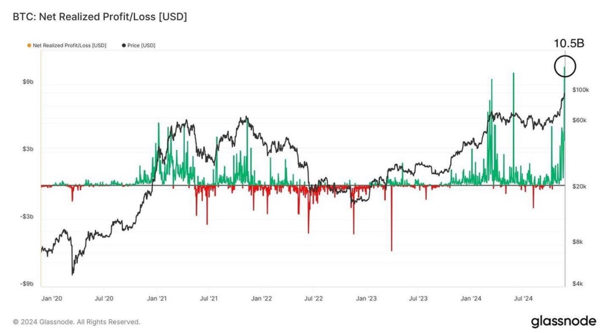

# 换庄和踏空

随着BTC（比特币）稳步向十万刀挺进，筹码交换也被逐步激活。毕竟，如果有人钻石手惜售，那很可能只是价格还不够高。BTC让你交出筹码的方法，除了暴跌恐惧、阴跌绝望之外，还可以是开出一个你无法拒绝的价格。

真正的永恒钻石手，也许只有持有100多万枚BTC的中本聪。那是《中本聪的传奇宝藏》（教链2022.9.30）。中本聪的意思是，他对BTC的预期，上不封顶，即，是无穷大——无论BTC涨到多高，中本聪的持仓绝不卖出。

就在BTC到达十万刀门前之际，昨日BTC单日链上换手交易量——这意味着获利了结金额——历史性地达到了惊人的105亿美刀。但就是如此之规模的获利了结，也未能撼动BTC向上的脚步。今日最高一度达到99.6k，距离10万刀仅有区区400刀的距离。现在仍在98k-99k区间。

随着BTC出人意料的迅速接近十万刀，市场多空分歧也愈发加大。有的人在发帖懊悔早年的错过。有的人在煞有介事地分析美国搞BTC战略储备有何预谋。有的人在忙着清仓。有的人还在空仓等BTC崩盘跌到25k。…… 

多头的幸福总是相似的，而不幸的空头却各有各的不幸。

对于BTC这样千年一遇的机会，踏空的机会损失是很大的。也许今天失去1个BTC，未来永远不会再有机会重新买回。

在BTC发展的每一个阶段，都要大浪淘沙。只有换庄，让前一阶段的主力出局，后一阶段的主力进场，完成交接棒，才能让BTC跃上新的台阶，在10倍高的价格区间，重演相似的成长曲线。

十万美刀之前的BTC，与十万美刀之后的BTC相比，BTC还是那个BTC，但主力选手已经换人。十万美刀之后，机构时代正式闪亮登场，规模体量已经不再是散户能够推得动了。

也往往是在权力交替之际，市场动荡不安，形势阴云密布，无数看不清形势的人，纷纷提前下车、踏空。

踏空有法宝，如下“三件套”：

一、空仓等25000。从3月份破新高以来，就一直有人高呼牛市见顶，今年就要终结，甚至今年就是15年大顶，还有觉得今年会有像2020年“312”那样的大崩溃，BTC要从6万刀以上一个猛子扎破3万刀，扎到25000刀。如此一来，当BTC从7万刀迅速蹿升到10万刀门前，便好好地享受了一番《BTC十万刀前夕，踏空是撕心裂肺的痛》（教链11.22内参）。

二、炒合约，开空单。如果说空仓只是被动地等暴跌，那么合约开空就是主动出击了。也对，都如此笃定要暴跌了，为什么不用杠杆放大自己神预测的收益呢？当BTC不断续创历史新高，杠杆也就很到位地放大了亏损，让人酸爽不已；甚至直接爆仓，来个痛快的。

三、拒绝囤币。拒绝囤BTC现货。坚信囤币无用论、囤币有害论甚至囤币有罪论。坚持币炒不囤的理念。因为BTC绝大多数时间都是在横盘震荡或者下跌，只有极少数时间突然暴涨，拒绝囤币可以有效杜绝满仓吃到极少数的涨幅，从而很好的让自己的仓位收益率回归平庸。

只要把上述三条落实到位，那么BTC再怎么涨，估计你都能完美踏空和错过，有效避免了自己发财致富。

BTC也正是在一代又一代炒家自作聪明、沾沾自喜的踏空中，不断更换新庄家、迈向新台阶、走向新阶段、开启新时代的。
