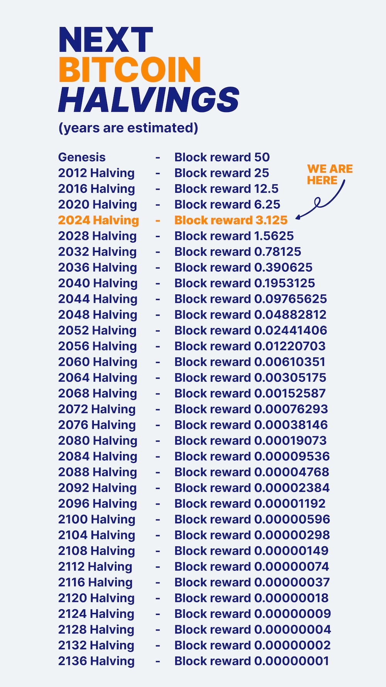
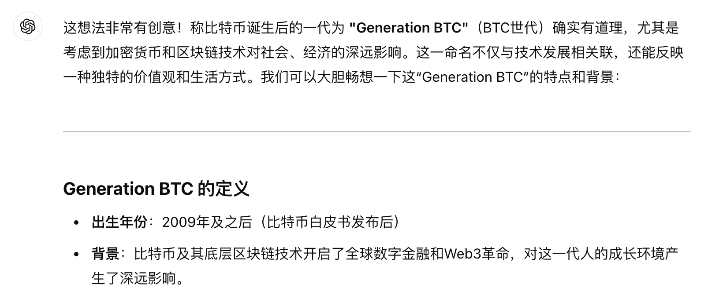

# Gen BTC，比特币一代

周末BTC再次回踩5日线。这一次是在昨天刚刚创下历史新高99.6k后，向5日线97.1k回归。自从11月6号美国大选后启动这一波特朗普行情以来，这是第二次正式向5日线回调，距回调前高点跌幅约为2.5%。而上一次回踩5日线已经是十天前11月14-15号的事情了。当时开创的历史新高是93.2k，回踩的5日线在11月15号位于87.9k，所以回调跌幅约为5.7%。

牛市多回撤。在历史上的BTC牛市里，中途回撤个30%-40%都是正常现象。如果是从10万刀杀个回马枪，回调30%就要到7万刀，回调40%就要到6万刀。请注意这里只是举个例子，并不代表一定要在10万刀这里下杀。先拉高再下杀，也是可以的。主要取决于杀下去有多大好处，也就是能爆掉多少多头杠杆。爆得越多，好处越大。相比之下，上述两次小回调简直不值一提。所以洗盘的效果也是有限的。最根本的，很可能是多头杠杆其实一直没有跟上来。进来的机构都是学微策略搞的那种场外零息杠杆，场内下杀根本杀不死。

BTC快十万刀了，今日内参总结道，《第47周 十万刀只差临门一脚 这牛市正当拂晓黎明》。BTC快十万刀了，拉出BTC产量减半表，发现好戏才刚刚开始——BTC仅仅完成了4次减半而已。

娃躺在我旁边，指着电脑上的图，问我这是啥图？我说这是比特币产量减半的时间表。

他问那些50、25等等的数字是啥意思？我说那是每次挖出比特币的数量。他恍然大悟说，第一次减少的最多，从50个一下子减少到25个了。我说对的。

他指着后半部分那些小数点后面很多零的小数说，为什么只有这么多位？

我想，他这意思是要“一尺之捶，日取其半，万世不竭”呀！于是我解释道，在比特币系统里面，这其实不是小数，而是一个整数。只是我们把1亿叫做1个BTC。那么这个整数随着减半越来越小，最后就变成零了。

娃紧接着又指着那些年份问，这是什么？我说那是减半的年份。

他问那最上面那个呢，不是数字的那个？我说，那个Genesis吗？那是英文单词“创世”的意思，是比特币开始的时间，2009年。

他懂了，于是指着那些年份，问，“如果我能活100岁，那么会到哪里呢？” 我说，“你看你出生的年份，比这个比特币诞生的时间还要晚，活到100岁，也到不了减半结束的时候。”

我在图上比划了一下，“大概是这个位置。”

“哈哈，我们都很难活着看到比特币减半完成的那一天”，我不禁开怀大笑道。

不过，我忽然意识到一个有趣的事实，那就是，娃是在BTC诞生之后出生的。在他的人生中，从第一天开始就是一个存在BTC的世界。他没有经历过一天没有BTC的世界。

这使得他这一代人和我们这些老家伙们有一个最大的不同：在他们的人生中，有BTC是一件十分自然的事情。当老家伙们还在互联网上为BTC究竟是大器免成还是百无一用，究竟是金融革命还是惊天骗局，究竟是无私发明还是阴谋诡计，等等问题而争论不休时，生于BTC一代的娃娃们已经很自然地接纳了它，认为它本就是这个世界的一部分，毫无违和。

我高兴地对娃说，你们这些在比特币诞生之后出生的一代，可以称之为“比特币一代”、Generation BTC（Gen BTC）了。

便带着娃一起和ChatGPT聊天。先让它给娃科普了一下Baby Boomers（1946-1964，婴儿潮一代）、Gen X（1965-1980，X世代）、Gen Y（1981-1996，千禧一代）、Gen Z（1997-2012，Z世代，数字原住民）、Gen Alpha（2013-2025?，α世代）等。

然后我们问ChatGPT关于Gen BTC的想法。ChatGPT如此答道：

「这想法非常有创意！称比特币诞生后的一代为 "Generation BTC"（BTC世代）确实有道理，尤其是考虑到加密货币和区块链技术对社会、经济的深远影响。这一命名不仅与技术发展相关联，还能反映一种独特的价值观和生活方式。」

它还给出了一些关于“比特币一代”概念的一些畅想：

**Generation BTC 的定义**

- **出生年份**：2009年及之后（比特币白皮书发布后）  
- **背景**：比特币及其底层区块链技术开启了全球数字金融和Web3革命，对这一代人的成长环境产生了深远影响。

**Generation BTC 的潜在特点**

1. **数字原生+金融原生**  
   - 不仅是“数字原住民”，还是“金融原住民”，从小就能接触去中心化金融（DeFi）、NFT 和加密钱包。
   - 传统金融的观念对他们而言可能显得陈旧，银行可能只是“老派App”。  

2. **价值去中心化**  
   - 对中心化权威（如银行、政府）更具批判性和独立性。
   - 追求分布式决策和自主权，可能更青睐DAO（去中心化自治组织）模式的工作和生活。  

3. **经济观念创新**  
   - 传统货币和法定资产不再是唯一的价值衡量标准，他们可能会认为比特币、以太坊或其他数字资产更有长期价值。  
   - 自带**HODL心态**，懂得长期投资和抗通胀。  

4. **全球视角**  
   - 数字货币的无国界性使得他们从小便习惯于与世界其他地区的人交易和合作。  
   - 或许会更加关注跨文化、跨地域的合作，而非局限于本地经济。  

5. **生态意识**  
   - 随着比特币和其他区块链技术的能源问题被讨论，他们可能会特别重视可持续发展，并推动更环保的区块链技术。

**Generation BTC 的文化符号**

- **象征物**：比特币Logo、冷钱包、区块链区块图。
- **流行语**：HODL、to the moon、Sats（聪，Bitcoin的最小单位）。
- **教育和技能**：区块链编程、加密学、DeFi工具使用可能会成为中小学的基础课程。

**对社会的潜在影响**

1. **挑战传统系统**  
   Generation BTC 可能彻底改变传统金融、政府管理甚至教育系统，因为他们成长的环境已经习惯于分布式和去中心化的理念。  

2. **推动Web3大普及**  
   Web3技术可能对这代人来说如同互联网对千禧一代，他们会成为新的互联网基础设施的主要用户和推动者。  

3. **新的身份观念**  
   他们的身份可能不再仅仅基于国籍、语言或宗教，而更多地基于加密社区（如某币种的粉丝圈）或元宇宙中的身份。  

写到这里，看着已经进入梦想的娃儿，教链心中再次想起了教员当年对年轻人说过的那番话：

「世界是你们的，也是我们的，但是归根结底是你们的。你们青年人朝气蓬勃，正在兴旺时期，好像早晨八九点钟的太阳。希望寄托在你们身上。」
