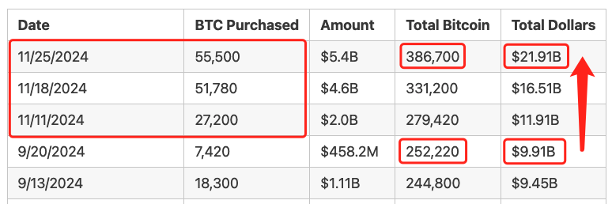
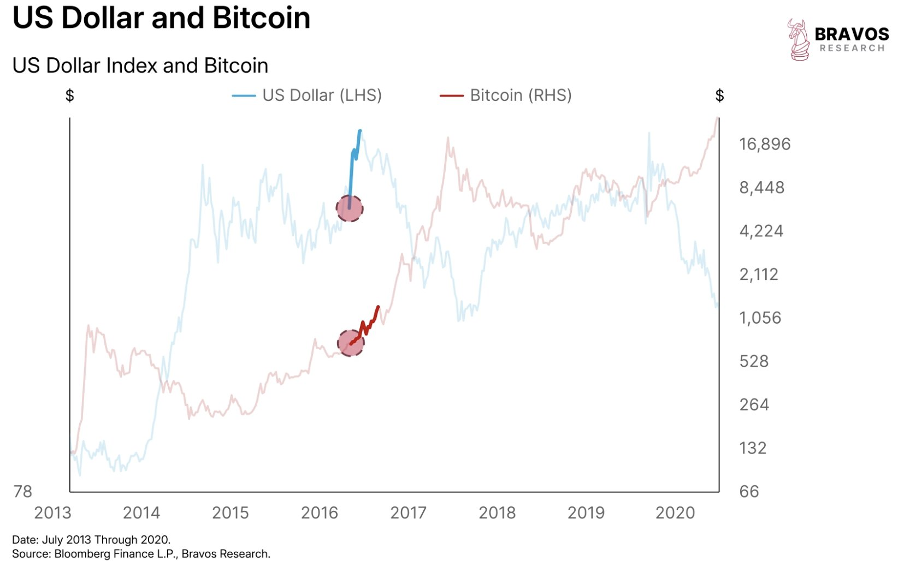
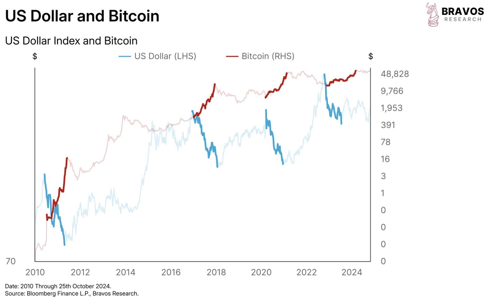
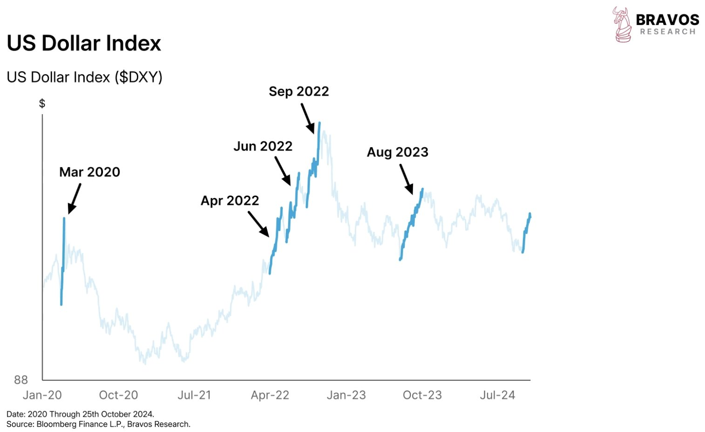
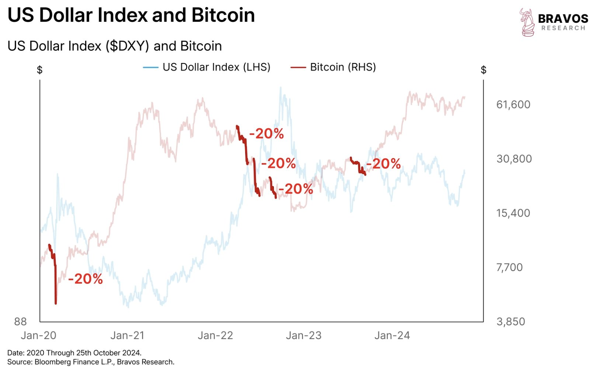
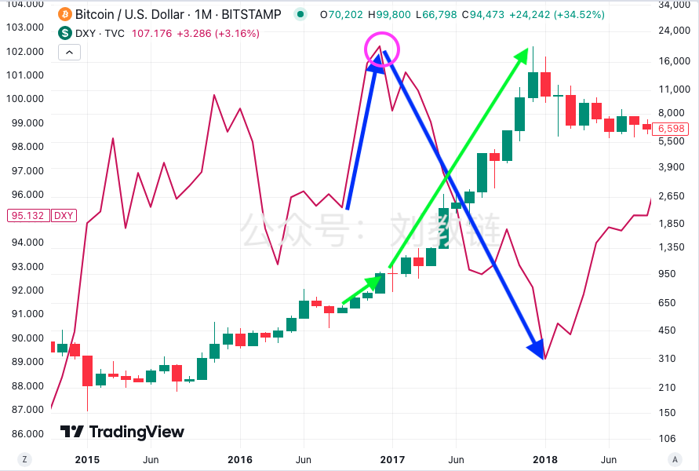

# 二选一

隔夜BTC反攻5日线带动山寨板块普涨，遭受阻击后收了一个十字星。今晨大饼（BTC）继续倒车，一度击穿93k，并拖动5日线掉头开始向下。

《11.25教链内参：大饼反攻5日均线，山寨版块普遍大涨》中提到，微策略又加仓了。这次成本高达97.8k。了解微策略的朋友都记得，它虽然是个机构，但是投资决策显然也会受到情绪影响。即，在熊市情绪低落时瑟瑟发抖，在牛市情绪高涨时十分上头。

仅11月份微策略就三次大手笔出手，投资本金直接翻倍，从约100亿美刀直接飙升到近220亿美刀，这也将其平均持仓成本从39,291美刀骤然推高至56,658.9美刀。它这明显是趁着BTC没有突破10万刀之前着急抢筹的架势呀！

从上述表格中的数据可以心算出来，微策略11月至今就豪掷约120亿美刀。这是什么概念？一个月的投入量超过此前4年总投入资金量的总和！

微策略“挥金如土”的money哪里来的呢？请回顾一下《11.19教链内参：BTC期权上市，微策略跑赢大饼》披露的信息，据推测它此前通过可转债融资筹措了超200亿美刀的资金呢。

看着微策略的操作，教链忽然受到了一个启发。

在2024.11.18文章《牛市宜挣钱》中，教链最后谈了一下快速投入和慢速投入在牛熊不同阶段的风险高低问题。如果预期现在处于2025年牛市前夕，而从这个时间点才开始入市建仓，用八字诀慢速操作的话，那么翻过山丘，会发现全都加在了高高的山岗上，到了熊市会比较尴尬。从这个角度讲，教链就更理解微策略为何要赶在2024年底前、大饼10万刀前快速加仓抢筹了。

因此这就启发了一个思考：启动于2023年中的《八字诀·十年之约》实盘见证计划，是不是可以“预支”未来一年甚至一年半的本金，或者至少其中属于机动部分即用于逢跌加仓的一半，提前投入，快速加仓？11月马上就要结束了。12月1号就是下一次逢跌加仓的诀择日。届时做一个选择吧。

西谚说：人类一思考，上帝就发笑。

你一上头，市场就会给你泼冷水。你一加仓，市场就会下跌让你站岗浮亏。微策略也不例外。

最近这个11月份从美大选后至今，美元指数和大饼双双走强。其实这不是常态。恰恰相反，这是特例。特朗普当选的例外行情。

上一次美元指数和大饼比翼双飞还是2016年的11月份。见下图。

而在绝大多数时间内，美元和大饼都是此消彼长的负相关关系。这一点从下面的图里看得很清楚。

过去几年，美元指数在半个月时间骤升5%的情况并不多见。除了今年11月份这一次，就只有5次：2020年3月，2022年4月，2022年6月，2022年9月和2023年8月。而每一次，都无一例外的伴随着大饼超20%的暴跌。

教链的意思并不是说这一次会向这些常态看齐。教链的意思是，似乎市场现在走到了一个抉择的十字路口：

接下来，可能要在美元和大饼之间二选一了。

要么，像2016年底那样，美元指数掉头向下，降低全球资本涌入大饼的成本，推动大饼走出一波超级大牛市；要么，美元坚持强硬姿态，……

教链觉得，惊弓之鸟的鲍威尔，应该是强硬不了太久了吧？
