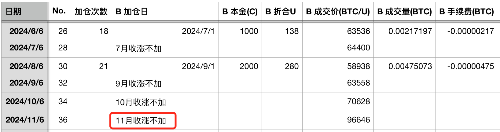
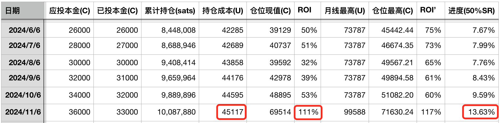
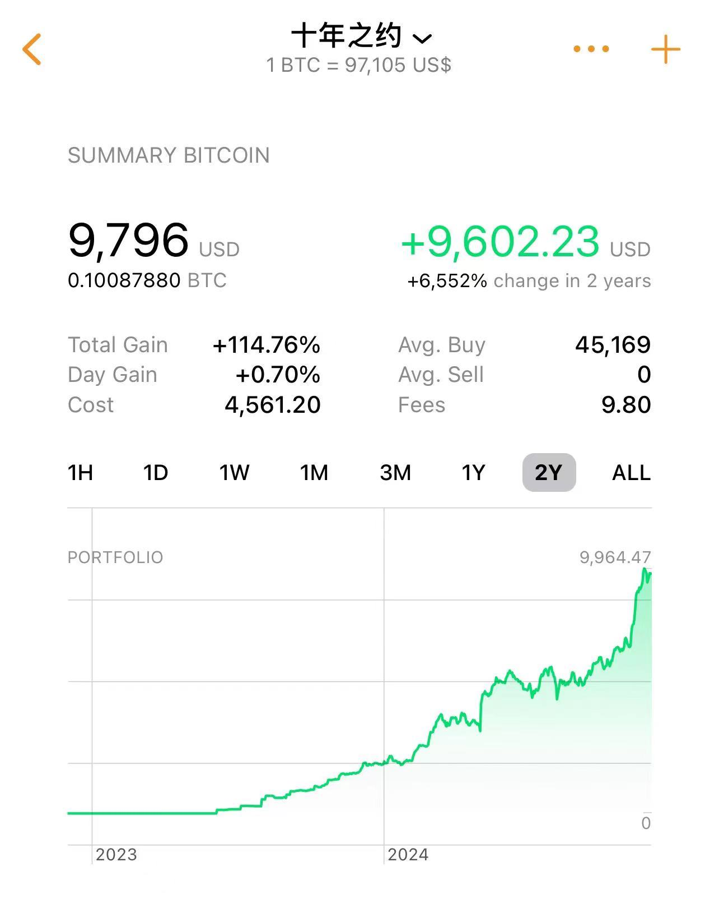
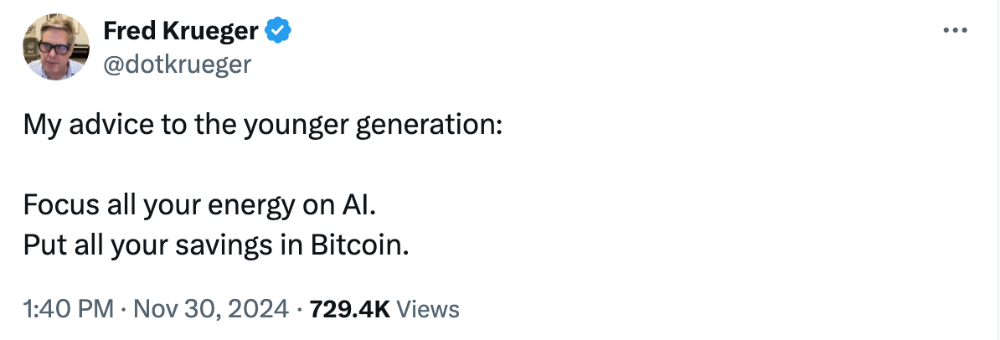
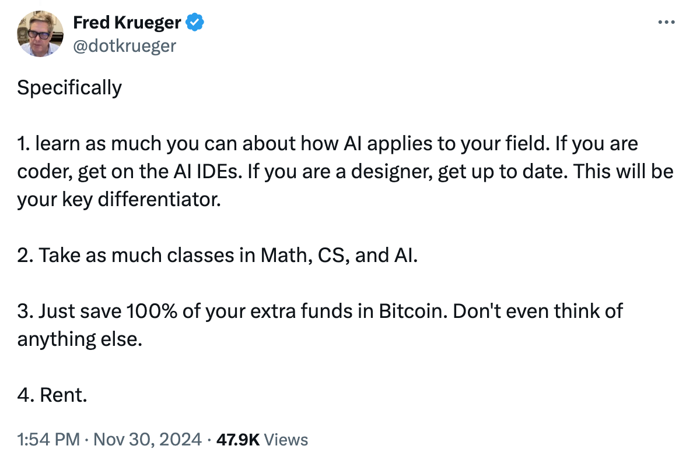
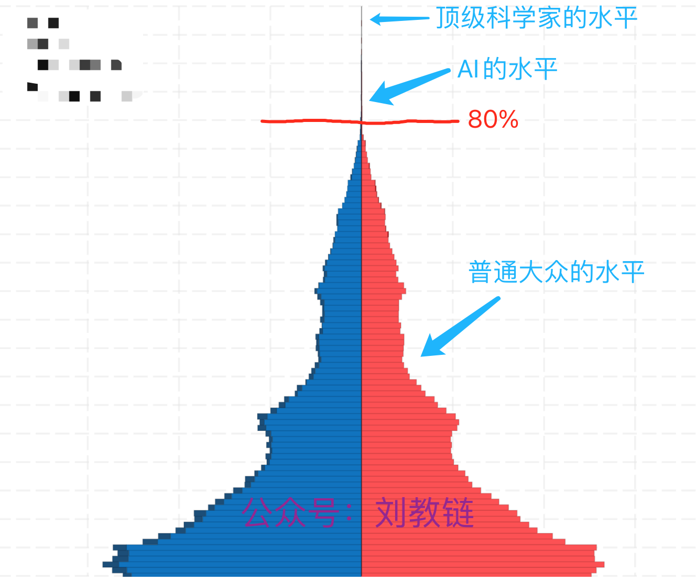

# 成为超级个体：拥抱AI、囤BTC——十年之约＃36（ROI %）

时光荏苒，白云苍狗，转眼间就到了2024年的最后一个月份——12月。教链在今天刚刚发出的一周总结性内参《第48周 教链社群再度进化 周期启动好戏连台》中如此说道：

「这个11月，是历史性的11月。11月BTC彻底走出了决定性的右侧突破——恰如教链早在3个月前BTC刚刚重回6万刀时就在文章《BTC重回6万刀，钟慢效应显现》中所提出的，4年箱体的右侧决定性突破或即将到来。

11月BTC开70.6k，高99.6k，低66.8k，收96.6k。一根大阳线，气贯长虹。

......

很显然，是决定性地突破。

所谓“决定性”，就是这种程度的突破，会彻底粉碎“BTC重回25k”的“最空幻想”。」

今天，也是《八字诀·十年之约》实盘见证计划执行的第18个月，第36篇报告。本次加仓点，因11月收涨而继续跳过加仓。这已经是连续3个月跳过加仓了。

按照11月收盘价96646刀计算，目前仓位平均成本45117刀，累计收益率111%。财务自由目标进度13.63%。

持仓价值增长曲线如下。软件取的是实时价格，和记账表格按照11月收盘价略有差异。

一旦学会了持有，就打开了新的世界。

今天教链看到连续创业者、天使投资人、Bitcoin maxi、斯坦福博士Fred Krueger的一篇帖子，说得特别好，称得上是“于我心有戚戚焉”。

他说：

「我给年轻一代的建议：

把你全部的精力聚焦在AI上。
把你全部的积蓄存放在BTC里。」

对此，他又进一步做了更具体的解释：

「特别地，

1. 尽可能多地学习 AI 在你的领域中的应用。如果你是程序员，去使用 AI 集成开发环境 (IDEs)；如果你是设计师，及时更新自己的技能。这将成为你的核心竞争力。

2. 尽可能多地学习数学、计算机科学和人工智能相关课程。

3. 将所有额外的资金都存入BTC。不要考虑其他任何东西。

4. 租房生活。」

教链在2022年底、2023年初ChatGPT一类LLM（大语言模型）AI刚刚爆火的时候，认为LLM的边界是无法超越人类知识边界的，并对这一波以LLM为主的AI浪潮持悲观态度。

但是今年，教链进行了自我认知的批判，认识到，也许超越全人类的AGI（通用人工智能）依然遥不可及，但是AI并不需要超越人类最高水平才足够有用，也许AI只需要超过80%的人类水平就足够有用了！

不要误会这个80%。因为人类的认知水平也许并不是20:80分布的金字塔，而是一个像这样的倒T字：（下图仅供示意，并非真实数据）

当AI的水平能够达到人类总体的80%时，其实它就已经超过了99.99%的人。只有极少数的专家，在其具体的专业领域内，可以击败AI。对于大多数普通人，以及专家在非自己的专业领域，都会被AI轻松战胜。

认识到这一点，教链突然就感觉豁然开朗了。我们绝大多数时候做的产品，都是给99.99%的普通大众使用的。AI在这个生产过程中，当然可以发挥作用。

于是教链开始有意识地在日常业务工作中使用AI来提高效率。在内容生产，代码编写，数据分析，系统运维等等方面，教链都开始采用AI，并获得了生产力大幅提升的回报。

自从2017年教链在事业方向选择上做出“AI是提升生产力，区块链是改进生产关系”的判断并决定投身区块链之后，经过过去数年的实践、探索、反思，得出的结论是，对于大多数普通人，从这两者当中最简单受益的方法是：使用AI，囤BTC。

生产力工具的竞争是极其激烈的。普通人去参与工具创新门槛太高。拥抱AI的最佳办法是直接学习使用世界最好、最顶级、最先进的AI产品，掌握如何把AI和自己的工作相结合，提升自己工作效率和生产力。

生产关系说白了就是剩余价值分配的规则。只学会了拥抱AI，提高了生产力，创造了更多剩余价值，却因为生产关系的分配规则问题，你创造的更多剩余价值只是让你的老板财富升级，而不是让自己走向财务自由，那么这样的生产力改进还有什么意义？

所以必须AI+BTC，两手抓，两手都要硬。持有BTC，就是享受BTC吸收全世界的剩余价值。虽然你创造的剩余价值被公司拿走了（这是现代公司制的制度设计），但是这些剩余价值兜兜转转，又回全部被BTC吸收。你囤了BTC，就会把被公司（或者平台）拿走（马克思称之为“剥削”）的剩余价值，又给吸回来。囤的多，吸回的多；囤的少，吸回的少。这是囤BTC的真义。

一旦持有BTC之后，教链很快就发现，持有其他资产没有任何意义，尤其是房产。特别是在租售比越低的地区，越是如此。

生产力是你作为个体的能力。生产关系是你在人类整体财富分配“食物链”里所处的位置。拥抱AI，把你的个体能力提升到超过99.99%的人。囤BTC，把你在人类财富“食物链”里的位置提升到超过99.99%的人。

当你的生产里超过了99.99%的人，你的生产关系网络位置也超过了99.99%的人，恭喜你，你已经完成了自我进化，以一当十、当百，成为了一个——超级个体！

未来，随着AI和BTC的普及，AI+BTC终将赋能人人进化成为超级个体。那将会是一个崭新的世界。
