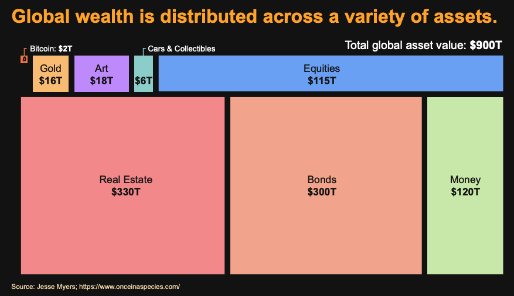
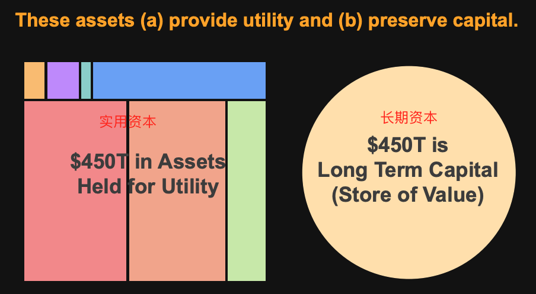
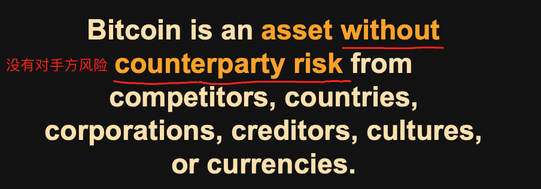
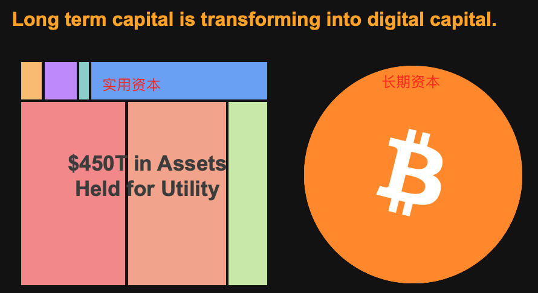
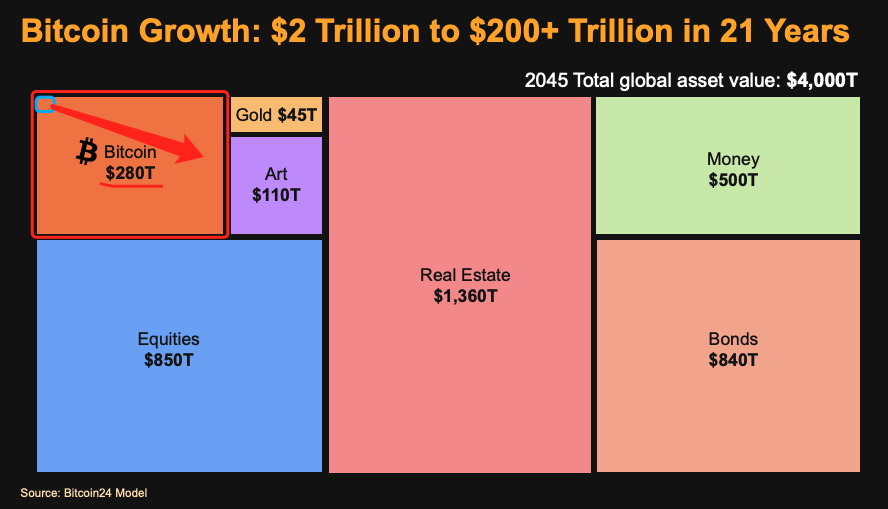
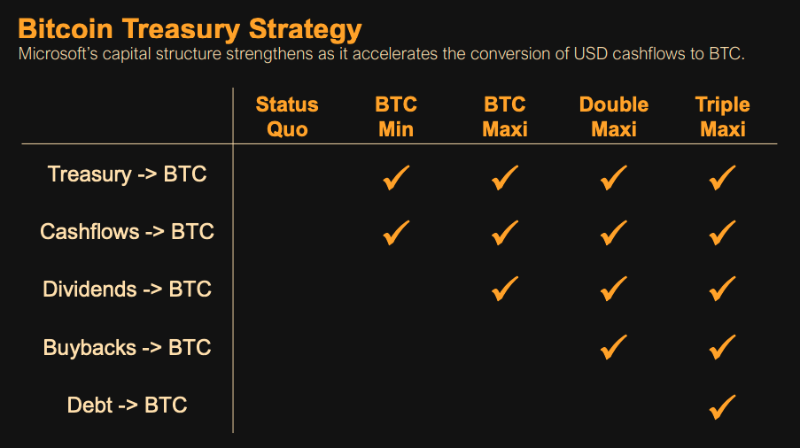
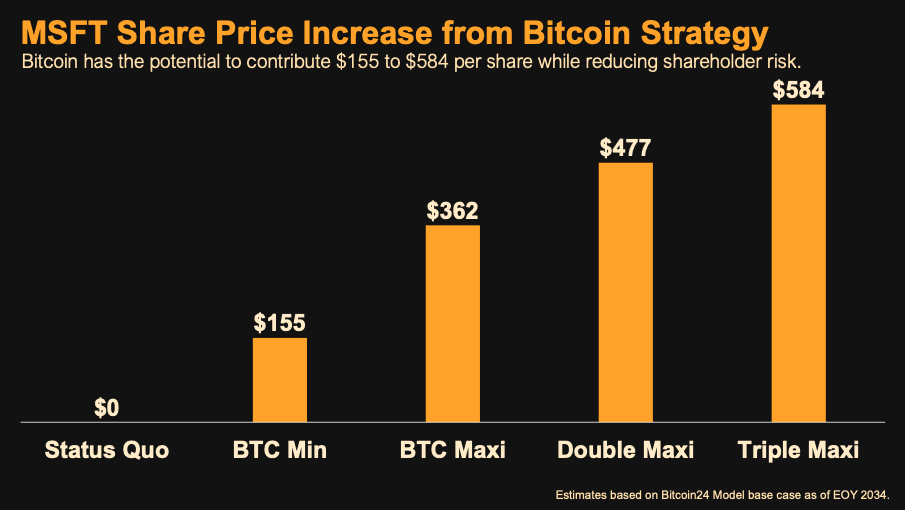
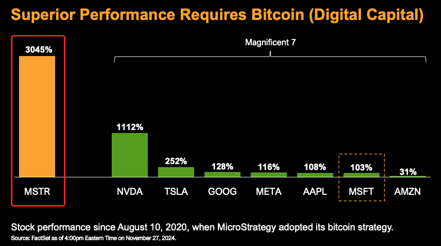

# 他，想说服微软囤BTC

号外：刘教链的VIP会员年终私董会（即2024年四季度私董会）现在开始登记报名了，请各位VIP会员查看《12.2教链内参：年终私董会开始报名啦！》了解和填报参会意向。一如既往的，年终私董会上，教链会发布并阐述2024年的年终报告，总体复盘过去一年的行业发展，展望明年的牛市进程。敬请期待。

隔夜BTC继续围绕96k中枢震荡，等待与30日线汇合。有不少人说山寨季启动了。教链只是看到，自己的Uniswap仓位收益率正在紧追以太坊仓位，就还差10个点了。

教链对待持仓，基本上是遵循“eat my own dog food（吃自己的狗粮）”原则的：自己用Uniswap，所以持有Uniswap；自己在EVM上开发代码，所以持有以太坊；自己囤BTC作为储蓄工具，所以持有BTC。

所以教链对于纯粹的“炒”是没有什么兴趣的。炒币，炒股，炒房子，还不如炒鸡蛋，炒黄瓜，炒土豆丝，炒油麦菜，炒蒿子杆，…… 教链甚至会觉得，把后面各种食材炒好，格物致知，可能是对于前面的投机大有裨益的也说不定呢。

其实，顶级大厨是不炒菜的。

顶级大厨、囤饼大师、机构钻石手代表、微策略公司创始人Michael Saylor（迈克·塞勒）日前造访微软公司董事会，给董事们做了一番有关BTC的科普，动员他们采用BTC战略，拿出一些资金，建立微软自己的BTC储备。

他的逻辑思路清晰而严谨。他的PPT较长，很多人，如果不够懂“资本”（Capital），可能不见得完全看懂。教链这里简要总结一下就是三段论：

一、未来，BTC将吸收全部长期资本。

二、如果微软把回购股票所“浪费”的资本，置换成BTC，那么将会更有效地推高微软的股价。

三、因此，微软应该采用BTC战略，囤BTC。

所以，Michael Saylor在演讲中给BTC的定位，说的也是“数字资本”（Digital Capital）这个词，而不是通常大家所讲的“数字黄金”（Digital Gold）。

妙极。

他这么一讲，就把BTC未来的成长空间进一步打开了。天花板不是黄金的市值16万亿美刀，而是全球总财富约900万亿美刀……的一半。

资本是什么？资本就是生产剩余，而且是用于投入再生产的剩余。任何社会，无论是什么文明阶段、什么文化、什么制度，其进步都有赖于资本的积累和运用。

如果整个社会就像原始社会似的，把生产出来的所有东西吃喝殆尽，挥霍一空，丝毫不剩，那么所有人都会终日处于为生存而奔波的最低级状态，根本没有时间、没有精力也没有资源进一步发展。

把各种生产剩余用货币工具测量（即货币化）之后就被变成了所谓的价值。马克思在《资本论》中称之为剩余价值。

在资本主义生产关系下，打工人努力劳动，生产剩余价值，归资本家支配。注意这里的资本家是严格不劳动的人；自己干活的老板，只能算半个资本家。资本家自己消费掉一小部分剩余价值，然后把剩下的部分，一半投入再生产，另一半则要放在安全的资本储存工具里作为长期资本，用于未来生产用途或者抵御经济周期风险等。

资本主义的先进性就体现在资本家这一环节。在奴隶时代或者封建时代，支配剩余价值的不劳阶级只知挥霍，这十分有害于资本的积累，从而阻碍了生产力的进一步改进和提高。而资本家阶级，虽然也会消费掉一小部分剩余价值，但其挥霍程度比之封建帝王已属节俭，大量的剩余价值得以被保留下来，成为投入再生产的实用资本，以及暂时储蓄不用的长期资本，从而推动了社会生产力的快速进步，使得资本主义在过去短短三四百年时间里，创造了比整个人类社会在此之前数千年文明史所创造的总财富还要多的财富。

因此，Michael Saylor认为，目前全球总财富900万亿美刀，估算一半即450万亿美刀是用于当前再生产的实用资本，而另一半即450万亿美刀则是暂时储蓄不用的长期资本。而右边这一半450万亿美刀长期资本，就需要找到合适的“价值存储”工具妥善保存和储蓄起来。

为什么Michael Saylor不把BTC称为电子黄金而是电子资本呢？因为时至今日，人们用于“价值存储”的工具，早就超越单一的黄金了。股票、房产、债券、法币甚至是艺术品，等等，都被人们拿来用于存储价值。

但是这些东西，拿来作“价值存储”，都有一个极大的缺陷。是什么呢？请各位读者想一想。

对了，这个致命的缺陷就是，这些东西往往都是被别人掌控的，而掌控者可以通过不断地发行（超发）其数量，从而冲淡和稀释你存储于其中的价值。

比如：艺术品，艺术家可以源源不断地创作新品；股票，上市公司可以合法增发；房产，可以不断地盖新房子；债券，政府和机构可以合法地不断发行更多；法币，央行可以合法不断印钞；等等。

他们有一个共同特点：没有存入，却可以无限支取。

很明显的，他们不是你的同伴，而是你的对手。

你用这些工具的目的是存储价值，但是这些对手的存在就是一个很大甚至是最大的风险。

这在金融上有个术语叫做——“对手方风险”（counterparty risk）。

因此，Michael Saylor说，BTC是比这些工具都要更好的价值存储工具，原因就在于，BTC没有“对手方风险”。根本上，因为BTC从最初就是去中心化的。中本聪在启动它的过程中，从未给BTC系统引入过任何一种“对手方”。功成身退，把自己这个潜在风险，也消散在历史云烟之中。

这样，BTC就将终成历史的选择，被所有有机会支配长期资本并需要寻找最安全的、没有对手方风险的价值存储工具来存储这些长期资本的人，所一致青睐，一致选择。

最终，其他资本工具都将逐渐退化为实用资本（比如房住不炒，只能用于自住(消费)或出租(实用资本)），而长期价值存储的需求，将尽数落在BTC身上。

这就推理出了Michael Saylor的第一个结论：未来，BTC将吸收全部长期资本。这个规模就是全球总财富的一半。

他的这个结论，和教链2024.3.4文章《比特币终局：或将等于人类全部剩余的价值总和！》相近，但更具体、准确。

这也是教链多次说过的，囤BTC的真义，就是吸收全世界的剩余价值。囤的多，吸收的多。囤的少，吸收的少。

基于此推论，Michael Saylor提出，BTC在未来21年将有望从2万亿美刀市值增长140倍到280万亿美刀市值。

这就给微软，作为一个剩余价值的掌控者，如何更合理的支配和运用它所支配的剩余价值，提供了更好的策略选择。

过去，微软赚了大量利润，无处投资，就拿来回购自家股票，从而拉升股价。

拉升股价，是回馈股东、公司高管（大部分高科技企业高管的薪酬包里都有很多股票或者期权之类的激励）甚至包括一些持股员工。

Michael Saylor是个优秀的销售。

记住：销售的第一原则是诉诸利益，而非诉诸情感。

画大饼固然看似宏伟，但是如果不能给在座各位听众带来切身的利益好处，那么你是无法打动他们，进而让他们买单的。

Michael Saylor此番演讲，在座的是什么人？微软的董事会，董事们，股东们。

他们对BTC宏大愿景没有直接共鸣。但是他们对自己兜里的微软股票股价上涨，那是很有共鸣。

所以Michael Saylor话锋一转，开始谈论，如果微软改变对于剩余资本的处置策略，那么就会带来可观的股价回报。

他给出了四种策略：BTC最小化，BTC最大化，双倍最大化，三倍最大化。分别代表着不同的投入力度。教链这里就不再展开。

然后他贴心地帮会议室里在座诸位计算了一下，各种策略下股票的超额涨幅有多少。潜台词：诸位可以心里暗暗盘算一下，自己的身价可以增值多少哦。

据他测算，采用BTC策略，可以在未来十年，让微软股票产生每股$155至$584的超额涨幅——即，除去普通业务增长所带来的常规增幅之外的额外增幅。

作为参考，微软当前股价是每股$430。

逻辑是什么？逻辑就是，用公司自己干业务赚的钱回购自家股票，是自己赚钱支撑自家股价；而用这些钱去囤BTC，则是用全世界赚的钱来支撑自家股价。

显然，吸收全世界的剩余资本来支撑自家股价，肯定比自己单干要好很多。

Michael Saylor最有资格说这个话。因为微策略的股价，几乎都是BTC支撑的，而不是它那点儿小的可怜的软件业务支撑的。

于是他秀出了他的大东西——3045%的大柱子。

至此，话就说完了。

各位董事朋友们，想要发财致富、身价暴增吗？请提升公司股价。不要再用回购提升股价的老办法了，请用BTC策略大幅提升公司股价吧。

这就是Michael Saylor的“销售”逻辑。

他为何在这个时间点去说服微软董事会呢？看过《11.15教链内参：回踩5日线，再战9万刀》的朋友可能还记得，12月也就是这个月的10号，微软要搞一个股东投票，审议是否要采纳储备BTC的提案。

大家觉得Michael Saylor的这番论述，能说服微软的董事和股东们，最终投票赞成采用BTC储备战略吗？
