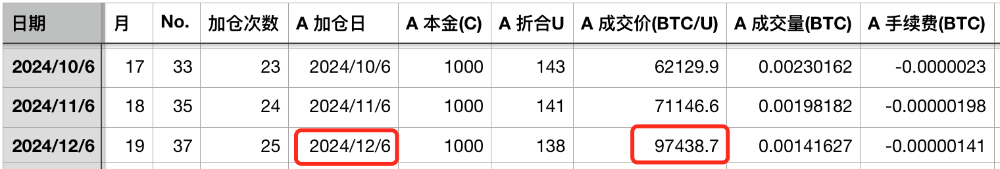
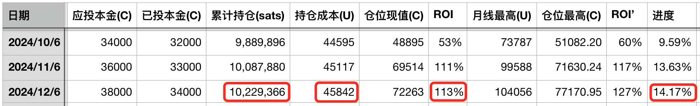

# 比特币无需“背书” —— 十年之约系列＃37（ROI 113%）

隔夜BTC突然插针，从10万刀上方，最低刺破9万刀，以这种方式与30日线进行了一次亲密接触，波动幅度高达10%，体现出BTC虽然已经长大成了10万刀的少年，却仍然活力无限。活力无限，未来才不可限量。

教链启动于2023.6.6的《八字诀·十年之约》实盘见证计划又到了坚持定投加仓时间。本篇是十年之约系列第37篇笔记。本月是坚持计划的第19个月。本次加仓是第25次加仓。加仓成本97438.7刀。投后总持仓增至约102万聪，持仓成本升至45842刀，收益率113%。进度14%（按50%储蓄率测算）。

经常听到有人说，BTC不是货币，这东西没有什么“背书”呀？教链听这种话也听了有五六年了。

网友Eric Yakes解释得好，这是一种思维观念的误区。

因为我们习惯了纸币，所以总觉得货币总得有其他东西来“背书”。其实深入思考以下就会发现，纸币之所以需要其他东西背书，就是因为纸币本身缺乏一个重要的货币性质——稀缺性。

最初的美元为什么是用黄金背书的？无它，无非是因为黄金具有美元所不具备的稀缺性而已。

正如诺贝尔经济学奖获得者、经济学家哈耶克所指出的，“人们时刻会以发钞者所发行的货币赎回黄金的可能性，不过是对发钞者施加了一种纪律约束而已，这能迫使他们将货币数量控制在适当的水平”，“金本位制只是在我们还没有找到约束政府的纪律的时候才勉强使用的一种办法而已”。

通过用黄金来背书纸币，我们得以享受到两者优点的结合：纸币的容易携带、运输成本低、分割简单，以及黄金的稀缺性。

“货币(Money)是黄金，而不是其他任何东西。”——1912年，大银行家摩根的证言。《比特币史话》第九章第35话

真正的货币不需要国家许可。货币贯穿于人类文明史。它比国家出现的还要早——石器时代还没有国家建构，但人们也许就已经开始使用货币。它也应当会比国家更晚消亡——世界大同到来之时，国家建构已经瓦解消亡，但人们也许仍然在使用货币。

法币(fiat)，即由国家建构通过立法形式所许可和认可某种货币，只不过是人类漫长文明史中的暂时现象而已。法币终将消亡，但货币永生。

在人类文明进入数字时代之前，为什么各种形式的天然货币慢慢归于了黄金？

无它，正是因为黄金乃所有人类可用之物中，最能满足诸货币性质的东西。这些货币性质包括：稀缺性(scarcity)，耐久性(durability)，可分性(divisibility)，便携性(portability)，同质性(fungibility)，接受度(acceptability)，等等。

“金银并非天然是货币，但货币天然是金银。”——马克思。《比特币史话》第九章第36话

自上世纪90年代互联网浪潮之后，人类文明快速进入了数字时代。

最初，互联网上的数字无法表示稀缺性——因为任何人都可以随意拷贝复制任何数据。

直到2008年，一个天才人物中本聪的横空出世，解决了如何在可以无限复制的互联网上，原生地实现具有稀缺性的数字的技术方法。

这就是比特币（BTC）。

可以说，在数字时代，BTC并非天然是货币，但货币天然是BTC。

无它，正是因为BTC乃所有人类可用之物中——包括原子形式的实体物以及比特形式的数字物，最能满足诸货币性质的东西。这些货币性质并没有变，仍然是上文所介绍的诸性质。只是，在这些性质上，BTC比黄金结合纸币的组合还要好。

BTC没有背书。BTC不靠背书。BTC无需背书。BTC自己就是自己的背书。

我们可以说，BTC是自证的(self-evident)。

从技术上讲，BTC是自证的，因为工作量证明(PoW)是自证的。为什么其他所有形式的共识机制所产生的数字资产形式，在货币性质上都不及BTC？归根结底是因为，在第一性上，它们都不是自证的。

故而，所谓黄金背书纸币，就是用黄金的稀缺性来证明纸币的稀缺性。纸币不能自证，所以需要他证。

他证必须是由技术操作来保证真的，否则就是假的。这个技术操作就是赎回。纸币持有者可以随时拿纸币赎回黄金的权利，才确认了背书的真实性、有效性。

所以当1971年美国单方面宣布解除美元赎回黄金的权利之后，这个背书一夜之间就消失了。

历史教训告诉人们，背书体现为赎回，赎回依赖于中心化权力的保障，也就可以被中心化权力一夜褫夺。

BTC自己背书自己的稀缺性，从而无需其他稀缺物来背书，就是要彻底解决掉中心化权力对持有者的储蓄予取予夺的问题。

更别说，在其他货币性质的诸方面，BTC都比黄金和纸币加起来还要好。比如：稀缺性上，比黄金更稀缺，总量上限固定；耐久性上，比黄金更耐久，永不腐坏；可分性上，比黄金、纸币更可分，最小可细分一亿份即1聪；便携性上，比纸币更便携，甚至可以记在脑子里；同质性上，比特和比特几乎是一样的；接受度上，正在为越来越多人所认可和接纳；……

还有防伪性，链上绝不会出现假币；安全性，自己私钥控制，不会出现被随意制裁、没收的风险；…… 等等。

有人说，BTC是电力背书的，或者更一般的，是能量背书的。

首先，你用BTC并不能找谁赎回电力或者能量，所以这个说法并不准确。

其次，广义地讲，人类社会的一切事物最终都是能量，是来自于太阳的赐予。所以用能量说，显示不出BTC和其他物的任何差别。

关键是，我们不应该保留脑子里“价值需要背书”的观念，而拼命去给BTC找到背书物，而是应该勇敢打破旧的思维框架，认识到真正的货币物是不需要他事物背书的。

学习和认识BTC，需要我们打破很多旧的、传统的思维墙壁。

越是善于思考的人，越能够通过主动思考和逻辑推理，自己打破思维壁，突破自我，提升认知，提前开悟，领先于其他人，更早抓紧BTC的机会。

而越是迷信权威的人，往往自己缺乏独立思考能力，传统权力通过传统媒体给他们注入了思想钢印，他们自己无法打破思维壁，也就无法开悟，从而只能寻求自我安慰和阴谋论，来应对认知失调，从而不断错过BTC的机会。

从这个意义上，BTC就像是一把破壁锤，帮助我们敲碎过去的思想钢印，打破传统的思维墙壁，不断走向开悟，实现认知升华，从而进化为一个更高阶的人。
