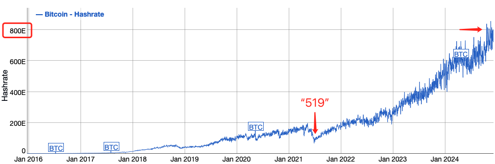

# 最后一枚比特币

周末BTC依旧于100k附近下方盘旋。过去一周是十万刀成真的一周，《12.8教链内参：第49周 好大饼初破六位数 新主管白宫展宏图》对此进行了回顾。

一枚BTC十万刀，确实让普通散户觉得不便宜了。但是，你知道吗，按照比特币系统代码规定的产量减半算法，总量上限2100万枚BTC中的最后一枚比特币，将要在2140年完全停止增发前，约需花费35年的时间才能够开采出来。

上图是BTC产量减半的时间表。每次减产后会挖掘21万个区块，大约4年的时间。简单计算可知，从2104年减产之后，直到2140年完全停止产出，总共可以产出BTC的数量为：

(298+149+74+37+18+9+4+2+1) * 210000 / 10^8 = 1.2432

现在，全球BTC网络已经拥有高达约800EHash/s的算力。800EHash/s，就是一秒钟能够计算800 x 10^18个哈希数，即800,000,000,000,000,000,000个哈希数。

据查，目前全球排名第一的超级计算机是美国的 El Capitan，它拥有超过 1.7 EFlops（每秒 1.7 × 10^18 浮点运算）的性能。

按教链《比特币史话》第十一章第53话记载，「超算的算力单位是 FLOP/s，根据之前中本聪和网友们对 CPU 算力实测数据的粗略估计，通用计算机的浮点算力转换为哈希算力，数值上大约需要减小为原来的万分之一，也就是说，每 1 万浮点算力(10 000 FLOP/s)约折合 1 哈希算力(1 hash/s)。」

也就是说，这台全球第一超算的算力，大约相当于 1.7 x 10^14 Hash/s。

800EHash/s，大致相当于500万台这样的超算。

在教链2020年写《比特币史话》的时候，世界最快的超算还是日本富岳（约442 PFlops/s），当时BTC全网算力仅100EH/s，约相当于300万台超算的算力。四年过去，超算性能提升至3.8倍，BTC全网算力则增长至8倍。

超算的技术在进步。但BTC算力技术进步的更快。

这还只是考察了算力的维度，没有考察能耗的维度。

在2020年写作《比特币史话》的时候，教链就对能耗做了估算，并如此写道：「而如果真的使用 300 万台超算，且不说能否有足够的资金生产制造，仅就其功耗而言，就要消耗掉 3 万倍于今天比特币挖矿所消耗的电能，这就不太可行了。」

这四年来，BTC算力发展进一步和超算拉开了差距。能耗差距，估计也进一步拉大了吧？

因此我们说，BTC的安全性，不是停留在抽象的、逻辑的层面，而是落实在人类无法僭越的物质和能量层面！

没有任何其他物，能够以更低的代价，压过BTC网络用以保护所有BTC安全的算力。这句话已经是一句板上钉钉的客观事实。

BTC可能还不是人类目前所有财富形式中市值最大的资产，但它已经是最安全的资产。

现在回过头来，想一想本文开始的问题，即，以BTC全网算力如此巨大、未来更为巨大的算力，穷35年之光阴，只为铸就最后一枚BTC。

试问这样一枚BTC，价值几何？

而就是与此完全相同的一枚BTC，今天却仅需10万美刀不到，就可以轻松拥有。

值，还是不值呢？
