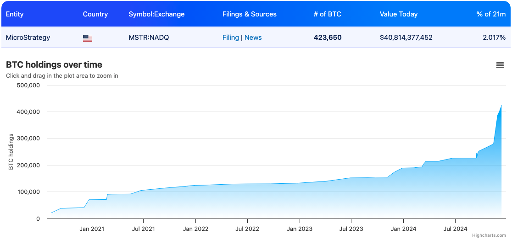

# 微策略目标：1个中本聪

隔夜BTC在96k附近寻求5周线的支撑。凌晨微软股东关于BTC储备的投票未通过，市场意料之内。微策略又加仓了。Michael Saylor发帖称：

「微策略已以约 21 亿美元的总价购入 21,550 枚BTC，平均价格约为 98,783 美元/枚。季度累计BTC本位收益率达到 43.2%，年初至今收益率为 68.7%。截至 2024 年 12 月 8 日，微策略持有 423,650 枚BTC，总购入成本约为 256 亿美元，平均价格约为 60,324 美元/枚。」

网友Fred Krueger剖析了一下微策略的加仓策略：

11月初的时候：微策略持有25.2万枚BTC。BTC价格69k。微策略股价是每股净资产的2.1倍。

微策略制定了一个计划，加仓17.1万枚BTC，仓位增幅68%。总计花费160美元，其中30亿美元通过可转债从美股市场上融资。最终，微策略股价成功提升至每股净资产的2.4倍。

数学魔法：由于较高的平均净资产倍数（2.9 倍）和可转换债券的使用，这次 BTC 持仓增加 68% 的计划，仅导致发行4千万股新股（增幅 17%）。验算：1.68 / 1.17 = 43% 的第四季度收益率（符合声明）。

回顾总结：微策略花费了 160 亿美元，将每股收益提升了惊人的 43%。

教链注：在新股增发的数字这里，Fred Krueger写的是40k。教链怀疑他笔误了，可能是要写40M，因为截至2024年12月份，微策略总流通股本约为2.3亿股）。另外值得吐槽一下的是，满网上搜索微策略总股本，居然找不到一个可靠的数字，各个财经网站给出的数字都不太一样。每每深入到这些细节问题的时候，就会在心底默默地更加坚信，区块链和数字资产将来一定会取代这些老旧的金融体系。这些老旧的体系，甚至让散户连一个数字都搞不明白，也没有任何可以公开透明可信验证的办法。简直令人怀疑是不是故意含混之。因为数量问题，是操弄增发稀释最关键的数字。任何一个接触过区块链代币经济的人都明白，代币经济最重要的顶层设计之一，就是总量和增发方式。

拉回正题。然后，Fred Krueger提出了一个新的BTC计量单位：1个中本聪(1 Nakamoto)，等于110万枚BTC —— 这是疑似中本聪早年挖矿开采的BTC数量。

以前，BTC原链最小单位是1亿分之一BTC，称为1聪(1 satoshi)。现在我们可以有一个比较大的囤币单位，1个中本聪，等于110万枚BTC。

我们知道，就在前几天，美现货BTC ETF的总持仓刚刚超过了1个中本聪。（参阅《12.6教链内参：美现货ETF大饼持仓超过中本聪》）

Fred Krueger推算，如果Michael Saylor尝试让微策略囤积BTC达到1个中本聪的量，还差676,350枚BTC。按现价96k估算，约需649亿美刀。这是此前160亿美刀的4倍。

借鉴以前黄金背书的纸币都讲究一个“含金量”，现在用BTC背书股票，可以有一个“含聪量”，即每股背后有多少聪BTC的支撑。

按目前微策略最近加仓后持有423,650 BTC，以及总股本增发后大约变成2.3亿加上4千万新股约等于2.7亿股推算，每股含聪量为：

423650 / 2.7 = 15.7万聪/股

如果微策略仍能以同样的融资效率去再融4倍的美刀，增持至1中本聪，那么持仓增至110万枚BTC，总股本扩容至4.3亿股，每股含聪量将提升为：

1100000 / 4.3 = 25.6万聪/股

算到这里，不知各位读者有没有发现，按微策略这个玩法儿，它虽然一直在增发股票稀释，但是由于它把增发融来的美刀全部换成了BTC，反而导致每股股票的含聪量上升了，如果长期看好BTC的价值增长，这意味着微策略每股价值也经过这种操作而得到了更大的提升。

当然，这个演算是太理想化了。首先，微策略能不能持续以高溢价从美股市场融资，是一个问题。其次，如果微策略一直这样买入，那么BTC的价格就决不会一直停留在96k这个位置等它慢慢加仓。也就是说，第一它未必能顺利融到那么多钱，第二就算它融到钱，也未必能以低价买入那么多BTC。

虽然如此，但是微策略仍然借助美股市场泛滥的美元流动性，实现了大量囤积BTC的战略目的，这番巧妙借势，实在是令人赞叹。
