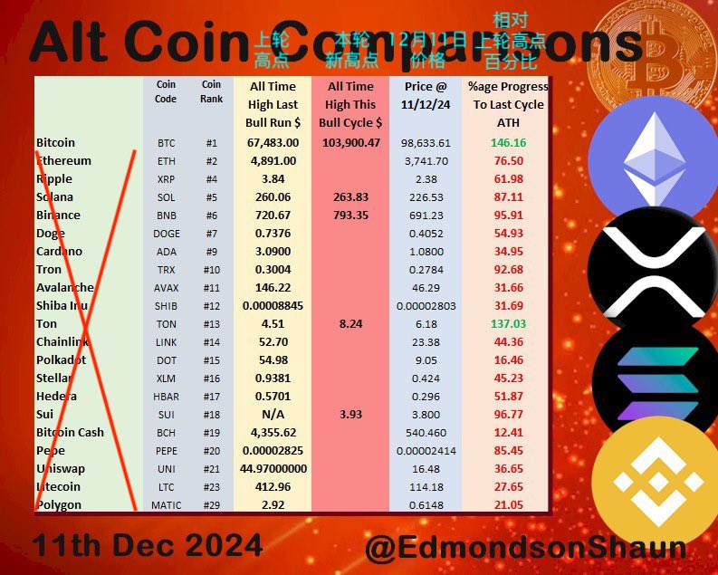

# 穿越牛熊，无一跑赢BTC

隔夜BTC再度发力，又上十万刀。有网友发现，上轮牛市即2021-2022年创过新高的山寨币、模因币，市值排名前50的，穿越牛熊，无一跑赢BTC。

不知道2021年3月9号写下《Uniswap(UNI)实盘回顾：站上30刀，跻身市值前10，大幅跑赢比特币》的教链，是否预料到时至今日大幅跑输BTC的窘况？

设若按BTC十万刀计算，ETH应回升至7000多刀、UNI应回升至70刀，但它们目前却仍仅前进至3800刀和17刀附近。

故而教链诸仓位收益率，就暴露了上轮布局山寨的“弄巧成拙”：BTC 495.6%, UNI 55%, ETH 48.6%。

如果按照BTC相对前高的升幅推算，UNI和ETH的收益率则分别应当达到538%和174%。

理想很丰满，现实很骨感。

每一轮新进场的无数小白新手，个个初生牛犊不怕虎，摩拳擦掌，跃跃欲试，总觉得自己能轻松战胜市场，跑赢BTC。掏出真金白银，下场耍一耍，就知道自己几斤几两了。

你觉得，一钱不值。你能不能持续做到，价值千金。

二级市场投资往往特别磨练一个人的一项重要品质：诚实。

诚实地面对真实的自己。拎得清自己几斤几两。老老实实地承认自己水平一般。

知之为知之，不知为不知，是知也。英文谓之intellectual honesty。

仓位收益率往往和你诚实的程度成正比。

越诚实，收益率越高。

越自大，仓位亏得越快。

狂妄、骄躁者，教链见过不少，但是能穿越牛熊活下来的，一个都没有。

诚实才会谨慎。慎始才能慎终。

往往是事后回顾起来，才会意识到事前“风控”的重要意义。教链当初做的风控有这么几条：

第一，先囤积BTC，BTC建仓目标达成，多余资金才可以配置其他品种。

第二，BTC仓位是压舱石，任何情况下都不允许抛售BTC换成其他资产。

第三，单一山寨仓位的比例应控制在BTC仓位的10%以内。

风控的反面当然就是山寨收益对总体收益率的贡献度降低。以至于即便遇到好的行情，对整个盘子而言也就是洒洒水啦。

这就告诉我们一个人生的道理：没有任何有利可图之事，是不存在对应代价的。

很多时候，看到一件好事，先别着急跳坑。请先想一想，代价是什么。

没有代价的好事，必定是陷阱。

不能承受风险之代价，是无力的。而不知风险之代价，则是愚蠢的。

不管是无力，还是愚蠢，都是阻碍我们走向成功的绊脚石。

无力的解决方法是努力。愚蠢的解决方法是学习。

努力挣钱，认真学习，戒骄戒躁，不贪不惰，则人人都可以取得成功。
