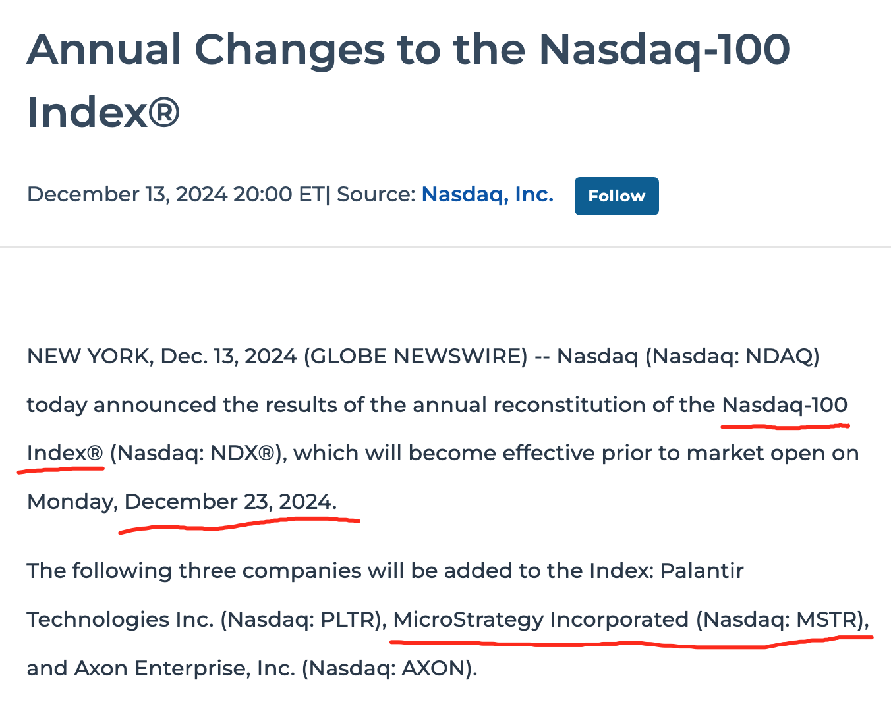
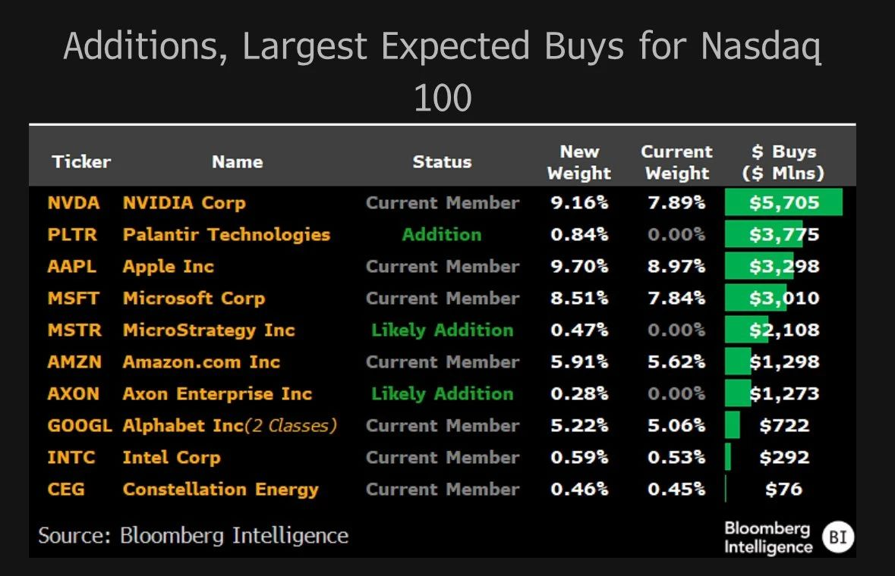

# 微策略将于12月23日进入纳斯达克100指数

周六BTC继续在10万刀上方横盘整理，小幅拉升。周五美股收盘前最重磅的消息，莫过于纳斯达克宣布，将把众所周知的“囤BTC公司”微策略（Microstrategy, MSTR）纳入纳斯达克100指数，该决定将于2024年12月23日开盘前正式生效。

三天前，《12.11教链内参：微策略或将进入纳指100》就曾说过此事。

此前一个预计的可能障碍是，微策略公司现在的市值主要是靠BTC支撑，而非其主业软件开发，如果这导致它不能被认定为科技公司，则无法进入排除金融公司的纳斯达克100指数。

不过，历史大事，浩浩汤汤，终究还会形势压过了质疑。微策略涉险过关，成功入选纳指。

定投纳指的兄弟忽然之间竟成了友军。😂

这就看出来BTC去中心化、超主权、跨国界在扩大共识方面的独特优势了吧？极强的包容性，友军遍全球。

正如教链在2019.9.29文章《比特币的文化类型及其历史位置》中，引述《人类简史》作者尤瓦尔·赫拉利教授所指出的：“金钱是有史以来最普遍也是最有效的互信系统。”“就算是在宗教上水火不容的基督徒和穆斯林，也可以在金钱制度上达成同样的信仰。”“比起语言、法律、文化、宗教和社会习俗，钱的心胸更为开阔。所有人类创造的信念系统之中，只有金钱能够跨越几乎所有文化鸿沟，不会因为宗教、性别、种族、年龄或性取向而有所歧视。也多亏有了金钱制度，才让人就算互不相识、不清楚对方人品，也能携手合作。”

从这个角度看，20世纪70年代以来脱离黄金锚定的法币无异于一种历史的倒退，因为法币开始和一个国家相绑定，从而以这个国家的利益为偏见，用这个国家的价值观去歧视。历史会走弯路，但终究会修复错误，继续前进。人类文明的继续进步，需要一种无国界货币。它具有超越一国之狭隘的全人类包容性，从而更加适合于未来的多元化世界。

前几天网上还在传alipay推某QDII基金的加密广告，具体产品穿透情况教链在《12.12教链内参：15年流入资本，一半在今年》中详细说过，不再赘述。这还没有一周，想搭一搭加密顺风车的内地散户，可以直接选择纳指100的QDII-ETF了。惊不惊喜？意不意外？开不开心？这类产品满大街都是，就无需多说了。

不过呢，这次微策略在纳指100中的权重也就只有0.46-0.47%的样子。如果是冲着加密而去，恐怕是聊胜于无的了。

无论如何，微策略进入纳指，是微策略的胜利，也是加密的胜利。

有网友画了一幅图。微策略就像一支特洛伊木马，成功地把BTC带入了纳斯达克的大门，从而让全球无数资本，开始自动地被动配置对BTC的敞口。

这些敞口有望给微策略带来的增量资本大概有多大量级呢？网友@Starskov做了一些估算。

- 美国各州养老金：20亿美元
- 全球主权财富基金：48亿美元
- 全球养老金基金：35亿美元
- 全球ETF：25亿美元
- 投资银行：27.6亿美元
- 对冲基金：46亿美元
- 家族办公室/高净值人群：69亿美元
- 散户：46亿美元
- 保险公司：16.6亿美元

全部加起来，大约330亿美元。

如《12.11教链内参：微策略或将进入纳指100》中教链所说，十万刀，微策略居功至伟。

12月23号，惊世开场，拭目以待。
