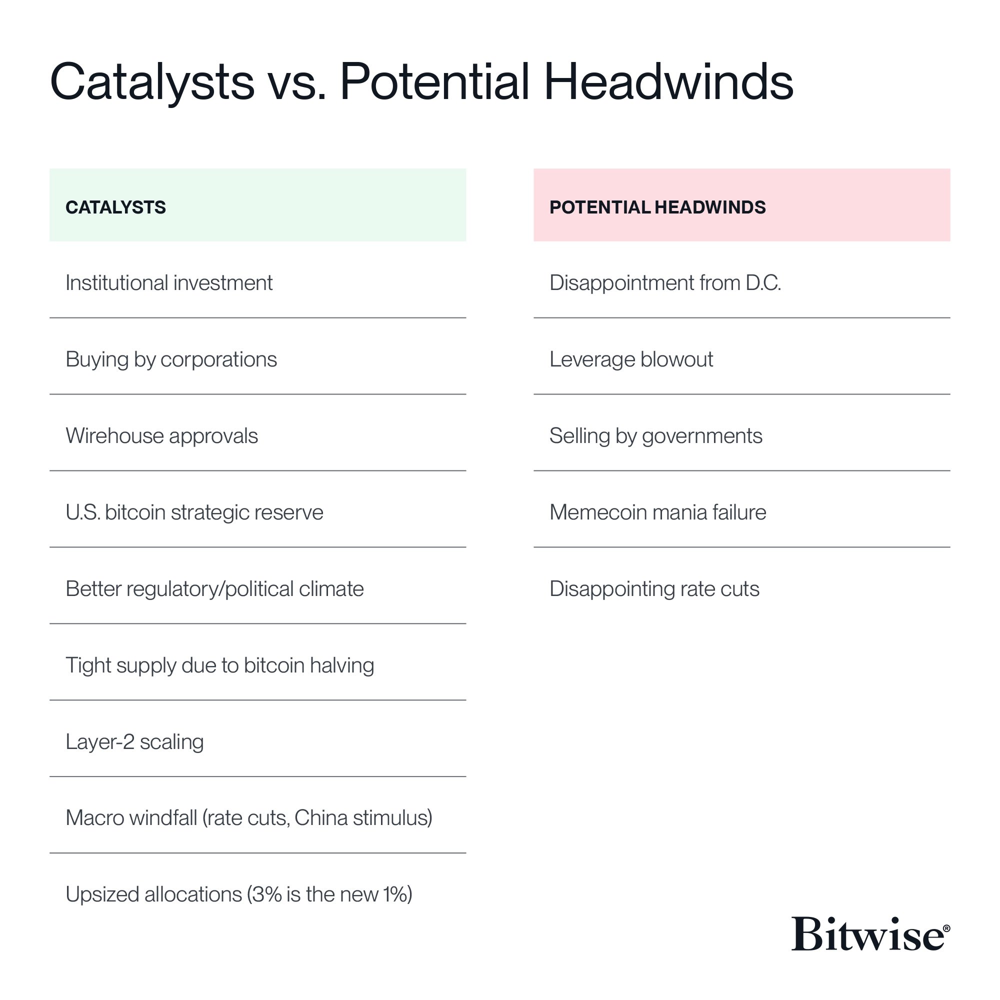
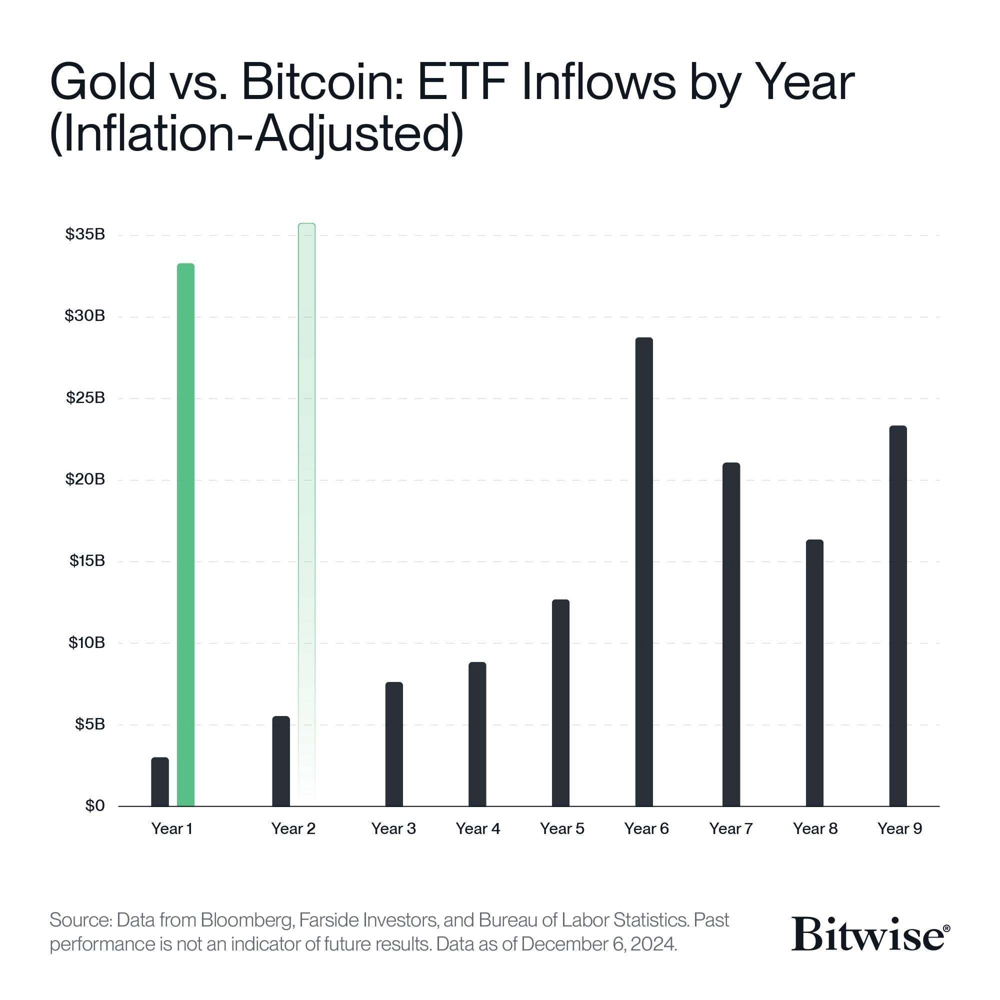
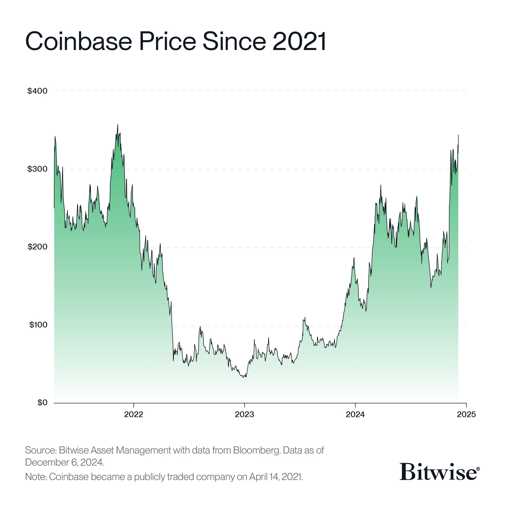
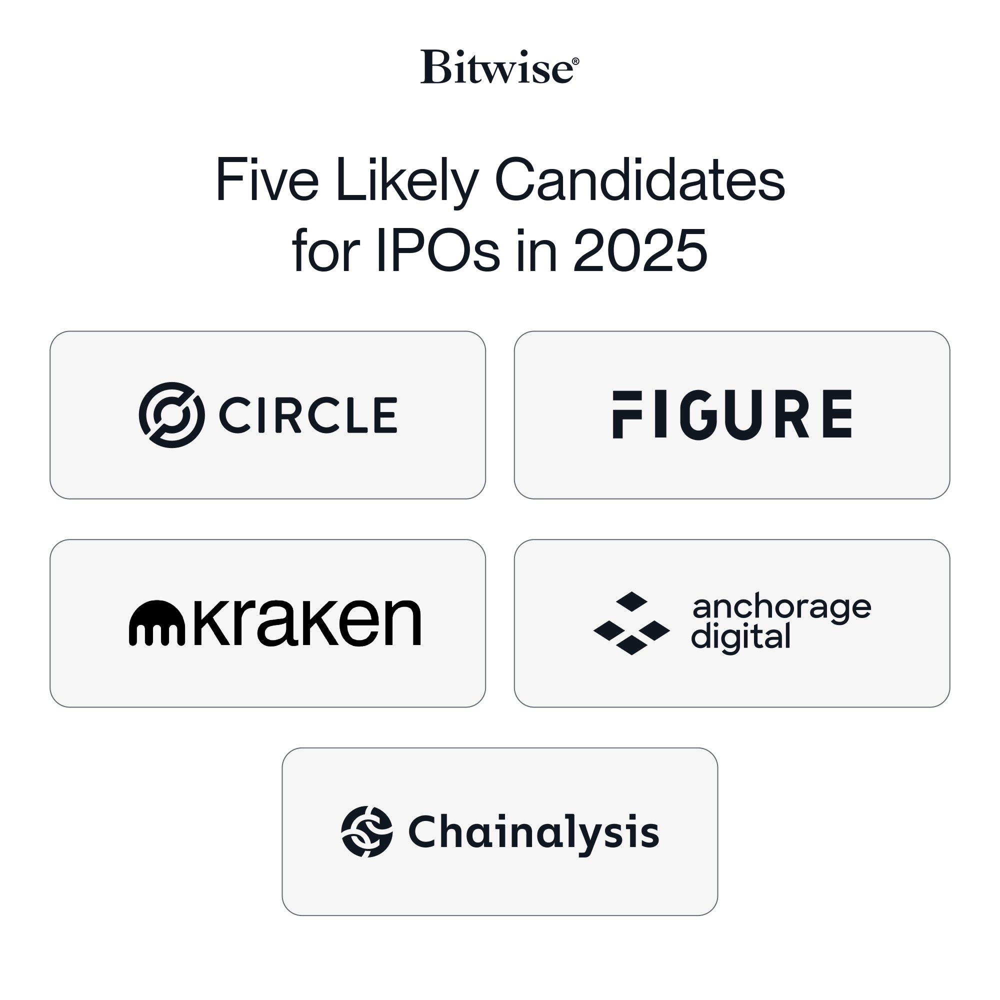
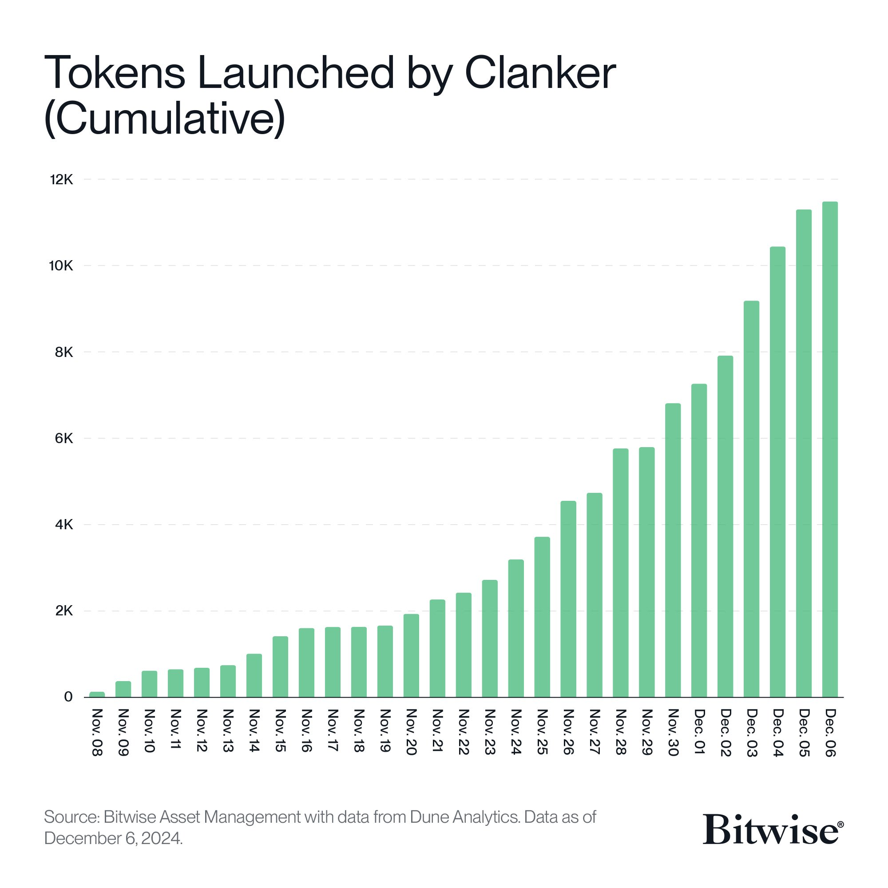
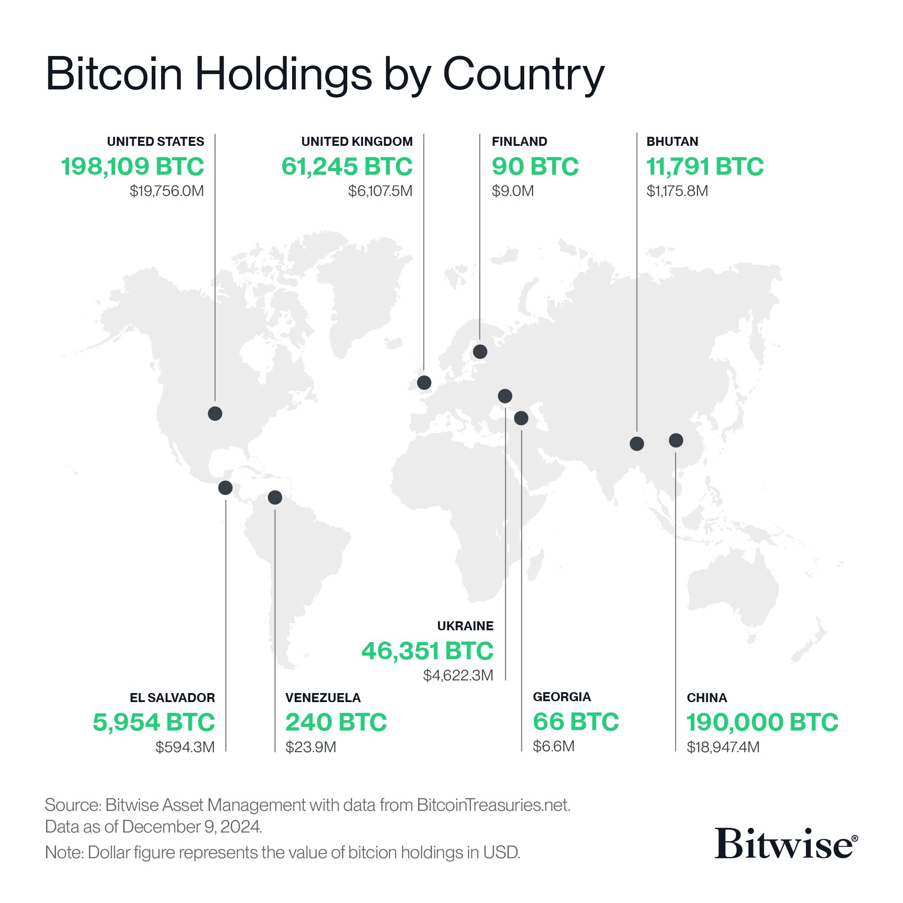
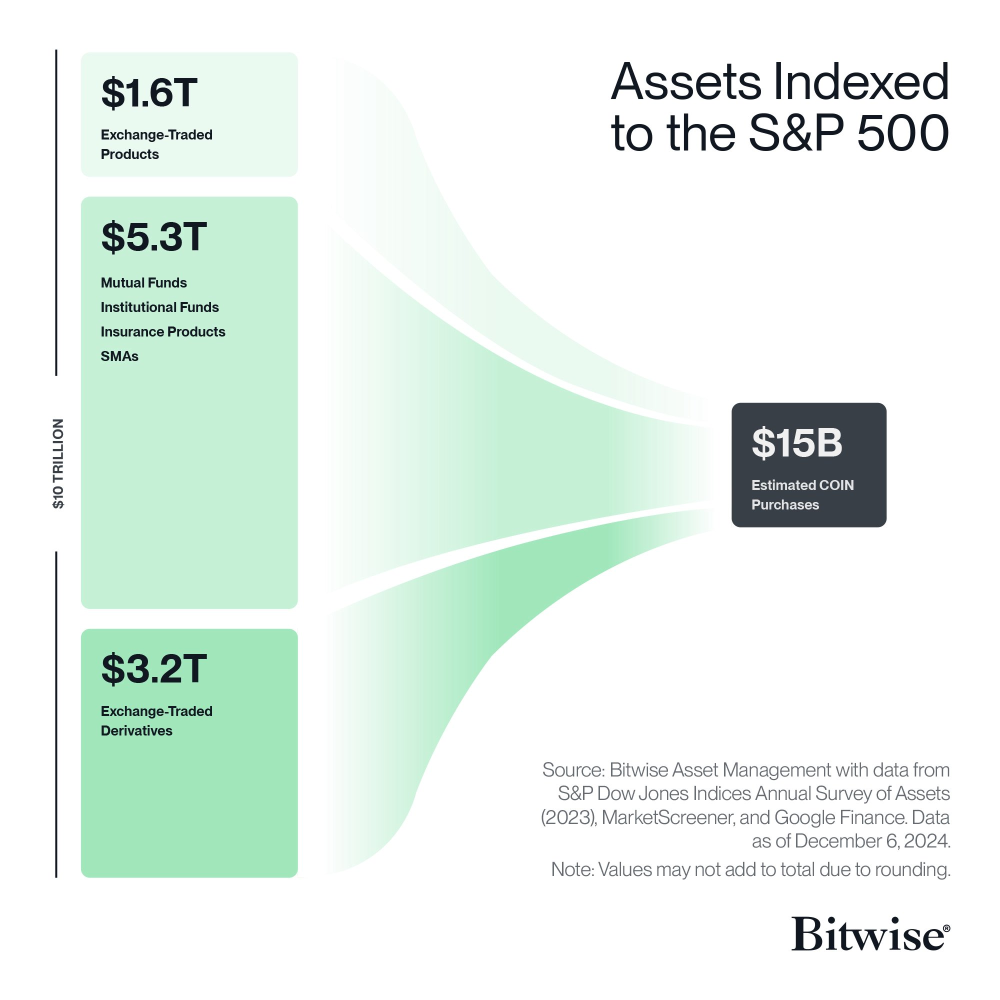
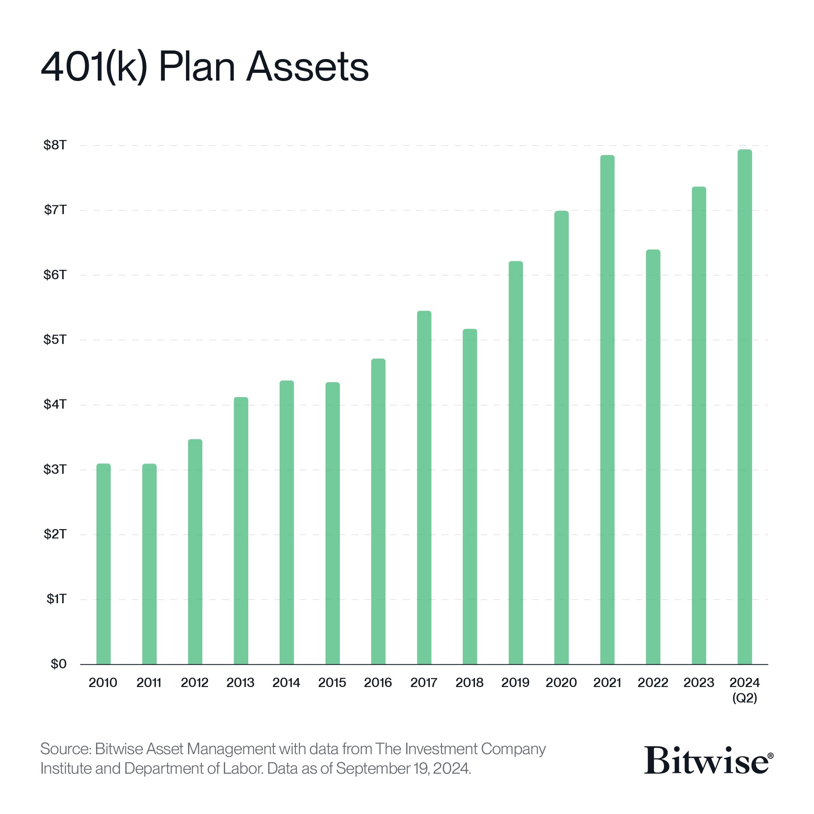
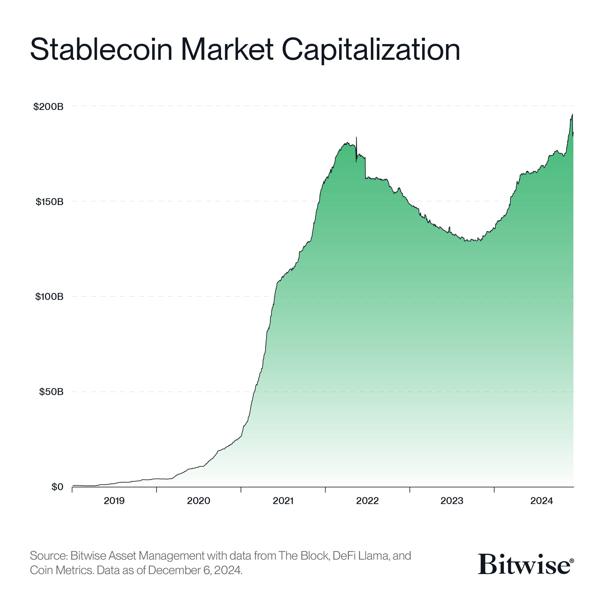
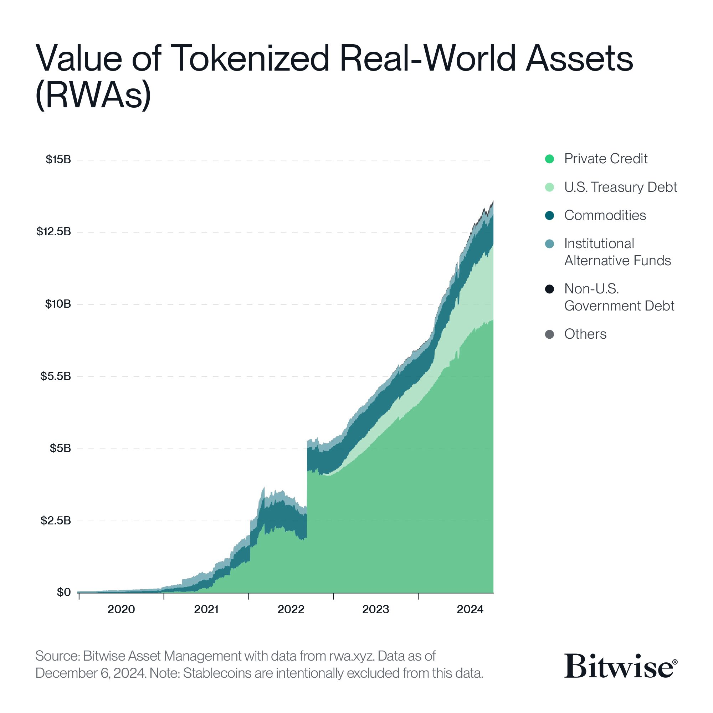

# 美资管机构的2025年十大预言

BTC最近回踩30日线后反弹并企稳在10万刀上方。《12.15教链内参：第50周 微策略鲤鱼跳龙门 行路难多歧路今安在》提到，年关将近，华尔街机构们纷纷开始展望2025年。下面是美资管机构Bitwise的2025年十大预言，

一、牛市催化剂和潜在目标。

BTC：企业/政府进场，ETF流入，以及减半后导致的供应冲击。目标：200k。

ETH：L2增长，稳定币，代币化等。目标：7k。

二、BTC ETF或将吸引更多资本流入。

2025年现货BTC ETF或将有更多流入。三个原因：1、ETF首年通常是最慢的一年；2、主要投行正在进入；3、投资者正在加大资产配置比例。

三、Coinbase 可能超越嘉信理财（Charles Schwab），成为全球最有价值的经纪公司。

原因：1、稳定币业务发展很好；2、他们推出的二层链Base将巩固其领先地位；3、他们的质押和托管服务有望在 2025 年实现倍增。

四、2025年或将是“加密货币IPO年”，预计至少有五家加密独角兽公司将在美国上市。

过去几年，加密公司IPO相对较少。但Bitwise预计2025年将迎来一波加密创业公司IPO的热潮。

五、由 AI 代理推出的代币将引领一场比 2024 年更大的模因狂潮。

比如 Clanker，这是一款能够在 Base 上自主发行代币的 AI 代理，已经推出了 11,000 个代币。

六、持有BTC的国家数量或将翻倍。

美国正在考虑建立战略BTC储备这一事实，或将开启一场“军备竞赛”。

目前，据称有 9 个国家持有BTC（以美国为首）。Bitwise预计到 2025 年，这一数字将翻倍。

七、MicroStrategy（微策略）已经进入纳斯达克 100 指数（Nasdaq-100），Coinbase或将进入标准普尔 500 指数（S&P 500），为几乎所有美国投资者的投资组合增加加密敞口。

八、美国劳动部或将放宽对 401(k) 计划中加密资产的指导方针，使数十亿美元流入加密资产。

如果加密资产占据 401(k) 资产的 1%，这将是 800 亿美元的新资本进入该领域，并且之后会有稳定的资金流入。

九、稳定币的资产管理规模（AUM）有望翻倍，达到 4000 亿美元。

四个催化因素：1、美国稳定币立法；2、金融科技（Fintech）整合；3、全球贸易和汇款需求；4、牛市。

十、随着华尔街对加密资产的接受度加深，RWA（实物资产）代币化的价值或将超过 500 亿美元。

Bitwise认为，华尔街才刚刚开始意识到代币化的潜力。

