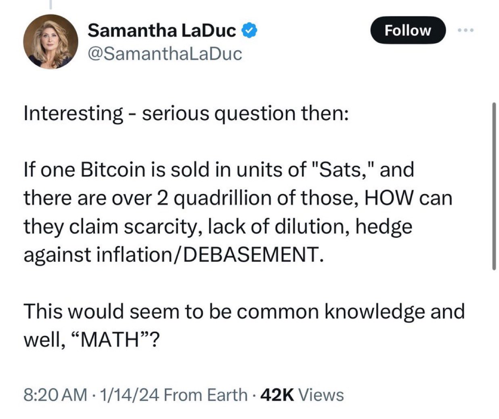

# 新高

隔夜BTC继续上行，续创历史新高106.66k。当数字来到6位数的时候，4位数即数千刀的波动就有些令人浑然不觉了。

有人悲观，有人乐观。宏观面前途光明，微观面艰苦跋涉。

世界总是由阴阳两面所组成的。有多少的阳，就有多少的阴。有多少的的善意，就有多少的恶意。有多少的赞美，就有多少的诋毁。

为什么要做那个站在风口浪尖的人呢？以匹夫之勇气，去直面人性之幽微。

我极目远眺，看不到答案。只看到天边的白云，须臾变幻，不作半刻停留。

历史洪流滚滚，把人们推到了这个地方。

这世间有多少东西是生可带来、死可带走、绝对拥有、不可剥夺的呢？只有生命和BTC。

有人说，如果1枚BTC可以被拆分成“聪”这样的单位，而且总共有超过2000万亿聪的话，他们是如何声称BTC具有稀缺性、防稀释、抗通胀/贬值的呢？常识和数学呢？

这不是一个稀奇的说法。教链2024.12.4文章《一块钱拆分成10个一毛钱，钱就多了10倍吗？》便谈过这个问题。

网友转评道：给一个人一条鱼，他能吃一天。把鱼切成1000万亿份，他能吃1000万亿天。

另一网友跟评：解决世界饥饿问题的办法 —— 把一张披萨切成1000万亿份。

有人调侃说：一盎司黄金包含数以亿万计的金原子，它又是如何被声称具有稀缺性的呢？

同样有人进行的类比还有：如果每一美元都按照便士来分配，我们就拥有了超过2000万亿？

亦有网友认真回复道：我曾陷入这样一种误区，只关注BTC的使用价值，认为1个BTC与0.0001个BTC的价值是相同的。但一旦意识到供需关系的存在，以及聪（sats）可以组合的特性，同时明白拥有更多聪或整个BTC的持有者总能抬高出价，使得单个聪的价值低于任何一个完整BTC或多个聪的组合时，就会发现，BTC的整体稀缺性决定了其任意分割单位的稀缺性。而且，任何一部分BTC在交易中的价值趋势始终会低于一个完整的BTC。

更长的回复还有：「BTC的供应是固定的，挖矿进度是预先设定且可预测的。虽然BTC的总量听起来非常大，但放在拥有超过80亿人口、2200万百万富翁和2000位亿万富翁的地球背景下，这个数字还算大吗？

「从稀缺性的角度看，我们可以用当前的法币之王——美元来比较BTC。当BTC的市值达到21万亿美元时，100聪将等于1美元，BTC和美元将在数学上达到平价。

「如今，全球经济的很大一部分都与美元有某种程度的关联。然而，美国及其代理机构不断凭空印发更多美元，供应没有上限。相比之下，BTC有固定的供应上限和已知的创造进度，而这些不是凭空生成的。你如何稀释一个固定的供应量？

「人们往往忘记，或者没有在BTC领域待足够久，因此未能意识到过去16年里这一经济博弈论是如何展开的。中本聪在设计和编码BTC时，必须将这一切考虑在内。作为一名长期学习经济学的从业者以及一名软件工程师/架构师（现已退休），我看到BTC的崛起更像是一匹“特洛伊木马”。它依然是特洛伊木马，只是如今不再是秘密，也不再是那些被亲朋好友嘲笑多年、被认为是疯子的人才谈论的狂野臆想（尽管他们的叹息依然在…… :-））。

「关于对抗通货膨胀和货币贬值……六年前我开始接触BTC时，需要3个BTC才能买一辆像样的车。今天，我可以用1个BTC买4辆车。我愿挑战任何人找出BTC推出以来的任意4年时间段，证明BTC未能对抗通胀。当然，这需要足够的流动性和较长的时间视野，但很显然，BTC已经证明自己是一个有效的通胀对冲工具。

「至于“捕鱼”的比喻听起来确实很巧妙，但更贴切的比喻或许是佛罗里达那位用1万枚BTC溢价购买了两块棒约翰披萨的人。如今，这两块披萨的价值已经超过5亿美元。如果你当时“捕捞”了1万枚BTC，现在你能喂饱多少人？」

归根结底，BTC是绝对个人的事。个人的事，终究要靠个人去悟，而不能靠别人说服。

老子说，胜人者有力，自胜者强。

自助者天助之。自弃者天弃之。

上桌或不上桌，上车或不上车，都是在赌自己的认知。愿赌就要服输。

放下助人情节，尊重各人命运，就好。

“如果你不相信我或不懂我的意思，我没有时间试图说服你，抱歉。”——中本聪，2010年7月28日。《比特币史话》第十八章第82话
