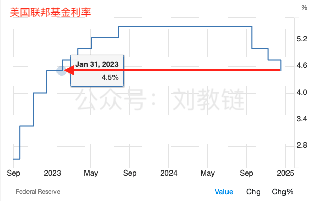
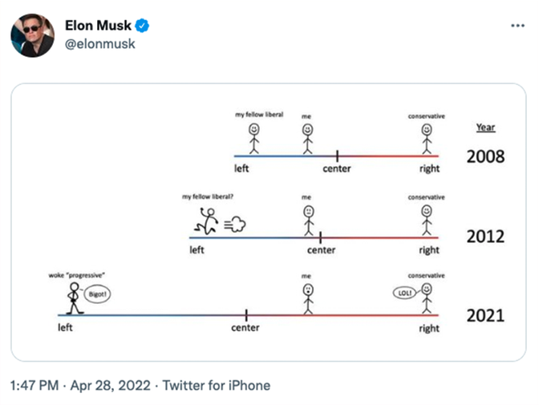

# 美联储不被允许拥有比特币吗？

隔夜今晨，美联储12月议息会议如期结束。结果符合市场预期，继续降息25bp。这一结果超乎了此前部分人猜测停止降息的预料之外。至此，自2024年下半年来，美联储已累计降息3次，降幅100bp，即1%，将美国联邦利率从5.5%降到了4.5%。

这就降回了2023年开年时候的利率水平。

降息落地。美三大股指、加密市场却都齐刷刷回调。为何？因为符合预期的降息，早已被市场预判并提前透支了。这就成了利好落地转头空，青山依旧在，几度夕阳红。

当然，回调的原因，和美联储主席表态，明年政策调整可能要更为谨慎，有一定关系。毕竟，这和市场部分人明年继续快速降息的激进预期，有落差。

毕竟，在这个激进主义风行全球的康波萧条期，稍微不那么激进，就会被批判为保守主义。降息不彻底，就是彻底不降息。

你作为一个温和派站在中间，既会被站在你右边的人喷你太左，还会被站在你左边的人批你太右。所谓两边不是人。

中国哲学为什么喜欢讲中庸之道？这就叫缺啥补啥。中国先哲们早就看透了，社会太容易向“M型”演化，站在中间的人才是最勇敢的。没有勇气，不敢站当中。不够强大，站中间会被撕成碎片。

非黑即白，非左即右，不是天堂，就是地狱，一念成佛，一念成鬼。今天是区块链革命，明天就是郁金香骗局。

装神弄鬼，很容易。做一个浮游天地之间、顶天立地的大写的人，很难。无脑迎合大众情绪的吹捧或狂踩，很容易。客观地、不带偏见地看待新生事物并抓住历史机遇，很难。

不懂她的好，是因为还没有和她处过。处过了，处久了，你就会知道她的好。

凌晨发布会上，鲍威尔答记者问的一段话火了。

记者提问有关于美国国家BTC战略储备的事儿。

鲍威尔回答道：美联储不被允许拥有比特币。我们也没有在寻求相关法律改变。

他说得的确符合“当前”现状。

只是这话说得比较笼统、概括和模糊。我们要仔细拆解一下。

首先，在鲍威尔心目中，BTC的性质是什么？

回顾一下教链2024.12.5文章《比特币风再起，首破十万刀》中，鲍威尔不久前就公开讲过，在他看来，BTC更像黄金。他说，「它不是美元的竞争对手，而是黄金的竞争对手。」

也就是说，他认为BTC是实物资产。

那么，美联储可以直接“拥有(own)”实物资产吗？显然是不可以。

譬如黄金。美国的黄金储备实际由美国财政部拥有。而真正的存放和保管，则分散在美国各地的储备库（比如纽约联邦储备银行）。根据《1934年黄金储备法》（Gold Reserve Act of 1934），财政部发行黄金券记录所拥有的黄金的价值。这些由美国财政部签发的黄金券，就是黄金储备的法律证明。

美联储可以拥有作为实物资产的黄金吗？不可以。美联储只能拥有作为金融资产的黄金券。

不过，即便是去拥有黄金券，也需要依法行事。这里的关键，就在于合法地将金融资产的价值计入美联储的资产负债表。

根据《1913年联邦储备法案》（Federal Reserve Act of 1913），美联储可以将黄金券计入其资产负债表作为储备资产的一部分。黄金券在美联储的资产负债表中以名义价值记录，代表财政部承诺的黄金价值。

在会计上，黄金储备价格由《1973年国际货币基金协议法案》（International Monetary Fund Agreement Act of 1973）设定，每盎司黄金以42.22美元的价格固定计价，而非市场价格。关于这个计价，教链在2023.11.14文章《美国究竟持有多少黄金？》中详细谈过，此处不再赘述。

但是，这个计价并不是一成之规。像咱们央妈，就是按市场价调整计价的。具体参考教链2023.10.31文章《央妈的“秘密”》。

好，了解了这些之后，我们需要先后考察两个问题：

第一、美国新任总统能否仅凭总统权力即可授权财政部储备BTC（大饼）并发行“大饼券”？

第二、美联储能否在不修订《1913年联邦储备法案》的条件下，事急从权，把“大饼券”计入资产负债表？

对于第一个问题。美国第35任总统约翰·F·肯尼迪（John F. Kennedy）已经做出了示范。

1963年6月4日，肯尼迪总统签署了一项行政命令，即11110号行政令（Executive Order 11110）。该行政令授权美国财政部根据《1920年白银购买法案》（Silver Purchase Act of 1920），拿财政部拥有的白银储备为基础，以财政部的名义发行“白银券”（Silver Certificate）的权力。

本质上，白银券是美国货币的一种形式，可以与等值的实物白银相互兑换。

1963年11月22号，肯尼迪总统遇刺身亡。详见教链2024.11.8文章《美联储如期降息，鲍威尔拒绝辞职》。

收音机里彷佛传出女歌手的声音：

「想要问问你敢不敢 / 像你说过那样的爱我 /
想要问问你敢不敢 / 像我这样为爱痴狂

想要问问你敢不敢 / 像你说过那样的爱我 /
像我这样为爱痴狂 / 到底你会怎么想」

对于第二个问题。美联储已经亲自示范过了。

2008年金融危机期间，美联储采取了一系列非常规货币政策，包括购买MBS和其他金融资产，以提供流动性并支持美国经济。这一政策被称为量化宽松（Quantitative Easing，QE）。

《1913年联邦储备法案》第14条第2款规定，美联储可以购买政府债券（如美国国债）来管理货币供应和稳定经济，但该法案并没有明确授权美联储购买与政府无关的私人资产，如抵押贷款支持证券（MBS）。

核心问题是：美联储的权力，究竟属于公权还是私权？

毕竟，公权力，法无授权不可为。如果法律没有明文规定美联储可以亲自下场购买MBS，那么它直接购买MBS就是涉嫌违法的。

但是，美联储作为美国的央行乃至于全球的央行，却是一个bug般的存在。美联储事实上是一个私人机构而非公共部门。而私权利，是法无禁止则可为。

所以，这就可以灵活释法了。

通常的解释是这样的：

一方面，《1913年联邦储备法案》并没有明确禁止美联储购买特定类型的资产。

二方面，美联储找到了其他一些法律来为自己的“事急从权”背书，包括像《1932年紧急银行法》（Emergency Banking Act of 1932）和《2008年金融稳定法案》（Financial Stability Act of 2008）等法律。这些法律授权美联储，在特定的紧急情况下，可以采取更多的非常规货币政策，被认为是为美联储在危机期间购买MBS提供了法律依据。

总而言之，言而总之，美联储解释说，购买MBS是出于货币政策和金融稳定的需要，而且是为了应对金融危机的特殊情况下采取的紧急措施。因此，尽管这些举措不符合《1913年联邦储备法案》的字面规定，政府通过新的授权为这些措施提供了法律基础。

事实上，美国各级法院也从并未明确裁定这些行为违反《1913年联邦储备法案》，而是将其视为紧急应对措施。

因此，结论就是，尽管存在法律的灰色地带，这一举措并未被视为直接违反《1913年联邦储备法案》。

在2024年《5.5教链内参：手滑转丢了1155枚比特币》和《7.1教链内参：按捺不住的反弹》中，教链反复提过，美联储一直在悄悄地把手里的“灰色”的MBS仓位置换成合法的美债仓位。

这一屁股屎，它从2008年一直擦到今天。

所以说，就算是不寻求法律改变，美联储也是可以通过灵活解释自身的权力性质，来给自己做什么不做什么找到法律依据的。

最后，教链还需要提一句，全球央行们还有一个国际协调组织叫做BIS（国际清算银行）。这是二战后国际金融秩序的一部分。

BIS的成员主要由全球的中央银行组成，目前已有约60个成员。这些成员包括全球经济重要国家的中央银行，如美国的美联储、欧洲的欧洲央行、中国的人民银行等。它成立于1930年，总部位于瑞士巴塞尔，称得上是中央银行的银行。

1974年，国际清算银行（BIS）设立了巴塞尔委员会（BCBS, Basel Committee on Banking Supervision），旨在制定国际银行业的监管标准和准则。

巴塞尔委员会的主要职能是制定与银行资本充足、风险管理、银行监管等相关的国际标准，尤其是关于资本充足率、流动性要求、风险加权资产等方面的规定。它通常会发布一系列监管标准和建议，供全球各国金融监管机构参考和采纳，以确保银行体系的健康和稳定。

1988年，巴塞尔委员会推出了巴塞尔协议I，它是全球银行资本充足要求的首次标准化。

2004年，巴塞尔委员会发布了巴塞尔协议II，这是对巴塞尔协议I的进一步完善和扩展。

2010年，在全球金融危机后，巴塞尔委员会推出了巴塞尔协议III，这是为了提高银行的资本质量，增强银行系统在危机中的抗风险能力。

可见，BIS（国际清算银行）和巴塞尔委员会在全球银行监管中扮演着至关重要的角色。巴塞尔委员会通过BIS设立，负责制定全球银行业的监管标准，而巴塞尔协议（I、II、III）则是这些标准的具体体现。

全世界的央行们，包括美联储，如果要把什么资产纳入自己的资产负债表，即所谓对某种资产进行风险暴露，通常是需要通过BIS在巴塞尔框架中进行制定标准，然后各成员央行才可好按此行事。

巴塞尔协议叫做协议而不是法律，是因为它是靠各成员自律遵守，而不是像法律那样是通过暴力机关强制执行的。

好巧不巧，早在2022年12月份，BIS就发布过一个报告，主要意思说的是，《BIS：各国央行自2025年起将获准配置不超过2%的比特币》（教链2023.12.17文章）。

