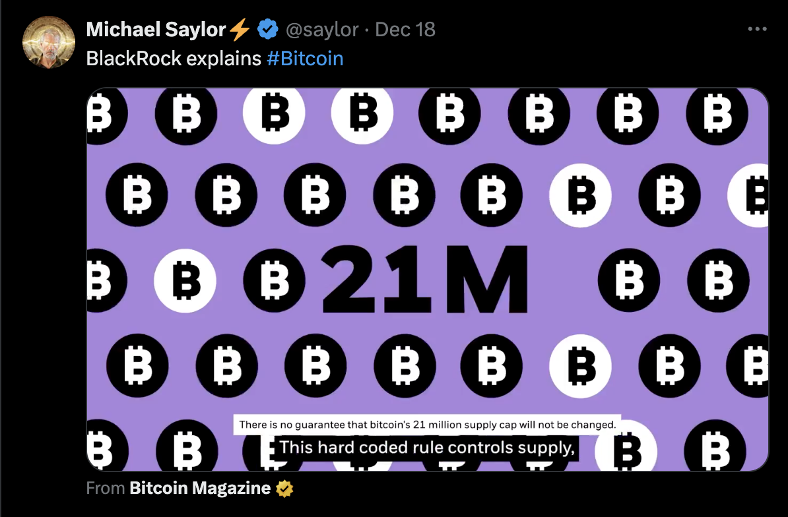
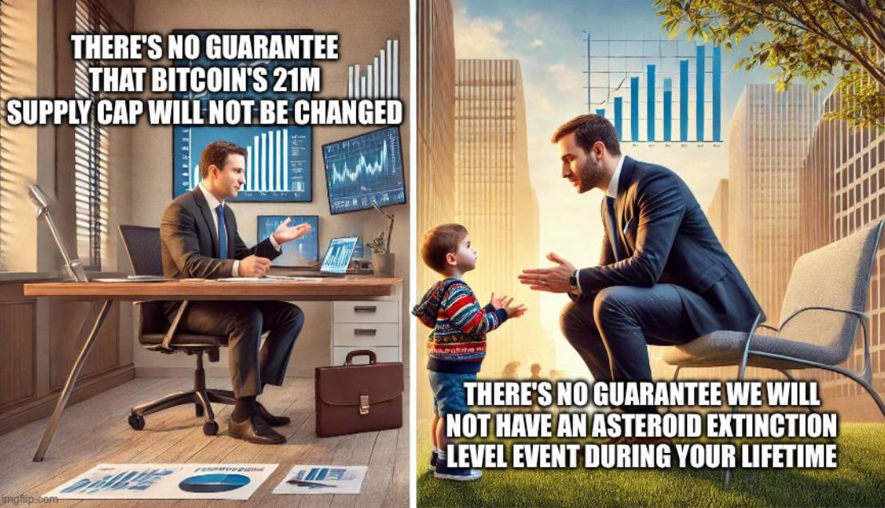
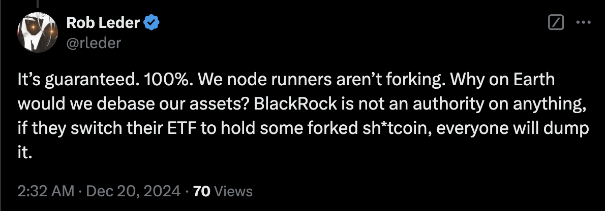

# 上帝也不能保证的事

周末BTC继续在30日均线下方横盘整理。上午教链12.22 内参《第51周 LTH难称钻石手 这周期不早也不迟》回顾了年前倒数第二周的情况。

前几日微策略创始人转发了贝莱德公司的一个BTC科普小视频。视频中一句字幕一石激起千层浪。

字幕原文：There is no guarantee that bitcoin's 21 million supply cap will not be changed.

翻译一下：不能保证比特币的2100万总供应上限不会被更改。

这句字幕出现在视频中介绍BTC固定供应量的片段里。可以视作是贝莱德公司对此的一则免责声明。

网络上一些BTC喷子们瞬间就高潮了。

低级黑就开始嚷嚷，说你们快看，贝莱德无意间揭示了BTC的真相，所谓2100万固定上限永不增发就是骗人的。

戏精们则开始脑补，说这就是大庄家们做的一个局，先慢慢传递BTC上限可以被修改的思想，然后未来控盘之后就推动实施。

还有不少大聪明再次借机跳出来，得意洋洋地鼓吹说，自己好久以前就断定不增发的BTC是死路一条，因为挖矿挖完之后矿工失去动力网络就要玩儿完，而给BTC早就指出一条明路那就是硬分叉加入增发代码，实施通胀。

教链并不准备浪费篇幅来反驳上面这些谬论。如果你被任何一种说法动摇，那只能说明你还不够懂BTC，继续加强学习吧。

这里教链只想仔细拆解一下贝莱德的那句字幕。

首先，那句英文是没有主语的。“保证”，是谁来保证？贝莱德吗？美国政府吗？还是上帝呢？

请问BTC最大的特点和价值基础是什么？去中心化。

什么是去中心化？去中心化，其实就是没有任何一个主体，可以“保证”什么事情。

中本聪不能保证。贝莱德不能保证。美国政府不能保证。

上帝也不能保证。

当你想依靠别人的“保证”时，就已经把自己套上了奴隶的枷锁。

想要保证，就是中心化思维，就是对自强不息的放弃。

须知，持有BTC最硬的精神内核是且只能是：我命由我不由天。

自助者天助之。自弃者天弃之。

动辄想靠在别人的保证之上活着的，在去中心化的加密世界只有一个命运：被作为韭菜收割。

第二，虽然没有主语，但是考虑到视频是贝莱德制作的，那么我们可以把贝莱德作为主语代入进去看一下。

贝莱德可以保证BTC上限2100万不被修改吗？不能的话，它能保证这上限会被修改吗？

仔细思考，你就会发现，在如此去中心化的BTC面前，一家机构的所谓保证与否，不值一提。

人只有对自己的力量能够有把握控制的东西，才谈得上“保证”。

贝莱德对BTC有任何掌控力吗？并没有。所以，它说不能保证，是陈述事实。它若拍着胸脯说可以保证，那反而成了欺骗。

第三，严格地讲，未来BTC上限2100万被改变的概率理论上不为零。技术上，如果社区达成充分共识，可以进行任何所需的变更。

但是，人类思维对于“小概率不可能原理”常常充满错误的直觉。

比如，理论上，黑客随机猜测一个私钥，恰好猜到你的私钥的概率大于零。我们可以说，不能保证黑客不会盲猜猜中你的私钥，偷走你的BTC。

这和“不能保证在你一生中不会经历一次星际灭绝级别的大事件”是一个道理。

随机猜中一个BTC私钥的概率有多小？比你看完教链这篇文章前地球毁灭的概率还要小。

BTC上限2100万被更改的概率有多小？比联合国五常悉数灭亡的概率小，怎么样？

由此可见，不能保证一定不会发生的事，只要发生的概率足够小，就足够好了。

最后，教链想问大家，把思维再提高一层，真的不能保证吗？上帝都不能保证的事，又有谁能来保证呢？

人民可以保证。

一位网友的回复就充满了这种豪情与气概：

「可以保证。百分之百。我们这些节点运行者不会分叉的。我们为什么要贬值我们的资产呢？贝莱德在任何事情上都不是权威，如果他们把ETF切换到持有一些分叉的垃圾币，大家都会抛售它。」

谁是人民？是你，是我，是亿万万坚信BTC上限2100万不可撼动的人！

上帝也不能保证的事，人民可以保证。而这正是“人定胜天”的豪迈，国际歌的精神：

「从来就没有什么救世主，也不靠神仙皇帝。要创造人类的幸福，全靠我们自己。」

人民，只有人民，才是创造世界历史的动力。

人民万岁。
