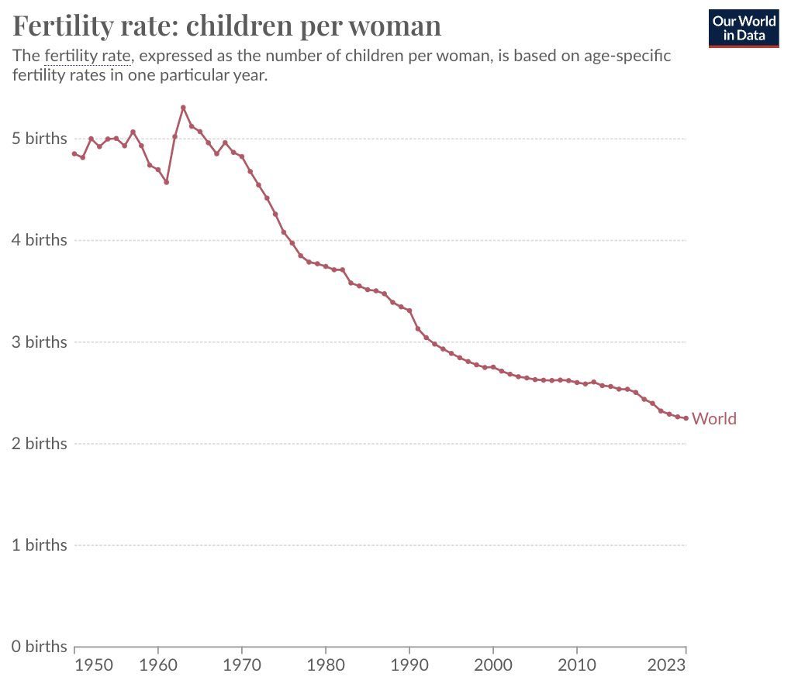
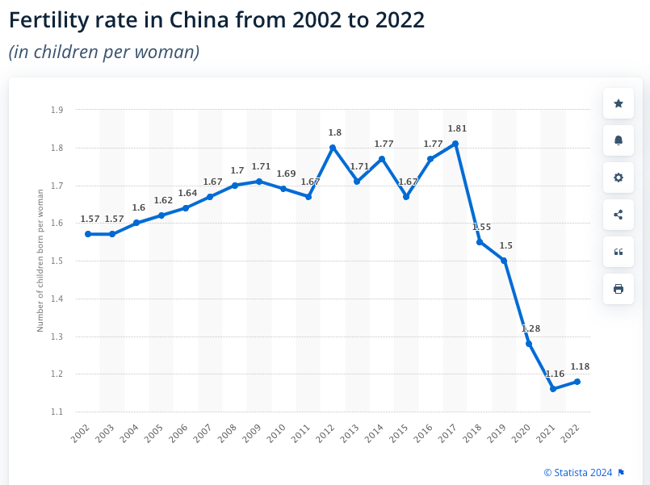
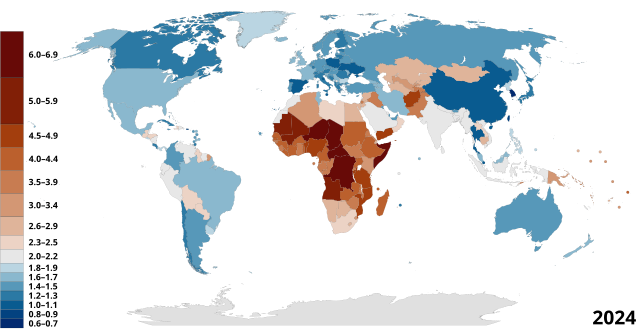

# 投资和生育

隔夜BTC暂于94k上方企稳。日前，包括马斯克（Elon Musk）在内的一些人在转发一张世界生育率走势图。如下。

图中横轴是年份，纵轴是平均每名女性生产孩子的数量。

数据显示，1950年，平均每名女性生产4.9个孩子。到2023年，这个数字已经下降了一半多，降到了2.3个孩子。

这是平均值。

下图是中国2002-2022的生育率曲线（平均每名女性生产孩子数量）。

两口子平均生育不到2个孩子，社会总人口就势必逐年下降。这是数学。

诚然，这个话题太敏感。一不小心就容易戳到某些人群的G点，一秒钟进入互喷模式。性别平等，女性权益，社会文明，一个个宏大的话题，展开无尽的辩经。唾沫横飞，口诛笔伐。

前不久，有位人大教授在某活动上询问某国顾问，关于该国如何提高生育率的问题，因为用词比较“朴实无华”（辣眼睛），招致了网上激烈的讨论甚至是声讨。从这一事件也看出，此话题的敏感，以及社会认知撕裂的现实。

“你负责赚钱养家，我负责貌美如花。” 仔细想想，消费主义陷阱，已经把人们的基本伦理观和价值观嚯嚯得不成样子。

男女结合成法律意义上的夫妻关系，本质上是形成一种50:50的合伙人关系的法定建构。从合伙关系的基本伦理上讲，最重要的是责任，各自根据自身的生理特点和能力，承担起责任和义务，从而实现1+1>2的合力。合伙，绝不意味着一方从此可以靠在另一方身上，只索取不付出，成为对方生活中的负资产。

从这一点上看，LGBT允许男人通过声称自己是女人而在法定意义上变成女人，真的可以说是用魔法打败魔法了。

法定女性（legal female），和法定货币（legal tender），还真有那么一丢丢天作之合的味道呢。当然，这是句玩笑话。

教链却想提醒大家再回看一下开头的那张图。世界生育率掉头下跌，无视经济周期，直线下滑，一切的转折点是在什么时候？

1971年前后。

1971年发生了什么大事件？

翻开教链2020年完稿的《比特币史话》，翻到第十章“中本聪的生日”，找到第42话“布雷顿森林”，找到这几段话：

「1971 年 8 月 15 日，美国第 37 任总统理查德·尼克松单方面宣布中止美元与黄金的可兑换性，史称“尼克松冲击”（Nixon Shock）。

美元与黄金脱锚，从此蜕变为了法币（Fiat Currency）。与此同时，各国法币也纷纷放弃挂钩美元，改为浮动汇率制。

布雷顿森林体系宣告解体。黄金美元的时代结束了。法令美元（Fiat Dollar）的时代开始了。

自此，失去了黄金约束的美元开始了一路贬值的狂奔。」

教链不禁陷入了沉思。

马克思说过，经济基础决定上层建筑。人们吵来吵去的抽象议题，归根到底还是经济问题。

生个孩子，本质上是一笔相当不菲的投资。备孕的辛苦，生产的痛苦，以及由此而造成的职业生涯的断档、滑落甚至中止，都是现代职场女性为生育一事所需要投入的巨大成本。

而养育孩子，学区房，培训班，这些是金钱方面的成本；每天上学接送，全年无休，要兼顾上班就不得不请老人来帮忙照顾，然后随之而来的就是更加复杂的家庭关系，这些都需要付出长久的时间成本、精神成本。

在付出巨大的投入之后，二十年后，投资回报是什么呢？一个基本合格的劳动者，也就是一个能够出卖自己劳动力的人。

根本上，在现代工业资本越发强大的今天，劳动力越来越不值钱。资本增殖的速度远远超过劳动赚钱的速度。说白了，花费几十年时间生产出一个新的劳动力，并不能带来多大的经济回报。

米塞斯说，人的行为就是经济权衡的结果。

用投资的眼光来审视生育这件事儿，人们权衡的，就是把这些钱和精力投入到生养一个孩子，或者投资到其他资产上面，二十年后，到底哪一个选择会更划算。

有人说，生育孩子不仅仅具有经济价值，还有精神价值，比如享受到天伦之乐，以及传宗接代的责任，等等。

但是，所有的精神价值，其实都可以转换为经济价值。不管人们是否羞于启齿，在他们心里进行默默盘算的时候，总是可以进行这种转换的。

当1971年无锚印钞时代开启之后，印钞机就逐渐摧毁了女性的子宫。

凯恩斯笑了。马尔萨斯再也不用担心资源增长，人口爆炸，导致资源相对不足，从而不可避免地走向战争了。印钞机已经成功地把胎儿扼杀在了受精卵形成之前。伟大的印钞机，简直要值100个诺贝尔和平奖了呢。

教链从世界各地区出生率和经济水平的关系上看到，这似乎不是一个单调关系，而是一个U型关系，即：

欠发达地区，女性权益落后，生育率高。可能的原因在于，低权益导致低成本，比如本来就是全职主妇，生孩子也就不存在损失工作的问题；而经济欠发达地区，资本对劳动力的优势相对低，劳动力也就相对更有价值，多一个孩子多一双手，多一个劳动力所带来的收益相对更高。投入相对更低，回报相对更高，于是从经济权衡上，自然就会倾向于多生。

高度发达地区，女性权益很高，生育率虽然不如欠发达地区，但却也要超过中等发达地区。这又是为什呢？可能是因为社会福利水平高，法律保障完善，对冲了女性生孩子以及家庭养育孩子所需要付出的巨大成本。简而言之就是，当你生活比较富裕，养个孩子轻轻松松的时候，你就会开始看中养育孩子的附加价值，比如精神满足、财富传承等等，而不会单纯权衡经济价值。

因此就形成了欠发达地区和高度发达地区两头高，而中等发达地区中间低的情况。

要修复这个问题，有退步主义或保守主义的态度——比如现在美国新政府推动的有关禁止堕胎（剥夺法定权利）、抨击无孩爱猫女（道德否定）等行动，也有进步主义的态度——比如限制资本增殖相对劳动力的优势地位，促进社会分配更加公平，让每个家庭都富裕起来，富裕到养两个三个孩子轻轻松松，不再是头疼无比的事情。

每当遇到困难时，退步主义就会成为人们想不出办法了最后的办法。

教链觉得，勇敢的人还是应当选择进步的办法。特别是，当你身处U型的谷底时，很多人满脑子想退回去，退到高处。但还是要向前看，向前走，走出谷底，走到新的高处。

要进步，就要富。我们已经拨云见日，找到了根源就在于印钞机。于是关键点就是对冲印钞机对家庭财富的稀释，对劳动力价值的摧毁。

囤BTC，fix the world（修补世界）。
