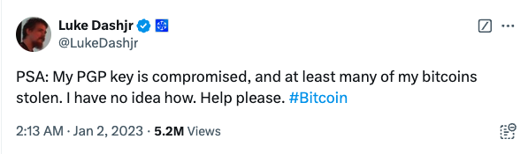

# 丢币

隔夜BTC回升至98k。此处也是30日均线的高度附近。市场分歧依然明显。恰如昨晚12.24教链内参《圣诞行情欲何求》所说，看空的看到市场低迷，看多的直接刻舟求剑。没办法，现在的高度，现在的时间节点，现在的周期进程，就是分歧时刻。

最近又看到有人丢币了。工作电脑既用于操作热钱包搞链上收益的事，又拿来开会办公。结果一不小心升级了植入木马的会议软件，钱包资产被洗劫一空。

热钱包是万万不可取的。

即便是对于精通加密技术的比特币老炮，自认为熟练掌握加密钱包的技术，就心大地把加密过的私钥文件放在联网的机器上，一样是被定向盗窃，损失200个BTC。按10万美刀估算，价值2千万美刀，以7.3汇率大约折合1.5个小目标。

他就是Bitcoin core开发者Luke Dashjr。教链在2024.3.22文章《Luke Dashjr：比特币传奇》中曾经介绍过他的主要事迹和贡献。

这200个BTC，是他全部的身家财富。一招不慎，烟消云散。

他自述对BTC的私钥进行了PGP加密。不过，加密所用的PGP密钥，其实是他日常工作使用的，用来给Bitcoin Knots软件包做发布签名使用的同一个PGP密钥。这就太不小心了。

高频次使用的密钥，暴露风险是很高的。每一次使用，都意味着一次可能的暴露。怎么能用同一个密钥去加密私钥呢？如果加密密钥暴露，那么用该密钥加密过的私钥也自然就不安全了。

至于被加密过的私钥文件，他应该是放在了笔记本电脑上。FBI怀疑是在他携带笔记本电脑参加某次会议时，被人接近了电脑，偷走了加密的私钥文件。而这个人可能早已获得了PGP加密密钥。如此一来，有文件，有密钥，就轻而易举解出私钥，偷走了所有的BTC。

如果前面开会的小哥使用了硬件钱包，把私钥和工作电脑分离了呢？

如果Luke Dashjr采用了教链在“超级小白课”所介绍的冷钱包来存储BTC呢？

也许他们就不会弄丢他们的币，清空自己的财富了。

也有网友觉得，冷钱包把私钥从网络空间和数字环境剥离出来，却又要面临物理世界的违法侵害风险，比如入室盗窃或抢劫的风险。比如：

你把私钥助记词抄在纸上放家里，被到访的人看到了，丢币。

你抄了多个备份放在不同地方。现在每个拷贝都成了暴露的风险点。任何一个拷贝被看到，丢币。

你怕纸会损坏于是用手机拍照放相册里，丢币。

你怕纸容易损坏，于是刻在钢板上放家里，被入室盗窃，丢币。

你给助记词增加了口令，但是把口令和助记词记在同一张纸上，同时泄露，丢币。

等等。

不过教链觉得，绝大多数的盗币，都是通过在线环境进行的。如果你生活在一个相对安全的地区，那么冷钱包肯定要比联网的热钱包要安全不少。

有人建议使用多签。把多签的几个私钥分开保管。

或者把私钥助记词拆成几份，多个分片，每个分片分别放在不同的地方进行保管。

看起来，这样可以在一处暴露的情况下，仍然保持资产安全。这避免了单点失败（失窃）。

但是丢币这事儿，除了没防住贼这种情况之外，还有一种情况，就是把自己也给防住了。

历史上，也有很多把存放私钥的硬盘当垃圾扔掉，或者自己也记不起来私钥解密的密钥是什么等等类似情况，造成BTC彻底被锁死，谁也动不了了。

这也是一种丢币。

至于自己主动交出私钥或控制权，比如把币长期存在交易所，或者放在机器人平台上由平台控制，随时可能被卷款的情况，不在我们探讨之列。

我们探讨的是自托管（self custody），也就是自己做自己资产的主人。

可见，自托管语境下的丢币，要么是让别人窃取了控制权，要么是自己也失去了控制权。

左边是让别人窃取了控制权，右边是自己也失去了控制权。我们希望做到的安全是不左不右、稳居当中，即自己掌握控制权，而别人不能掌握。

因此所谓单点失败也就有两种含义，且都十分重要。

一种是多个备份，单点失窃。任一个备份被窃取，就会导致控制权的被窃取。但是好处是只要有一个备份没有损毁，我就能找回这些币，不容易丢失控制权。

另一种是多个分片，单点损毁。任一个分片损毁，就会导致无法恢复出私钥，从而失去控制权。但是好处是只有所有分片全都失窃，才会导致财产损失。

鱼和熊掌，基本上是不能兼得的。
