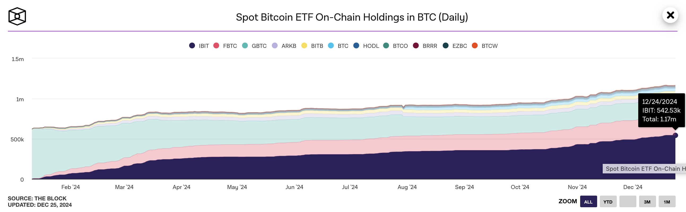
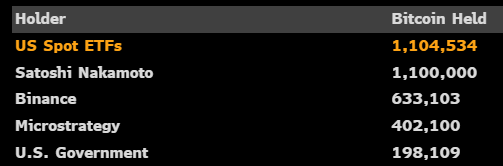
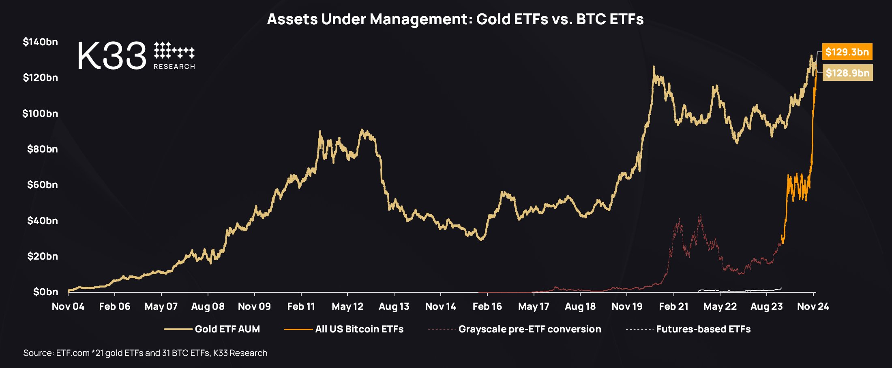
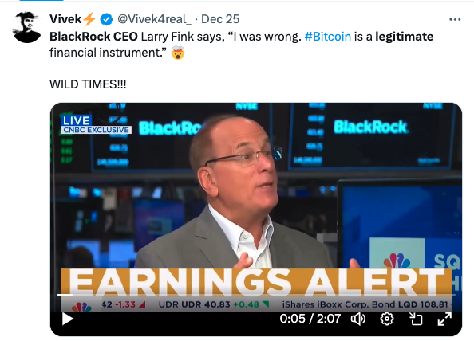
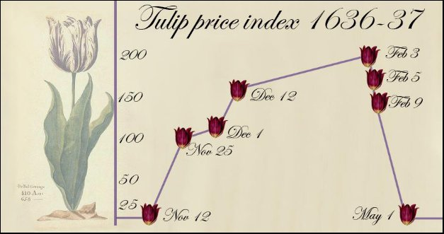
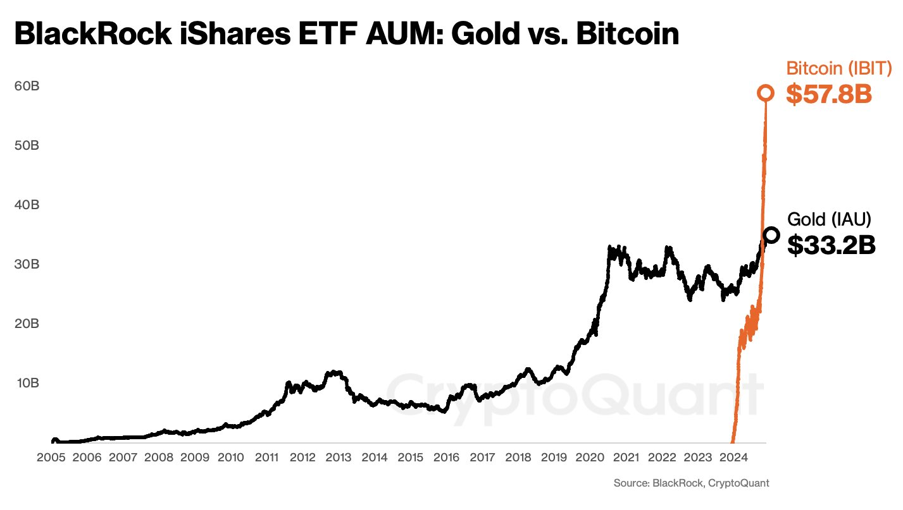

# 超过中本聪

隔夜BTC继续跟随30日均线向上修复，基本与均线98.9k持平。圣诞节前夕，美现货大饼ETF持仓已经增长至117万枚BTC，妥妥地全球第一。这一持仓量，超过中本聪疑似持仓地址中的110万枚BTC。

其实，早在12月6号，美ETF的持仓量就已经超过110万枚了。12.6教链内参《美现货ETF大饼持仓超过中本聪》当时就有说到过此事。

美黄金ETF发展20年，总市值被BTC ETF一年超越。

100万枚BTC，是7位数的BTC。1万枚BTC，是5位数的BTC。那么6位数，就是几十万枚BTC。当年在电视镜头前放言自己“拥有6位数的BTC”的某咖，拿到现在，可称得上是富可敌国了。

不过即便是100多万枚BTC，除以2100万枚的总量，也不过5%左右。BTC的持仓，还是非常分散的。

前BTC开发者Jonas Schnelli对此评论道：这不是值得庆祝的事情。这是中心化的危险信号——比特币设计的目的正是为了防止这种情况。

但是从另一个角度看，有新兴实体持仓超过中本聪，也是对中本聪单一实体中心化担忧的一种消去。

或许你不再需要担心某一天，中本聪复活砸盘。

美ETF虽都在美政府监管之下，但仍然是多实体分庭抗礼。虽不是最好，却也不是最糟。

其中最大的实体就是贝莱德了。117万枚BTC总持仓量中，其一家独占超过54万枚。

贝莱德CEO Larry Fink几年前还是一个BTC怀疑者，曾公开称其是洗钱指数。但知错能改，善莫大焉。现在Larry Fink四处上节目，上来就坦言“我错了”（I was wrong），并称BTC是一种合法的金融工具（legitimate financial instrument）。

请注意英文单词 legitimate 和 legal 的区别。Legitimate的意思是合法的、正当的，它强调事物或行为是道德上、社会上或理性上被认可的，具有正当性或合理性，而不仅仅是法律上的合法性。Legal的意思是合法的，强调的是符合法律规定或法律要求的行为、状态或事物，指的是某件事情在法律框架下被允许或认可的。

一件事如果不合乎目前的法律规定，那么它就是illegal（非法）的，但是如果它却符合人们普遍的道德理性，被普遍认为是正当的、合理的，那么它就是legitimate（合法）的。从法学意义上，一社会之法律绝不应与人们最普遍的道德理性相违背，否则它就会成为恶法。

人们普遍认为正当、合理的事，不应该在法律上规定为违法行为，比如对于个人持有和交换BTC这等对于私人财产的占有和处分权利。人们普遍认为不正当、不合理的事，也不应该在法律上规定为合法行为，比如对于某些公权力滥用职权“远洋捕捞”，应当明令禁止，并修法补漏。

当作为世界上规模最大的资产管理公司之一的贝莱德CEO都能够坦然面对镜头前的观众承认自己过去认知错误的时候，却也还有很多专家、博主对BTC的认知依然深陷荷兰郁金香泡沫的老旧叙事中不能自拔。

贝莱德自2005年起就开始在美运营黄金ETF，发展20年至今资产管理规模330多亿美刀。贝莱德自2024年初才开始在美运营的BTC ETF，发展不到一年，资产管理规模已经超过570亿美刀，近乎两倍于其所管理的黄金ETF资产规模。

于是贝莱德CEO被深深折服，称BTC当之无愧于“电子黄金”的称号。

对于法币，人人都想得到它，是因为可以放弃它以换取对自己有用的东西。这叫做为了放弃而获得。

对于BTC，人人都想得到它，却是因为持有它可以长期保有其价值。这叫做为了持有而获得。

法币的价值，取决于它能换到什么样的使用价值。BTC的价值，却取决于它能在长期保有多少价值。

为了持有而不是为了放弃，这才是“电子黄金”的真义。
