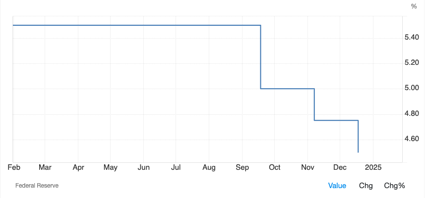
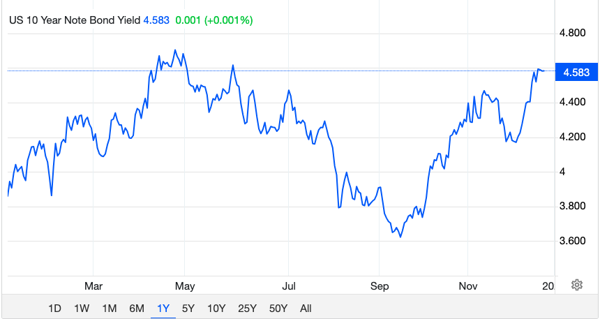
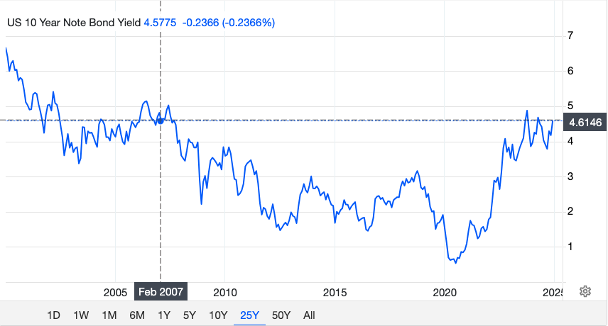
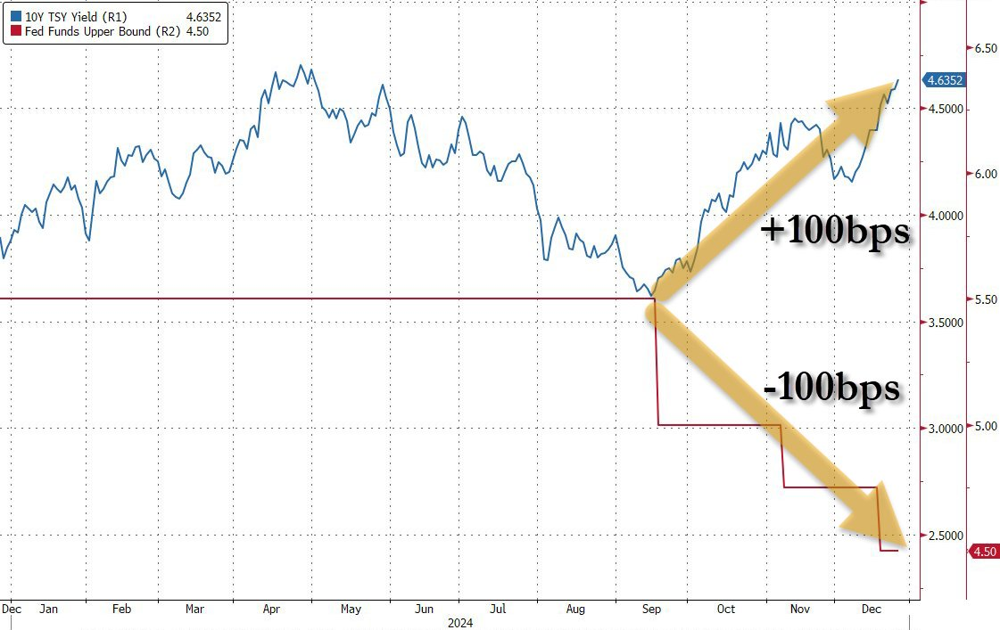
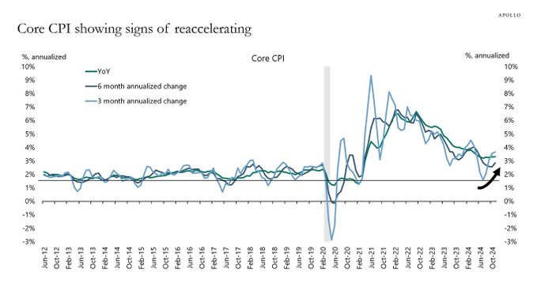

# 失控

隔夜BTC在《周四，急速坠落》（12.26内参）后，于96k一线企稳。整个加密市场也顽强防守，暂时止住了颓势。

今年9月份以来，美联储三次降息，累计将联邦基金利率削减了100bp，从525-550降至425-450。

不同寻常的，10年期美债收益率也从9月份开始转折上升，到年底累计升高了近100bp，从约360升至约460。

这是4月份时的局部高位，也是17年前2007年时的历史高位。

2007年发生了什么，无需多言。那一年，次贷危机开始在美蔓延，并最终引爆了席卷全球的金融危机。2008年，中本聪忽然得到灵感，发明了比特币。

现在，美联储降息100bp，美债收益率上升100bp。严重的背离。美联储的利率调控似乎已经失控。越降息，市场利率越高！

了解美联储如何进行宏观利率调控——其实直白点儿说就是干预市场利率——的朋友应该清楚，美联储加息降息并不能直接改变市场利率，而是通过所谓公开市场操作买卖美债，通过美债这个工具来把利率调节传导到市场上面去的。

比如2024年12月议息会议的执行纪要里就有这么两条：

* 进行常设隔夜回购协议操作，最低投标利率为4.5%，总操作限额为5000亿美元。
* 进行常设隔夜逆回购协议操作，提供利率为4.25%，单一交易对手每日限额为1600亿美元。将该利率设定在联邦基金利率目标区间的下限，旨在支持货币政策的有效实施以及短期资金市场的平稳运行。

债券收益率和债券价格是反比例关系。仅这一点就把很多人绕糊涂了。

美联储以4.25%的利率抛美债、4.5%的利率收美债，就一定能把市场利率卡死在425-450这个区间吗？

那可不见得。

比如2024年9月份降息前，美联储的利率控制区间还处于历史高位525-550，可是美债市场利率已经降到了360的局部低位，中间利差近2个百分点。

这说明啥问题？这说明，市场疯了一样地买美债，全然不顾美联储的“官价”更便宜。

当然，美联储的也只和指定的大银行做交易，普通人根本无法直接参与。

市场不理性到底是真的看好美债，还是散户羔羊被投资顾问忽悠着稀里糊涂地入了局呢？

教链还记得那段时间，网上铺天盖地的帖子，宣扬美债，劝韭入场。

回过头来从图上看，那一波舆论引导应该是从5月份到9月份，对应美债收益率下降的走势。至9月份，已经是收官了。

降息预期，市场抢跑，逻辑是什么？或者说，销售话术是什么？

教链想，大概会是这样，说老板你看，美联储马上要开启降息通道了，还不快买点儿高收益的美债保值增值？过了这个村儿可就没有这个店，等美联储把利率降下来，就只有低息美债可以买了。

可惜，金融市场的铁律永远是，听别人的投资建议做决策，不是吃亏，就是上当。

降息落地，美债暴跌。抢跑者被埋。

被埋的理由是什么？被埋的逻辑也很简单，那就是美联储降息，市场risk on，即所谓风险偏好上升，资本抛售美债追逐高风险的美股，债跌股涨，美债收益率不降反升。

但是再想一下，资本真的都是鸡血上头、心甘情愿地去配置高风险资产的吗？

还是被未来预期高通胀给逼的呢？

