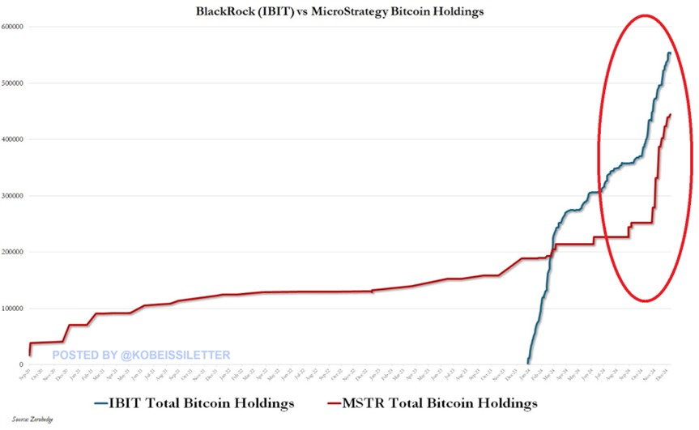
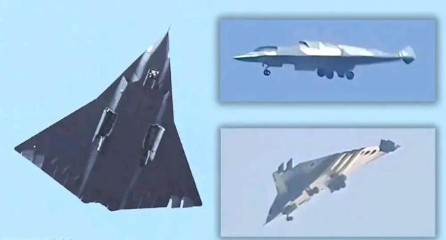
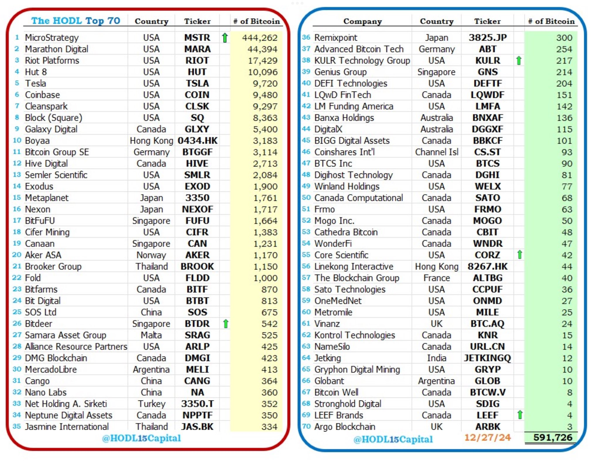

# 双飞

周末BTC继续小幅回撤至95k以下。自20号有效跌至30日线下方之后，吊挂于此，震荡八日，所谓命悬一线可也。于是很多人就要开始慌张。心里慌了，心态崩了，就要拿不住。

惊慌失措防心乱，风物长宜放眼量。

今年以来，两个持仓大户冉冉升起。一个，是突然加速的微策略（MSTR）。另一个，是半路杀出的贝莱德（IBIT）。

其中，微策略在最近几个月启动了它的增长飞轮，持仓量迅速翻倍，达到了444,262枚BTC。

而贝莱德更是后来居上，从三月份以来翻倍增长，仓位更是高达552,028枚BTC之巨。

微策略自2020年底开启BTC战略以来，本来在悠哉悠哉地慢慢积累仓位。未料半路杀出程咬金，贝莱德借美现货ETF的东风，竟能如此威武雄壮，后来居上！

后发优势，恐怖如斯。

一枝独秀，已成比翼双飞。

两强手仓位之和，总计996,290枚BTC。接近一个中本聪（110万枚BTC）。

除以BTC总量2100万枚，就是4.7%。

新的巨鲸，冉冉升起。

在企业储备榜上，一骑绝尘。

如果你有3枚BTC，就可以摸到企业持仓的尾巴了。

BTC的共识，从未如此广泛。

BTC的需求，从未如此强劲。

很快，全世界的企业都会逐渐意识到，新的利润处置模式的力量。

以往企业利润，只能以法币现金的形式放在账上，除去必要的风险备用金之外，更多的现金储备实在是令企业十分头疼的事。

这就是现金流强劲的优质企业特有的烦恼。

股东会质疑董事会，为什么让具有贬值风险的现金趴在账上，而不是投入到为股东创造更多利润的事情上面去？

可是公司业务发展速度有限，投入再生产花不了那么多钱。

于是乎，要么提高分红，把钱和股东分掉；要么回购股份，拉高股价回馈股东。但是这两种办法都是在消灭资本，把资本退化成了货币。大白话说就是，这些钱没法子继续生钱了，于是直接分给大家算了。

也有企业会成立投资部门，把这些钱拿去搞战略投资，产业链上游下游，到处花钱。这就需要费很多精力。如果把投资也看作一项专业性极强的业务的话，那么迫使每家企业，特别是业务发展良好、盈利颇丰的企业，在主业之外去做投资这项业务，本质上就是在逼企业干它并不擅长的事。

投资有风险，入行需谨慎。

所以，靠主业赚的钱，靠投资亏掉。这实在是一种悲剧。

于是储备BTC，就给出了企业超额利润处置方式的新选项。
