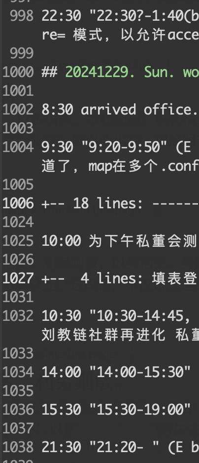

# 教链的一天

周末BTC继续在30日线下方悬吊震荡，暂于95k一线企稳。过去一周之回顾，教链已尽写在12.29教链内参《第52周 刘教链社群再进化 私董会年底好收官》中，不再赘言。蓦然回首，2024年最后一个整周已经和我们永远说再见了。下周我们就要正式迎来2025年。

在这个辞旧迎新之际，教链也和社群的朋友们齐聚一堂，促膝畅谈。这便是12.29的教链私董会。教链的私董会，更像老友会。人生一世，能有一些一辈子志同道合、一辈子一起走下去的老朋友，是最幸福的事之一了。

以利相交，利尽则散；以势相交，势去则倾；以权相交，权失则弃；以情相交，情断则伤；唯以心相交，淡治明志，友不失矣。诚哉斯言。

教链多次说过，自己不过是一个平凡而普通的投资者，只是有心喜欢码字，喜欢编程，喜欢广交四海朋友，于是就在日常写点儿随笔，分享一些纯粹个人的看法，随缘偶遇一些志同道合、相互包容的朋友，一起在人类向web3去中心化新范式、新物种进化之路上做出一些有趣的、有意义的、小小的探索和实践。

所以教链要做的，就是一个“人”，一个老朋友。教链既不想做什么高高在上的意见领袖，也不想做什么苦口婆心的导师，更无意做资本增殖的工具。教链追求的，是独立、自由的灵魂，是驾驭资本的人，而不是被资本驱使着完成其增殖使命的奴隶。

教链的随笔，是手术刀，解剖每一个利维坦的庞大身躯。教链的言谈，是鸡毛掸子，任何人都可以吸收为己所用，时时掸去自己心头被传统叙事灰尘所蒙蔽的良知（注：王阳明心学的“良知”）。

投资即修行。

所修者，乃从有到无的境界。手中有私钥，而心中无仓位。

及到无时，乃入六祖慧能之境界，“本来无一物，何处惹尘埃？”从此不再为世俗偏见所累。

不为外物所累，不为他人言行所累，不为心中欲望所累，以至于不为厄运、贫苦、伤病所累，人生渐渐活成一个圆满，并在死亡时完成这个圆满。

人一生只活一次。所以，大胆地去活，勇敢地去活，自由地去活。不要让任何理由，不要让任何人，也不要让懒惰和拒绝改变，夺走了我们对自己人生的掌控。

人生不过三万天。30000天。每一天，都值得按照自己最希望活成的样子去活。

教链也时刻提醒自己这一点，并按照这个原则来安排自己的每一天。

譬如今天，一个平常的周日。对教链来说，是每年52个周日中的一个。教链有记录自己每日时间安排的习惯，如下图所示。

这个周日，从周六跨夜到凌晨编码开始。留下一个悬而未决的bug，百思不得其解。睡觉。

今天是带娃办公的一天。早上带娃到了办公室，忽然灵光闪现，顺手先把昨夜今晨睡觉前百思不得解的bug给解决了。在2024年即将结束的时刻，推动教链社群从web2向web3结结实实地迈出了一小步。会员站可以支持web3登录了。登录的一小步，社群向web3进化的一大步。高兴。由衷的开心。

上午延续到中午饭前饭后，写作时间，完成12.29教链内参《第52周 刘教链社群再进化 私董会年底好收官》。同时，开了一个测试space和大家闲聊，为下午私董会做一些线上的准备。

陪娃吃完午饭，回到办公室，开了一个链社群的治理会议。主要是旁听。做了一些简短发言。

然后离开办公室，载娃驱车十余公里，到达年底私董会的现场。这次来的朋友很多。空间尽显局促，但外在的不足，恰恰有利于我们把关注点聚焦在重点——思想交流。这就是辩证。

外部条件的不尽如人意并未影响教链的谈兴。教链兴之所至，讲了3个半钟头。行到水穷处，坐看云起时。

不觉渐晚，天色已黑。带娃回家，吃饭，稍事休息。

夜已凉，娃已睡。教链坐在被窝里，听着娃的熟睡声，码下今天最后的字儿，就是各位亲爱的读者朋友们正在看的这篇文章，《教链的一天》。

在教链心目里，所有这些事情中，最酷的一件事其实是——带娃。

做一个带娃工作的超级奶爸，真的很酷，不是么？

回家路上，娃说，今天过得真充实。

充实的一天，就是幸福的一天。就像巴菲特爱说的，他每天都是跳着踢踏舞去办公室。

如果我们可以活成一个独立而自由的灵魂，不在八小时内出卖自己宝贵的时间，不在八小时外把钱包出卖给消费主义，不在睡觉的时候把积蓄出卖给通货膨胀和投资镰刀的收割，我们每个人，也都可以自由、开心、幸福地活着，每天跳着踢踏舞去办公室。

自由、开心、幸福地活着，也就活成了一个鲜活的、充满生机和活力的、真正的“人”。

史称“人的解放”。
