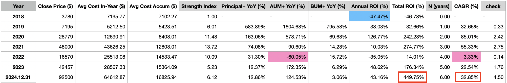
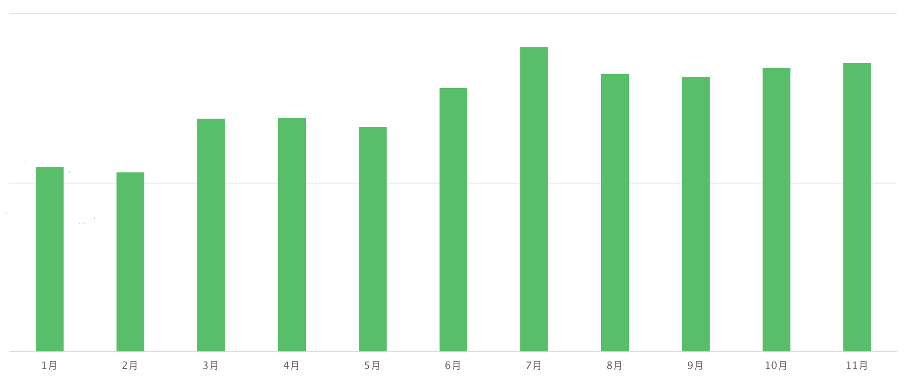
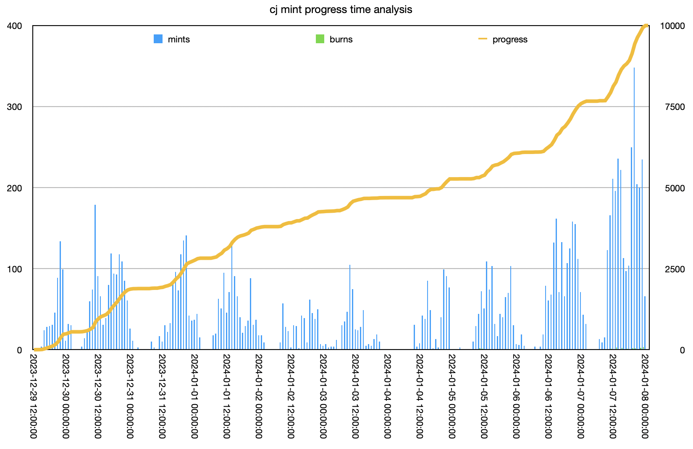

# 教链个人年终总结2024

今天是2024年最后一天，BTC一度回撤至92k又拉回至94k。在2024年行将结束、2025年即将开启之际，教链抽了点儿时间，略做了一些个人在2024年这一年的回顾盘点，整理如下，供自己参考，亦发表出来，与诸君分享。

该个人年终总结分为如下几个部分：

一、日程安排
二、投资复盘
三、写作总结
四、传道授业
五、社群进化
六、开源参与
七、健康保持

* * *

一、日程安排

（一）家庭：
- 每工作日：接送娃上下学
- 每周末：带娃跑步 3-7km
- 每假期：陪家人旅游

（二）工作：
1. 健康：
    - 日常：监测和控制体重
    - 每周：自己跑一次步 5-7km
    - 每周：打一次羽毛球 1h
2. 写作：
    - 每工作日：发表一篇文章
    - 每工作日：写一篇内参（仅会员）
    - 每周末：写一篇内参周总结（仅会员）
    - 每年底：完成一个长篇研报，即行业年终回顾和次年展望报告（仅会员；一年后解密公开）
    - 每年底：完成一篇个人年终总结
3. 研发（编程）：
    - 日常：编码，建设会员站（仅会员）
    - 日常：编码，向开源社区贡献代码，奉献自己的一份力量
    - 日常：运行和维护链节点
4. 运营：
    - 日常：帮助会员解决参与社群时遇到的各种问题，比如配置权限、链地址等（仅会员）
5. 活动（会议）：
    - 每周末：参加开源社区治理、交流会议
    - 每周末：（如开班）小白课教学
    - 每季度：教链季度私董会（仅会员）

（三）投资：
    - 按计划执行十年之约等投资计划（每周/每月）
    - 记账以及定期/不定期复盘

这份日程安排不是未来的计划表，而是过去的执行表。不是构想，而是回顾。不是刻意规划出来的，而是自然演化出来的。不是写在日历上的要求，而是内化到身体里的自律。

上述列表的自上而下的顺序，也是价值观重要度从高到低的排序。即，家庭 > 工作 > 投资。而工作子列表中，健康 > 其他。

为什么健康会列在工作子列表里呢？教链的想法是，为祖国健康工作五十年嘛。健康是工作五十年的铁的前提，所谓身体是革命的本钱，因此保持健康应当作为工作的重中之重。

教链从25岁开始参加工作。虽然现在已经不上班了，但是工作却没有停下来。特别是，随着投资逐渐跨越一些关键阶段，工作和劳动就慢慢地不再仅是谋生的手段，而是变成了生活的一种需要，甚至是“第一需要”（《哥达纲领批判》）。所以身体一定要锻炼好，至少要干到75岁再退休，才能达到健康工作50年的目标。

* * *

二、投资复盘

从2018年初高位进场算起，教链已持仓穿越一牛两熊。至今天2024.12.31，按市场价92.5k估算，年内新增仓位平均成本64.4k，收益率约43%；累计平均成本16.8k，累计收益率约450%，折算CAGR（年化复合增长率）32.85%。

如果算上拖后腿的山寨仓位，那么总收益率会下降到375%左右。

没有泼天富贵，只有知足常乐。

教链的投资之旅，和绝大多数人一样，在牛市顶部进场，高位接盘，越买越跌、越跌越买，第一年就遭遇本金亏损近半的暴击。幸运的是第一年轻仓试水，扛住了暴击。年末一算，收益率约-47%。就这样也没有失去信心和希望，才是最大的奇迹。

回想起来，主要的原因也许正是在于，在仓位亏损连连的时候，教链也在没日没夜地研读中本聪的史料，认知在节节攀升。最终，当2018年底仓位巨亏近50%时，教链对BTC、对中本聪的认知却达到了一个全新的高度。

或许正是这一自我认知的刷新，支撑着教链继续加大投入力度，顶着熊市底部的刺骨寒风，坚定地走下去。

穿越的第二个熊市就是2022年。个人财富直接缩水超60%。打个比方就像是10万一年时间亏到还剩4万。更惨的是，辛辛苦苦投资4年，CAGR一算只有3.33%，比美联储加息后的无风险收益率（4-5%）都要差——换句话说就是还不如美国人存银行吃利息。

周期对投资、仓位和人性的考验，对恐惧和贪婪的挑拨，穿越一牛两熊，教链体验得淋漓尽致。这考验，不仅在于场内的巨大起伏，更在于场外财务状况的改善和恶化，它往往和周期同频——牛市上头的时候，钱似乎也多起来，于是过度投资；熊市颤栗的时候，工作生活的前景似乎忽然也灰暗了起来，乃至于家庭、自身也突发变故，发生意外开支，财务压力骤增，甚至倒逼底部割肉救急。

好在教链还算未雨绸缪，在牛市顺风顺水时也常做压力测试，并在场外留足备用金，尽量确保即便在巨大的财务危机冲击下，生活仍能继续，不会被迫割肉。

于是得以风雨兼程，一路坚守。至今，终于守得云开，基本达成投资目标。

站在2024、2025年的分界线处，继往开来，新的阶段即将开始。是故，教链为2024年终报告冠了个标题，就叫做《奔向黎明》。

* * *

三、写作总结

2024年至今，公开发表随笔 370 篇，总字数约 90.1 万字。（采用wc -m统计）

2024年至今，对会员发表内参 316 篇，总字数约 78.3 万字。

2024年12月，完成年终报告约1.2万字。

加起来总写作篇目 687 篇，总字数约 169.6 万字。

查了下四大名著的字数。《红楼梦》约73万字，《三国演义》约64万字，《水浒传》约96万字，《西游记》约82万字。大概相当于写了一部《红楼梦》加上一部《水浒传》。

* * *

四、传道授业

2024年，应广大同学要求，分别在4-5月份、8-9月份、以及11月份开设了“刘教链超级小白课”第三期、第四期和第五期，进行了直播授课，并圆满结业。

* * *

五、社群进化

刘教链公众号粉丝数相比年初增长了61.3%。其中，常读用户比例 38%。常读用户比年初增长了56.4%。

「刘教链的星球」VIP会员累计（含已退出）在2024年增长了40%。

2024年，分别在3月24号、6月16号、9月22号和12月29号召开了四次教链私董会，畅谈行业趋势，数往知来。

12月份，会员站启航，并已成功接入web3登录。「刘教链的星球」会员社群已经踏上了从web2社群向链上web3社群进化之路。

虽然，这还只是刚刚破土而出的一颗小苗。但是教链觉得，只要赋予其web3的力量，未来它就会长成一颗参天大树。

教链和他的朋友们，在“社群+区块链”的落地实践上，默默无闻地探索着。因为，我们心中有光，所以，不怕上下求索。

* * *

六、开源参与

2024年，教链参与的社群开源项目Jouleverse取得了长足进展。独立节点数从17个（7个记账节点+10个见证节点）增长到66个（17个记账节点+49个见证节点），增长了288%。关键在于，与具有实控人（比如由一厂独占优势数量节点从而可以操纵账本）的很多区块链不同，Jouleverse的节点都是分散主体独立控制，无优势方，因而足够去中心化。

接入点信息：chainlist.org/?chain=3666&search=jouleverse

在2024年初元旦期间，教链在Jouleverse上发起的“铸造朋克头像”或称所谓“打CJ铭文”的活动取得了小小的成功。CJ铭文的智能合约代码是无主的（即所谓“不可变智能合约”），一经部署，所有人包括部署者就都失去了对它的控制。在2023.12.31教链发文《小福利：迎元旦，CryptoJunks铭文免费打》之后，仅仅到了2024年1月8号，不到10天时间，全部10000个限量铭文就全部被打光了。链活跃度得到了空前的提高。

其他代码、文档等方面的贡献，不再一一罗列。

* * *

七、健康保持

2024年上半年，有感于经过一个冬天后，体重微胖，BMI超出上限。于是立即决定瘦身减肥。方法很简单，就是节食加运动。几个月时间成功减去数公斤，把日常体重控制到了70kg以内（BMI中位），并保持至今。

养成了每周长跑和打球的习惯，并带动孩子们一起长跑，从小就养成重视体育、增强体质的好习惯，避免重蹈自己小时侯体弱多病的覆辙。

记得1917年教员在《新青年》上发表文章《体育之研究》，其中便如此写道，「体育于吾人实占第一之位置，体强壮而后学问道德之进修勇而收效远」。

* * *

亲爱的读者朋友们，感谢你关注教链，一路同行！2024年再有几个小时就要过去了，2025年的脚步声已经隐约可闻。在这辞旧迎新之际，愿大家在过去一年都有厚实的收获和积累，愿我们在来年都有更加灿烂、美好和开心幸福的日子。

新年快乐！
