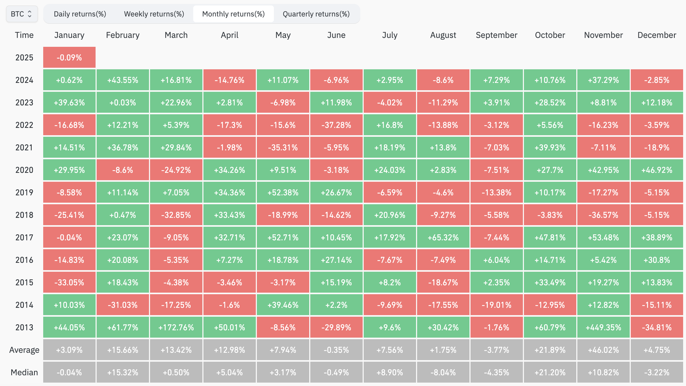
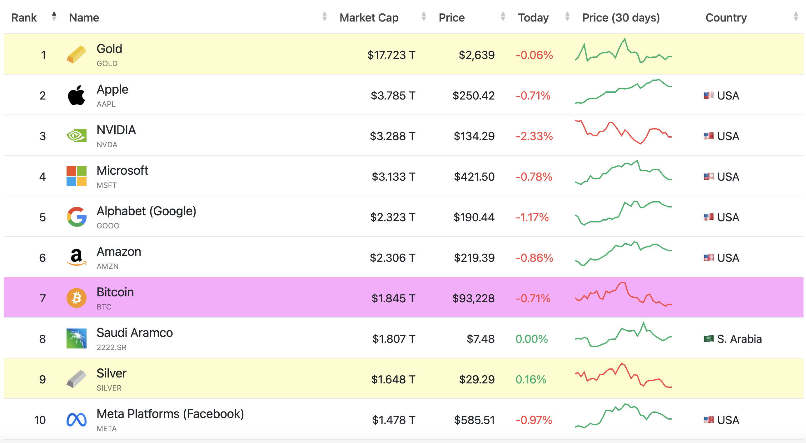
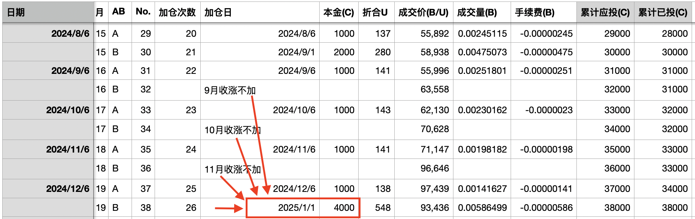
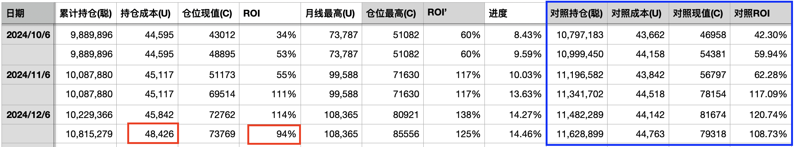

# 零息资产的无声咆哮 —— 十年之约系列＃38（ROI 94%）

今天我们正式送走了2024年，迎来了2025年。在经历了11月份的猪突猛进之后，2024年的12月份终究还是收跌，月线开盘96.6k，最高108.4k，最低89.7k，收盘95.4k。2024年全年开盘1月42.5k，最高12月108.4k，最低1月38.6k，收盘12月95.4k。全年涨幅124.5%。

这一年，黄金、白银、BTC，悉数闯入全球前十大市值资产之列。零息资产们的价格咆哮，是对法币世界流动性泛滥和通胀侵蚀财富的无声控诉。

今天是2024年12月份回顾加仓的B点，由于12月份收跌，故而将此前9、10、11三个月因收涨未投出的3份，加上12月的1份，总共4份，悉数投入。

投后持仓1081万聪，平均持仓成本48k，收益率94%。

有读者朋友可能注意到，教链调整了之前的记账表格，把A、B份拉直了。为什么这么修改呢？就是为了添加上图蓝色方框里的对照组数据。

这个对照组就是对A、B两份均采取简单定投而非A份定投、B份回顾逢跌加仓的办法所估算的数据。从数据显然可以看出，在投资这个问题上，简单往往是更优的策略。

对照组持仓1162万聪，比教链过去一年半的复杂策略，多囤积了7.5%的聪。平均持仓成本44.7k，成本低了7.6%。收益率也更高，达到了108.7%。

这就应了红楼梦里的那句话：机关算尽太聪明，反误了卿卿性命。

不知不觉间，“十年之约”已经走过了一年半、19个月的光阴。教链为该系列也已经写了38篇文章（含本篇），记录着这一投资实验的点滴。无论是智慧还是愚蠢，真诚的、真实的就是最宝贵的。

以下是38篇系列文章的列表，可以点进“刘教链”公众号搜索相应标题（或按时间筛选）进行回顾：

2023.6.7 《八字诀 · 十年之约》
2023.7.1 《内参：「十年之约」浮盈29%，B份6月收涨不加》
2023.7.6 《「十年之约」7月实证，浮盈20%，继续加仓》
2023.8.1 《「十年之约」实证#4：7月收跌，触发双倍加仓，浮盈回撤至3%》
2023.8.6 《「十年之约」实证#5：八月A份加仓，浮盈转为浮亏》
2023.9.1 《SEC推迟ETF，BTC跌破26k，十年之约#6逢跌加仓》
2023.9.6 《十年之约#7，ahr999囤币指标辨析》
2023.10.1 《十年之约#8：格物致知》
2023.10.6 《十年之约#9：放长线，钓大鱼》
2023.11.1 《十年之约#10：桃李不言，下自成蹊》
2023.11.6 《十年之约#11：积累的力量》
2023.12.1 《【实盘实证】十年之约#12：熊市坚持加仓可以摊低成本》
2023.12.6 《【十年之约#13】比特币在呼吸》
2024.1.1 《教链的2023：写了190余万字，投资收益率143%（十年之约#13）》
2024.1.6 《如果BTC达到100万刀（十年之约#15）》
2024.2.2 《十年之约＃16：逢跌加仓不如无脑定投？》
2024.2.6 《加仓！》
2024.3.1 《你没有错过比特币，更不会错过山寨币 —— 十年之约＃18》
2024.3.6 《万刀斩：BTC拉至前高，暴跌一万刀 —— 十年之约＃19》
2024.4.1 《BTC连续7个月收涨，三月收超7万刀——十年之约＃20（收益率120%）》
2024.4.6 《比特币和黄金联手痛击美联储 —— 十年之约＃21》
2024.5.1 《满上！ —— 十年之约＃22》
2024.5.6 《乘胜追击 —— 十年之约＃23》
2024.6.1 《十年之约＃24：首战告捷，成功提币！第一年收益率64%》
2024.6.6 《7万刀，新的起点。 —— 十年之约＃25（投后ROI 69%）》
2024.7.1 《6万刀，“矿工底”？ —— 十年之约＃26（ROI 50%）》
2024.7.6 《胜算更大了！—— 十年之约＃27（ROI 33%）》
2024.8.1 《美联储举起白旗 —— 十年之约＃28（ROI 51%）》
2024.8.6 《日元偷袭珍珠港 —— 十年之约＃29（ROI 32%）》
2024.9.1 《央妈购债欲何为 —— 十年之约＃30（ROI 32%）》
2024.9.6 《该割肉的都割完了 —— 十年之约＃31（ROI 24%）》
2024.10.1 《市场和孩子 —— 十年之约＃32（ROI 39%）》
2024.10.6 《月薪5000工薪族的财务自由计划 —— 十年之约＃33（ROI 34%）》
2024.11.1 《微策略的金融永动机 —— 十年之约＃34（ROI 53%）》
2024.11.6 《大选日，7万刀，1000万聪——十年之约＃35（ROI 55%）》
2024.12.1 《成为超级个体：拥抱AI、囤BTC——十年之约＃36（ROI 111%）》
2024.12.6 《比特币无需“背书” —— 十年之约系列＃37（ROI 113%）》
2025.1.1 《零息资产的无声咆哮 —— 十年之约系列＃38（ROI 94%）》

2025的新征程已经开始。一起继续努力加油吧！
