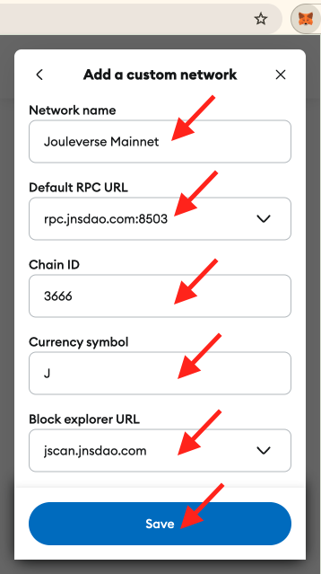

# 小教程：安装MetaMask并添加Jouleverse区块链网络

教链按：本教程由deepseek辅助教链进行创作。教链对创作过程亦进行了披露，旨在普及AI+区块链结合使用的相关知识。

* * *

教链提出需求：

* * *

### 教程：如何安装MetaMask小狐狸钱包并添加Jouleverse区块链网络

本教程将指导您如何在不同的设备和浏览器上安装MetaMask小狐狸钱包，并添加Jouleverse区块链网络。我们将提供两种添加网络的方法：通过chainlist.org一键添加和手动配置添加。

教链注：MetaMask小狐狸钱包是一款去中心化链上web3钱包，它不对你的链上资产进行中心化托管。

---

### **版本1：使用谷歌Chrome浏览器安装插件版小狐狸钱包并添加Jouleverse网络**

教链注：如果你的网络环境无法安装和使用谷歌Chrome浏览器，请尝试换用Firefox火狐浏览器。

#### **步骤1：安装MetaMask插件**

1. 打开谷歌Chrome浏览器，访问 [MetaMask官网](https://metamask.io/)。
2. 点击“Download”按钮，选择“Chrome”浏览器。
3. 点击“Install MetaMask for Chrome”，跳转到Chrome网上应用店。
4. 点击“添加至Chrome”，然后点击“添加扩展程序”完成安装。
5. 跟随MetaMask插件的引导，用纸和笔抄写、备份并妥善保管助记词，进入MetaMask界面。

#### **步骤2：添加Jouleverse网络**

**方法1：通过chainlist.org一键添加**

1. 打开 [chainlist.org](https://chainlist.org/)。
2. 在搜索框中输入“Jouleverse”，找到“Jouleverse Mainnet”。

3. 点击“Connect Wallet”或“Add to MetaMask”即可一键添加。

**方法2：手动配置添加**

1. 打开MetaMask插件，点击右上角的网络选择框（默认显示“Ethereum Mainnet”）。
2. 选择“Add a custom network”。

3. 填写以下信息：
   - 网络名称(Network name): `Jouleverse Mainnet`
   - RPC (New RPC URL): `https://rpc.jnsdao.com:8503`
   - 链ID (Chain ID): `3666`
   - 代币符号(Currency Symbol): `J`
   - 区块链浏览器地址(Block explorer URL): `https://jscan.jnsdao.com`
4. 点击“Save”保存。

---

### **版本2：使用Firefox火狐浏览器安装插件版小狐狸钱包并添加Jouleverse网络**

#### **步骤1：安装MetaMask插件**

1. 打开Firefox火狐浏览器，在其插件商店搜索metamask，找到MetaMask小狐狸钱包插件。

2. 进入插件详情页，点击“添加到Firefox火狐”，然后点击“添加”完成安装。

3. 跟随MetaMask插件的引导，用纸和笔抄写、备份并妥善保管助记词，进入MetaMask界面。

#### **步骤2：添加Jouleverse网络**

**方法1：通过chainlist.org一键添加**

1. 打开 [chainlist.org](https://chainlist.org/)。
2. 在搜索框中输入“Jouleverse”，找到“Jouleverse Mainnet”。

3. 点击“Connect Wallet”或“Add to MetaMask”即可一键添加。

**方法2：手动配置添加**

1. 打开MetaMask插件，点击右上角的网络选择框（默认显示“Ethereum Mainnet”）。
2. 选择“Add a custom network”。

3. 填写以下信息：
   - 网络名称(Network name): `Jouleverse Mainnet`
   - RPC (New RPC URL): `https://rpc.jnsdao.com:8503`
   - 链ID (Chain ID): `3666`
   - 代币符号(Currency Symbol): `J`
   - 区块链浏览器地址(Block explorer URL): `https://jscan.jnsdao.com`
4. 点击“Save”保存。

---

### **版本3：使用苹果手机下载安装小狐狸钱包并添加Jouleverse网络**

#### **步骤1：安装MetaMask应用**

1. 打开App Store，搜索“MetaMask”。（教链注：可能需要切换为海外Apple ID。可使用email自行免费注册，注册方法请自行搜索。）
2. 点击“获取”并安装应用。
3. 安装完成后，打开MetaMask应用。

4. 跟随MetaMask插件的引导，用纸和笔抄写、备份并妥善保管助记词，进入MetaMask界面。

#### **步骤2：添加Jouleverse网络**

**方法1：通过chainlist.org一键添加**

1. 在MetaMask内置浏览器中打开 [chainlist.org](https://chainlist.org/)。

2. 在搜索框中输入“Jouleverse”，找到“Jouleverse Mainnet”。
3. 点击“Connect Wallet”或“Add to MetaMask”即可一键添加。

**方法2：手动配置添加**

1. 打开MetaMask应用，点击左上角的网络按钮（下拉按钮）。
2. 在弹出的“选择网络”面板下方，点击“添加自定义网络”。
3. 填写以下信息：
   - 网络名称(Network name): `Jouleverse Mainnet`
   - RPC (New RPC URL): `https://rpc.jnsdao.com:8503`
   - 链ID (Chain ID): `3666`
   - 代币符号(Currency Symbol): `J`
   - 区块链浏览器地址(Block explorer URL): `https://jscan.jnsdao.com`
4. 点击“Save”保存。

小彩蛋：在MetaMask内置浏览器网址栏输入会员站网址，打开后点击页面下方的“使用MetaMask登录”，成功登入后就可以查看会员专享内容啦。（注：在有效期的会员需要联系教链先帮你安排配置链地址才能成功登入）

---

### **版本4：使用安卓手机从小狐狸钱包官方GitHub下载安装APK并添加Jouleverse网络**

#### **步骤1：安装MetaMask应用**

1. 打开手机浏览器，访问 [MetaMask官方GitHub](https://github.com/MetaMask/metamask-mobile/releases)。
2. 下载最新版本的APK文件。
3. 下载完成后，打开APK文件并安装。安装过程中可能需要允许“未知来源”应用的安装权限。
4. 安装完成后，打开MetaMask应用。

5. 跟随MetaMask的引导，用纸和笔抄写、备份并妥善保管助记词，进入MetaMask界面。

#### **步骤2：添加Jouleverse网络**

**方法1：通过chainlist.org一键添加**

1. 在MetaMask内置浏览器中打开 [chainlist.org](https://chainlist.org/)。

2. 在搜索框中输入“Jouleverse”，找到“Jouleverse Mainnet”。
3. 点击“Connect Wallet”或“Add to MetaMask”即可一键添加。

**方法2：手动配置添加**

1. 打开MetaMask应用，点击左上角的网络按钮（下拉按钮）。
2. 在弹出的“选择网络”面板下方，点击“添加自定义网络”。
3. 填写以下信息：
   - 网络名称(Network name): `Jouleverse Mainnet`
   - RPC (New RPC URL): `https://rpc.jnsdao.com:8503`
   - 链ID (Chain ID): `3666`
   - 代币符号(Currency Symbol): `J`
   - 区块链浏览器地址(Block explorer URL): `https://jscan.jnsdao.com`
4. 点击“Save”保存。

小彩蛋：在MetaMask内置浏览器网址栏输入会员站网址，打开后点击页面下方的“使用MetaMask登录”，成功登入后就可以查看会员专享内容啦。（注：在有效期的会员需要联系教链先帮你安排配置链地址才能成功登入）

---

### **总结**

无论您使用的是Chrome、Firefox火狐浏览器，还是苹果、安卓手机，都可以通过以上步骤安装MetaMask小狐狸钱包并添加Jouleverse区块链网络。您可以选择通过chainlist.org一键添加，也可以手动配置网络信息。希望本教程对您有所帮助！

