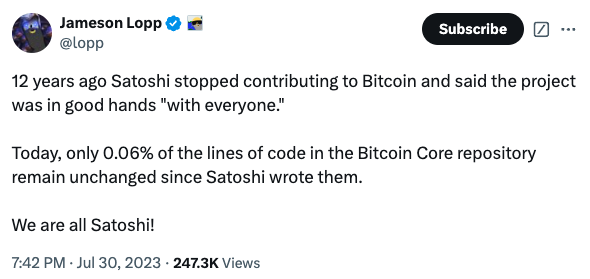
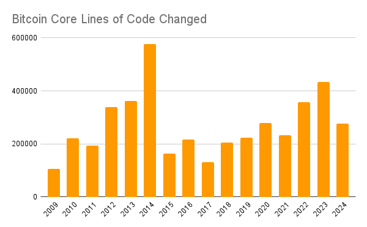

# 比特币创世16周年

隔夜BTC继续延续反弹势头，暂居96-97k区间。

今天是2025年1月3号，距中本聪当年前制作的比特币创世区块中镌刻的日期2009年1月3号，刚好过去了16个春秋。

虽然中本聪早已离去，但BTC却从未停止前进的脚步。

BTC一直没有变。BTC一直在改变。

不变的是它的“协议”（protocol）。变的是它的代码（code）。

如今，在继承自中本聪原始代码库的Bitcoin Core项目中，仅剩下不到0.06%（万分之六）的代码是中本聪所写的代码。其他99.94%的代码，都是来自于全球开发者的无私贡献。

「不必时时怀念我，也不必指望我回来，我离开以后，你们就是我。」

每年，Bitcoin Core都有大量代码更新。其中，仅2024年一年就更新了约27.6万行代码。

这些代码，都是来自于世界各地的贡献者的付出。

人人都是中本聪。

BTC似水。至柔至刚。身体至柔，而精神至刚。柔而能持续进化，充满生命力。刚而能威武不屈，泰山压顶而不变色。

代码是BTC的肉体，协议是它的灵魂。

据研究，人体每16天更换掉全身76%的原子，每年更换掉98%的原子，每5年100%的身体原子都要更换一遍。可你还是那个你。

99.94%的BTC代码被改写，但BTC还是那个BTC。

忒修斯之船。

变与不变的辩证统一。

易经讲三易之理：简易，变易，不易。

BTC大道至简：sum(50/2^n)*21万 = 2100万。

BTC持续进化：改写了超过99.94%的代码。

BTC从未改变：1 BTC = 1 BTC。

完全符合易之理。

合乎天道。

以此为镜，照照自己，反省一下我们在工作生活中，是不是常常违背易理行事？

不知易乃简易之理。不会做减法，只会做加法。事情越搞越复杂，心里搞得乱如麻，环境搞得一团糟。处处是堵点，处处理不顺。工作不是越做越轻松，却是越干越疲惫。这就是失了简易。

不知易乃变易之理。抱残守缺，不思改变。晚上想想千条路，早上起来走原路。虽然对工作已经失去了热情，却仍然以各种理由和借口拒绝改变。不如意时也不是没想过改变，但是行动上却是抱起手机刷几个短视频，刷累了倒头便睡，一觉醒来继续一切照旧。没动力，没胆量，没计划，没行动。这就是失了变易之理。

不知易乃不易之理。不懂坚守初心，长期主义；不知拿住底仓，长线布局。当浮躁的反复横跳充斥着市场时，坚贞就成了一种稀缺的独特优势。因而易经卦爻辞中频繁出现“利贞”、“利坚贞”、“利永贞”这样的字眼，就是告诉我们，坚持初心不改、坚守长期主义是最有利的！日日追逐热点，时时切换赛道，常常割肉换仓，必然是输多赢少、亏多赚少。为何？易经屯卦·六三爻辞已经告诫过了，“即鹿无虞，惟入于林中，君子几不如舍，往吝。” 没有金刚钻硬揽瓷器活儿，这就是失了不易之理。

投资之功，不在于弄资，而在于修身。

只有认知配得上什么level（水平）的财富，才有可能赚得到什么level的财富。

在这一方面，每个BTC持有者都可以仰望中本聪这座精神丰碑。

中本聪疑似早年开采110万枚BTC，16年从未移动。姑且按照10万美刀一枚计算，这大约就是一笔折合1100亿美刀的巨额财富。

不妨估量估量，中本聪的言行和功劳所体现出来的认知水平和思想境界，配得上1100亿美刀的财富吗？

配得上，甚至超过。那么，10万美刀的BTC就不算贵。否则，就贵了。

教链觉得，或许可以讲是大大超过。横向对比一下，拥有超过这个水平财富的世界首富们，他们的境界，比之中本聪，尚属下乘。

因此，BTC如果再翻倍，达到20万美刀。那么中本聪就将有可能以大约2200亿美刀的财富比肩世界首富。

而这是个双料冠军时刻。20万美刀的BTC，也将问鼎全球企业市值第一苹果公司的地位。

再掂量掂量，中本聪配得上世界首富的水平吗？BTC配得上美股市值第一的地位吗？

配得上，那么就不是遥不可及的梦想，而是脚下正在走的路。

再大胆一点，设想BTC达到100万美刀呢？

面对指数级加速的未来，也许唯一限制我们的，只有我们贫乏的想象力了吧？

创世16年，好戏才刚刚开场。
