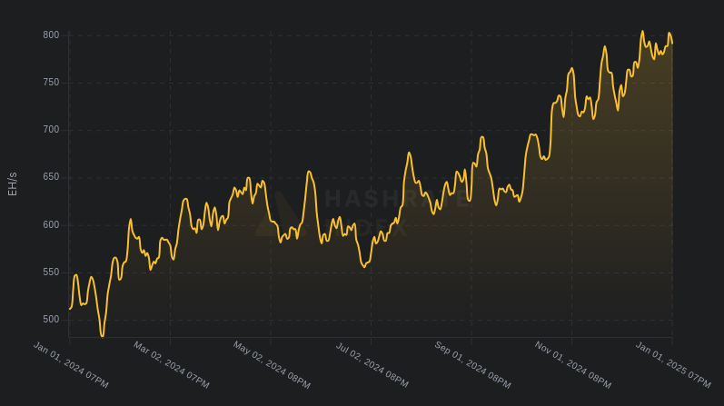
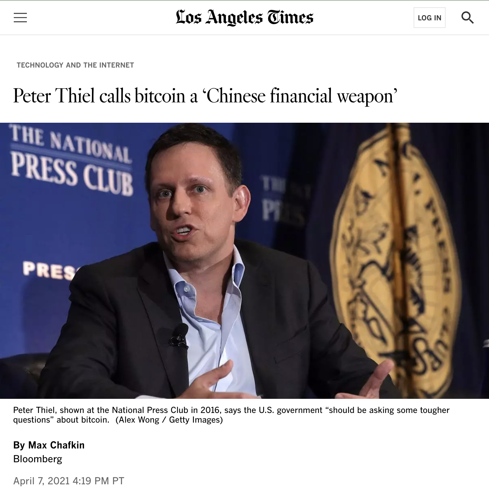

# 哈希率上涨56%

隔夜BTC继续延续反弹上行趋势，一度重新站上30日均线98.3k。

过去一年，BTC从42.5k涨到95.4k，涨幅124.5%。在价格翻倍的背后，BTC网络的全网算力上涨了56%，从512EHash/s涨到800EHash/s。

800EHash/s，就是一秒钟计算800,000,000,000,000,000,000个哈希值。咱们这颗蓝色星球上人类建成的最强算力。

现在回望仅仅4年前即2021年所谓“519”崩溃，算力从200E腰斩到100E时所砸出来的“小坑”，是不是更深刻地明白了那句“那杀不死我的，会让我更强大”？

彼时，教链写了一篇《杀君马者道旁儿》（2021.6.27）。

疾驰骏马应声倒地。有人哀嚎，有人狂喜。

曾经仰望华人矿池的美国新矿池Foundry USA，经此巨变，紧抓历史机遇，短短几年便跃居全球最大矿池的头等位置。

东方千里马疾驰如飞，令人望尘莫及。

杀君马，吃马肉，埋马骨。

西方千金买马骨。

东学西渐，凤凰涅槃，耶稣转生。

2023年，贝莱德进场。

2024年初，美BTC ETF获批上市。

2024年末，国家战略储备构想被提出。

别再听信那些“BTC是美国人搞的金融武器”的调调了。就在4年前，硅谷教父Peter Thiel恰恰是在说它是中国人搞的金融武器。

有时候，实话和战忽，真的难辨雌雄。

只能说，客观上，千里马之死，才真正让千里马走向了世界。

BTC调动了强大的有形之手的力量，帮助自身完成了涅槃重生的壮举，进行了一次轰轰烈烈的去中心化，走向世界，被世界第一强国的上层意志接纳。

2024年结束了。BTC全网算力已经达到800EHash/s的水平。这一数字，是2021年“519”崩溃前200EHash/s水平的4倍。

有人说，BTC的价值来源于共识。

去中心化的力量在于，共识扩大，价值提高。

但是，共识终归只是意识层面的产物。

而最终决定意识的，仍然是物质。

物质的力量。

算力。
