# 未来30年

周末BTC正在努力重回30日均线98k。站在10万刀门前的新起点上，展望未来30年宏观经济的大势，我们也许需要以史为鉴，以期获得些许启发。教链摘编网友Max Anderson的部分见地，注解如下，与各位读者朋友分享。

目前，美国联邦债务规模与GDP比例（下图蓝色曲线）重回120%的极限高位。历史上，这一高度仅在二战后的1945年左右达到过。接下来会发生什么？历史告诉我们，答案也许会是：长达30-40年的国家去债务、去杠杆周期，实质上是债务向全世界包括美国居民部门的全面转移，手段是货币违约和持续的高通胀，伴随着美联储持续加息以对抗通胀的努力。下图红色曲线是3个月联邦债券利率。

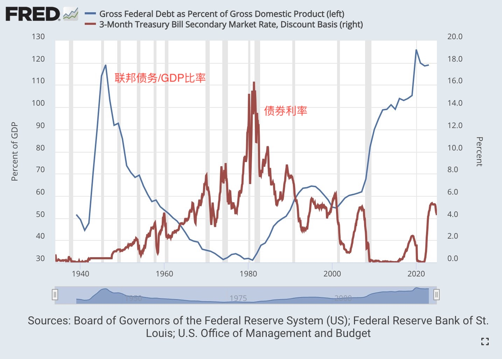

结局是什么？高通胀彻底冲淡了联邦债务，但是也稀释了全世界人民包括美国人民的财富，并且随着联邦基准利率的不断升高，生产部门遭受了致命的打击。80年代的沃尔克冲击。

应该做什么？抛售债券（实际负利率资产），持有有望跑赢通胀的风险资产（如成长型股票），或者内生性抗通胀资产（如黄金、BTC）以对抗超级通胀对财富的侵蚀。

下面是整个故事：

二战结束时，美国联邦债务规模占GDP的比例已经高达120%。

这是宏观债务天花板。因为政府税收的天花板是GDP的20%。以20% GDP的税收，最高就只能支撑120% GDP的债务。20/120 = 1/6。这意味着，经济增速必须6倍于利率，否则整个国家就有陷入债务死亡螺旋直至破产的危险。

美国在1945年曾经为了提高联邦收入而加税。个人所得税最高边际税率一度提高到惊人的94%！可是税收规模呢？不升反降！从20% GDP下降到了13% GDP。

这个惨痛的教训说明了一个深刻的道理：剪羊毛不能太狠。94%的所得税，人们就干脆宁可在家躺着不工作了。

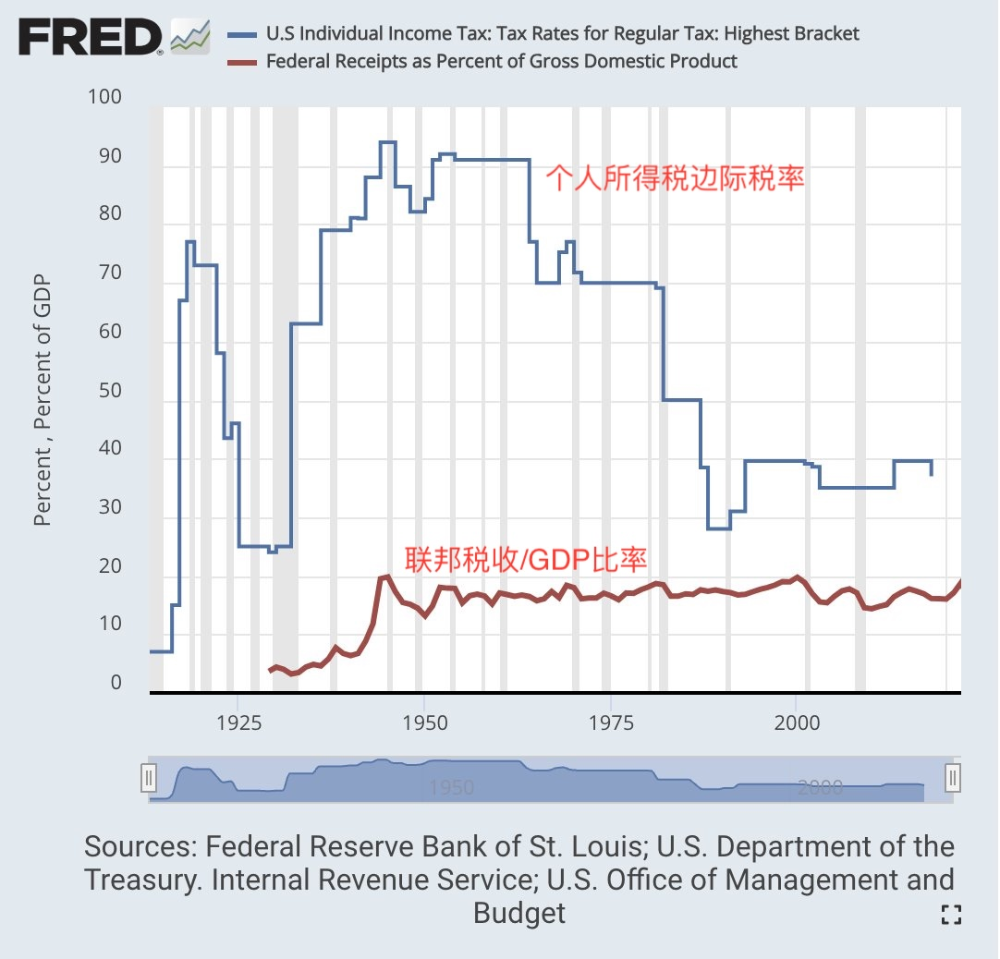

事实证明了，20% GDP就是税收能力的极限。

可是GDP增长也是受到客观规律约束的。对于超大规模经济体，即便是正在高速发展中的，GDP增速通常也就是5%左右。发达经济体很多时候能有个2-3%就算很快了。 

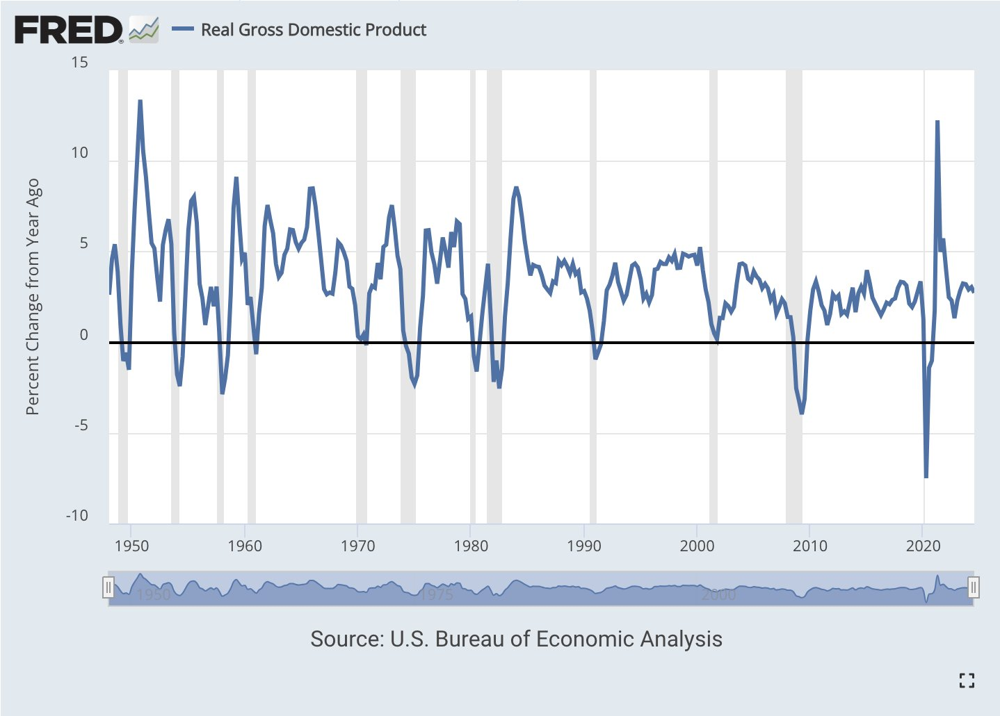

这么一来，120%的债务率，20%的税收极限，5%的经济增速都成了限定条件，那么就可以反推出来，维持债务不破产的利率水平是多少？

5% / 6 = 0.8% < 1%

也就是说，连1%水平的低利率都会导致债务破产。必须维持近乎低息的利率环境，才能让庞大的联邦债务苟延残喘。

40年代美国拥有一项绝对优势，Max Anderson坦言，军事霸权。

于是美国拿走了全世界的黄金，主导建立了美元体系，并用枪顶着所有人的脑袋让其他国家的货币锚定美元。

经过35年的持续通胀（美元贬值），美国联邦债务这个恶性肿瘤奇迹般地痊愈了。

到70年代初期，美国联邦债务占GDP比率已经下降到了30%的水平。

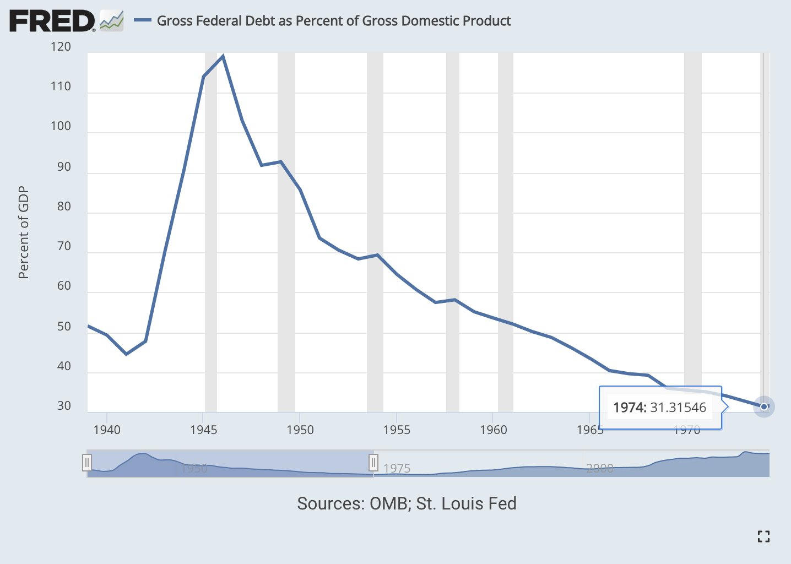

但是，很快，美国又遇到了两个问题。

第一个问题，越战泥潭让美国联邦债务与GDP占比在70年代又重新向上，有重新失控的苗头。

第二个问题，美国普通民众发现，国内物价越来越贵了，生活成本越来越高。

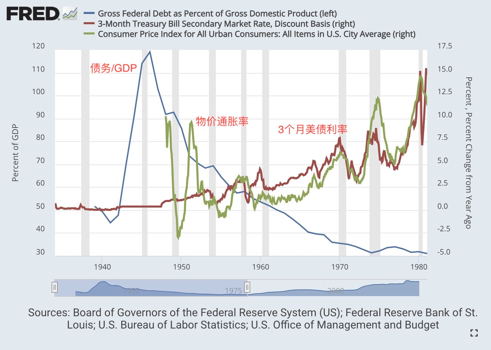

于是美联储开始加息，以对抗物价通胀的名义。 

到了80年代，一切都结束了。联邦债务/GDP比率被控制在了30%。但是，美元的购买力从40年代到70年代贬值了三分之二。到80年代又贬值了一半。

这一波长达数十年的大贬值，摧毁了人们的储蓄，80%过去积累的财富灰飞烟灭。

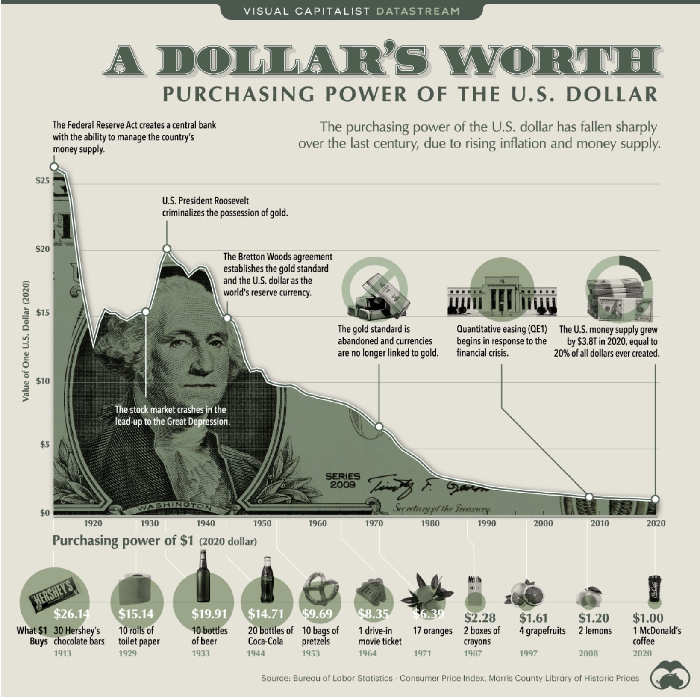

代价转移出去了。美国联邦政府去杠杆完成。通胀结束了。从80年代到2020年代，是通胀回落的40年。美国经济的黄金时代。

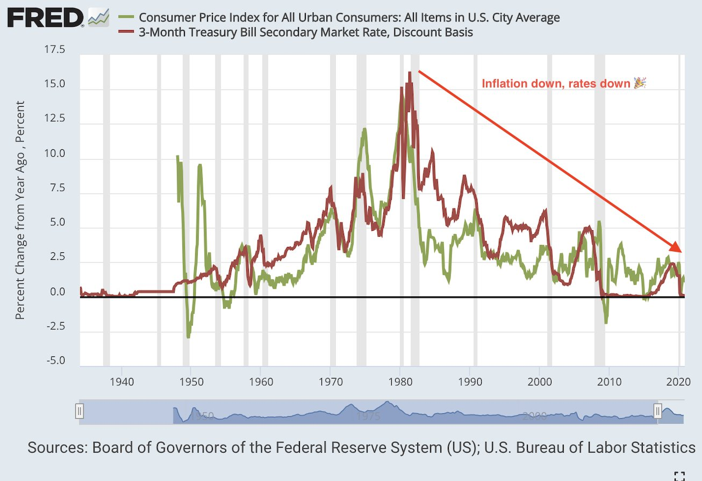

各类资产的超级长牛。

股票长牛。

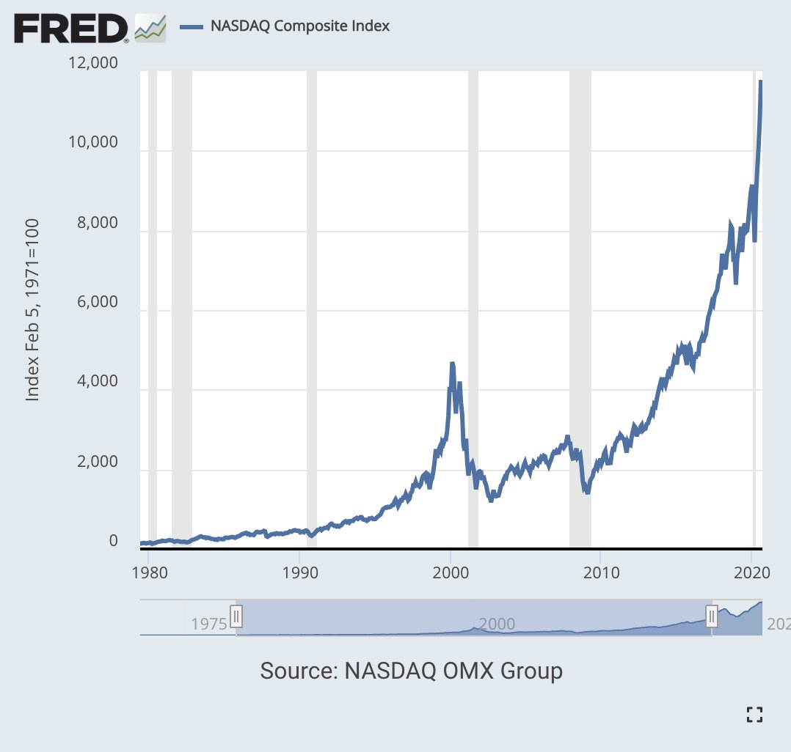

房产长牛。

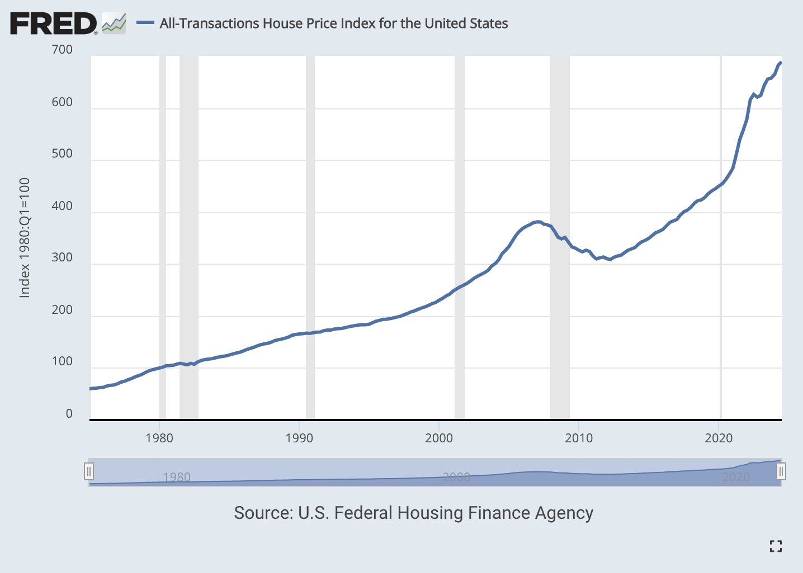

数十年的利率下降，让所有美国人都染上了借债的瘾——借债消费，借债投资。因为钱越来越便宜，不借白不借。

而成瘾最深的，显然是美国联邦政府自己。

财政赤字一年比一年大。联邦债务/GDP比率，嘿，它又重新飙升了。

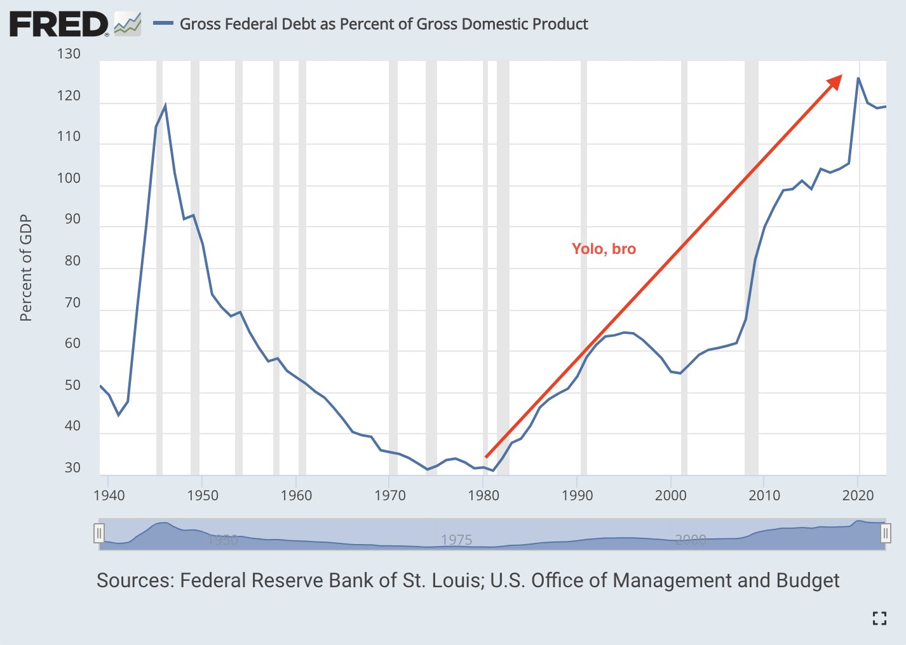

现在，联邦债务/GDP又一次重回二战结束时的水平：120%。

接下来，它又将如何故技重施，消灭这些债务呢？

加税？还是超级通胀（贬值美元）？

1980-2020的40年，重新加杠杆的周期，未来30年将不会再现。

债券将成为亏钱的最佳方式，因为它们可能连通胀都跑不赢。

从房产浪潮中轻松赚到钱的、婴儿潮一代的父母们也许会继续抱持着对房产的思想钢印，试图劝说下一代继续把房产作为最佳投资。但是很可能，BTC一代压根儿就不会听父母辈苦口婆心的劝诫。

最后，通胀的来源只会是联邦政府赤字。而这一数字已经高达5-10% GDP。

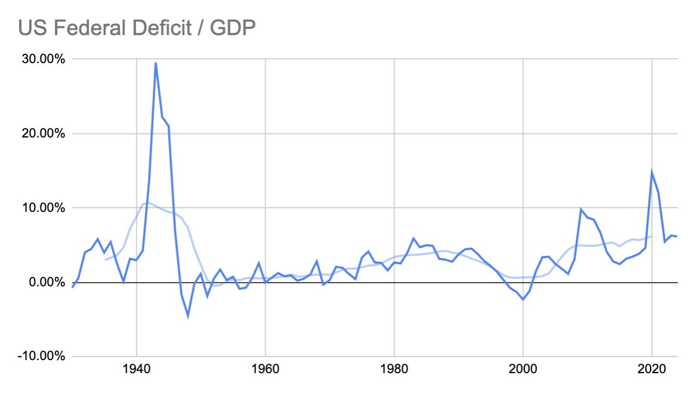

因此，收益率低于10%的投资，比如债券、分红型股票、房产，都将成为实际负利率的垃圾投资。

好了，介绍完了。以上就是Max Anderson的核心观点。希望能有所启示。
