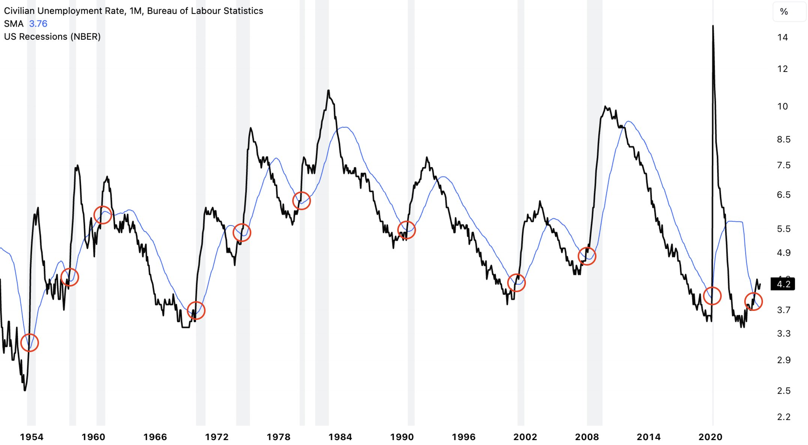
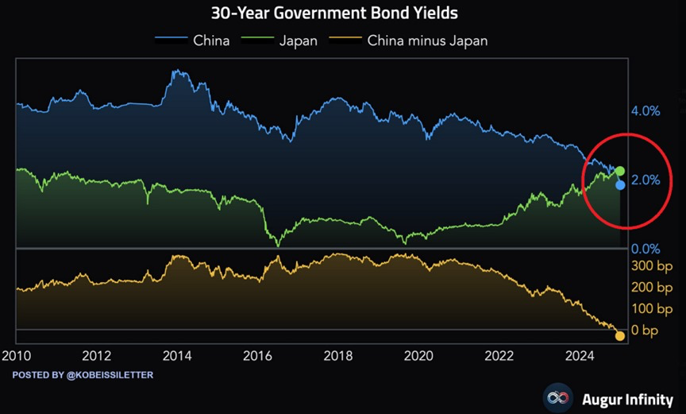
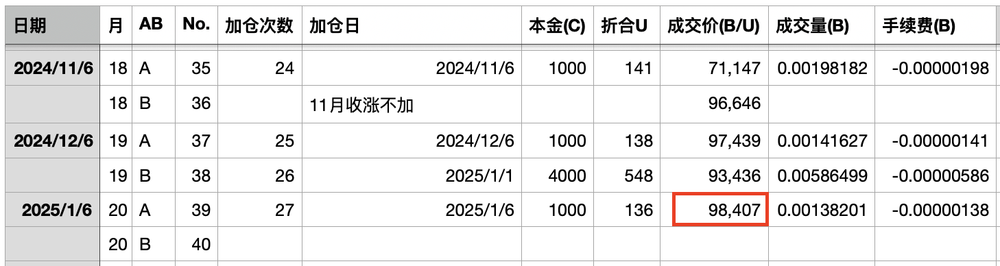
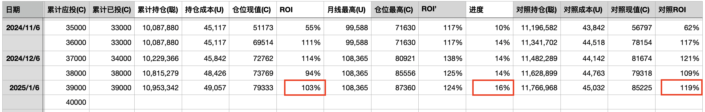

# 风雨兼程 —— 十年之约系列＃39（ROI 103%）

隔夜BTC多空双方激战于30日均线98.2k下方。闪烁不止的宏观信号让人们忧虑，令人想起三体中那闪烁的夜空。观者无不虎躯一震，奔跑的灰犀牛如千钧巨石压在胸口。汪淼跌落在地，大脑空白而茫然。

美国失业率已经运行到36个月均线之上。衰退会降临吗？

30年期中债收益率历史首次低于30年期日债收益率。如何摆脱低增速陷阱？

当你穿透迷雾，知道了闪烁夜空乃是三体人对视网膜的操纵，而非真的改变了宇宙的客观规律，你才能够洞悉真相。

统计数据正是这样。它通过改变我们视网膜上的成像，影响我们的认知。它绝不会有能力去扭曲现实世界客观规律。

摆脱视网膜操纵，洞悉真相，作出明智选择。

于是，风雨兼程。

今天是《八字诀·十年之约》实盘见证计划执行的第20个月，第39篇报告，第27次加仓。加仓价98407刀。

投后持仓109.5万聪，持仓成本升至49057刀，收益率回升至103%，低于参照组的119%。计划进度16%。

昨天1.5教链内参《第53周 承上启下新年开启 分歧时刻尽逞英豪》教链谈了一下在牛市期间调整十年之约执行计划的初步设想，基本的思想是在市场过热期削减投入力度，所以考虑在牛市上行大幅偏离幂律中性价格时暂停B份加仓。个人想法，不构成任何参考意见或建议。切勿盲信盲从。

说回来，投资是完全个人的事情。一定要有自己的独立判断，独立制定自己的投资计划。千万不可以盲目抄别人的作业。资金来源、经济实力、投资目的、持仓心态、个人修为、家人意见，等等，各方各面，各人差异简直是太大了。所以常常有讲，一个人的蜜糖，另一个人的砒霜。惨痛教训历历在目，共勉。

做自己不懂的投资，无异于赌博。投资和赌博有何区别？有策略规避风险，从而获得合理收益的，是投资；任何方法都无法规避风险，收益期望严格为负的，是赌博。

做投资的方法千千万，首要的一条就是：不要赌。
